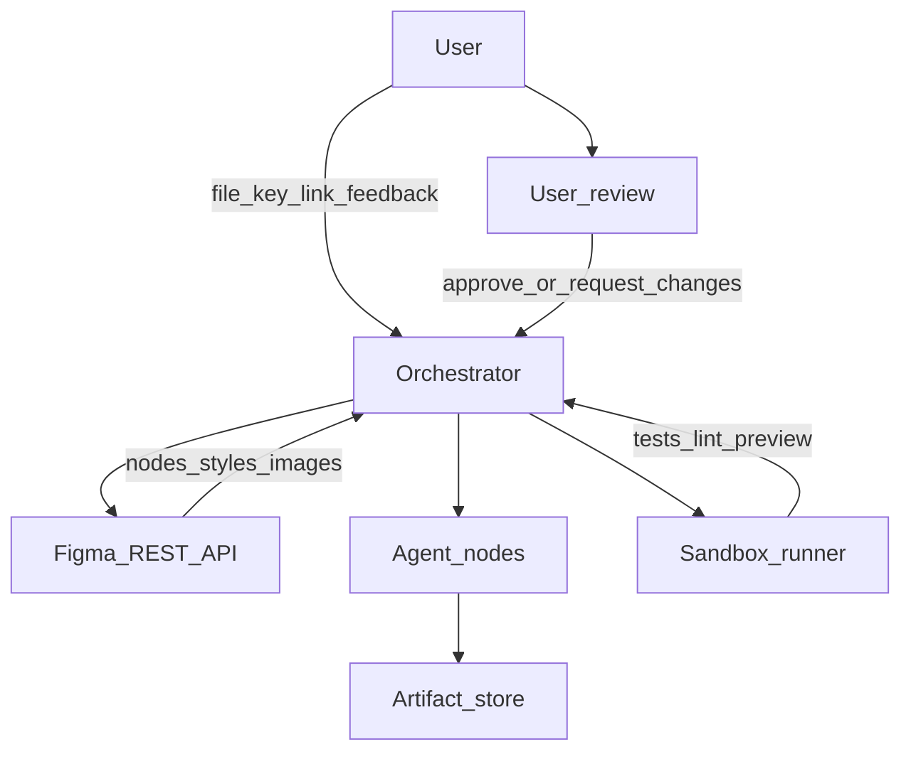

# AI Coding Agent: Figma to Production Website

This repository is **documentation only**: a GitBook-friendly, implementation-oriented guide for building an **AI agent system** that reads **Figma** designs and produces **production-grade frontend code** (this corpus standardizes on **React + TypeScript + Vite**).

## Who this is for

- **Beginners and PMs**: you learn what the system does end-to-end, without assuming you already know agents or the Figma API.  
- **Junior engineers**: you get concrete components, prompts, data shapes, and failure modes so you can implement v1.  
- **Maintainers**: you get scaling, security, cost, and operations guidance for growing the product.

## Visual architecture

High-level view of how data and control move through the system:

**Reading the diagram**: the orchestrator is the brain: it schedules work, calls Figma, runs agent steps, validates output in a sandbox, stores artifacts, and loops when the user requests changes.

## Quick start

| Goal | Where to start | Time |
|------|----------------|------|
| Understand the product story | [docs/01-overview/README.md](docs/01-overview/README.md) | ~20 min |
| Implement the pipeline | [docs/03-workflow/README.md](docs/03-workflow/README.md) → [docs/04-agent-design/README.md](docs/04-agent-design/README.md) → [docs/05-prompts/README.md](docs/05-prompts/README.md) | ~2–4 hours reading |
| Ship safely | [docs/14-security/README.md](docs/14-security/README.md) + [docs/07-sandbox/README.md](docs/07-sandbox/README.md) | ~1 hour |

## How to navigate

- **GitBook sidebar**: open [SUMMARY.md](SUMMARY.md) (this is the table of contents GitBook expects at the repo root).  
- **All chapters**: live under [docs/](docs/) in numbered folders (`01-overview` … `15-cost-optimization`).  
- **Canonical external links**: [docs/00-references.md](docs/00-references.md).

## Simple explanation

Think of the agent as a **factory line**: on one side you put a **Figma link** and preferences (framework, design tokens); on the other side you get a **zip or git branch** of a website. Between those sides, specialized steps (parse layout, map components, write code, test) run in order, sometimes **more than once**, until quality checks pass or a human says “good enough.”

## Deep technical breakdown

Implementation-wise you typically run: **OAuth or personal access token** to Figma → **GET file JSON** (`GET /v1/files/:key`) → normalize to an **intermediate representation (IR)** → LLM-assisted transforms per agent node → **write files** to a workspace → **Vite build + tests** in an isolated runner → **diff review** → optional **re-prompt** with validator errors. Async jobs (large files) use a **queue** and idempotent steps with **retries** and backoff on Figma rate limits.

## Mermaid diagram

See the architecture diagram above (system scope).

## Real example

User shares `https://www.figma.com/design/abc123/MyMarketingSite`. Your backend resolves `file_key=abc123`, fetches the document tree, extracts a frame named `Landing`, and emits `src/pages/Landing.tsx` plus CSS modules or token-backed styles.

## Challenges and pitfalls

- Treating the LLM as a compiler: it will **hallucinate** missing constraints unless the IR and validators are strict.  
- Ignoring Figma **auto-layout** vs absolute positioning: layout quality collapses on responsive breakpoints.

## Tips and best practices

- Version the **IR schema** and pin prompts to that version.  
- Always keep a **human diff review** step before merging to production.

## What most people miss

The hardest part is not code generation; it is **deterministic layout normalization** before the model writes JSX. Invest there early.
