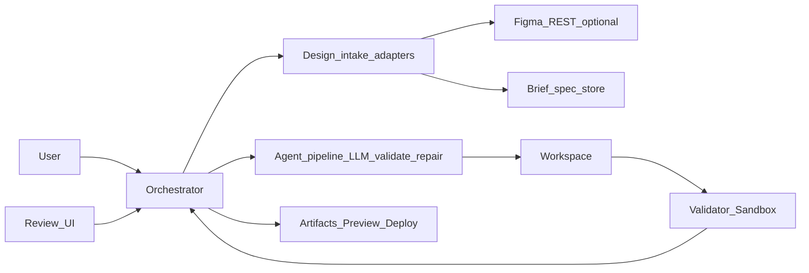
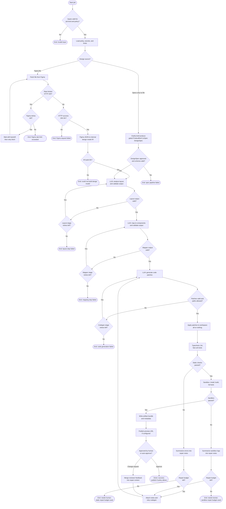
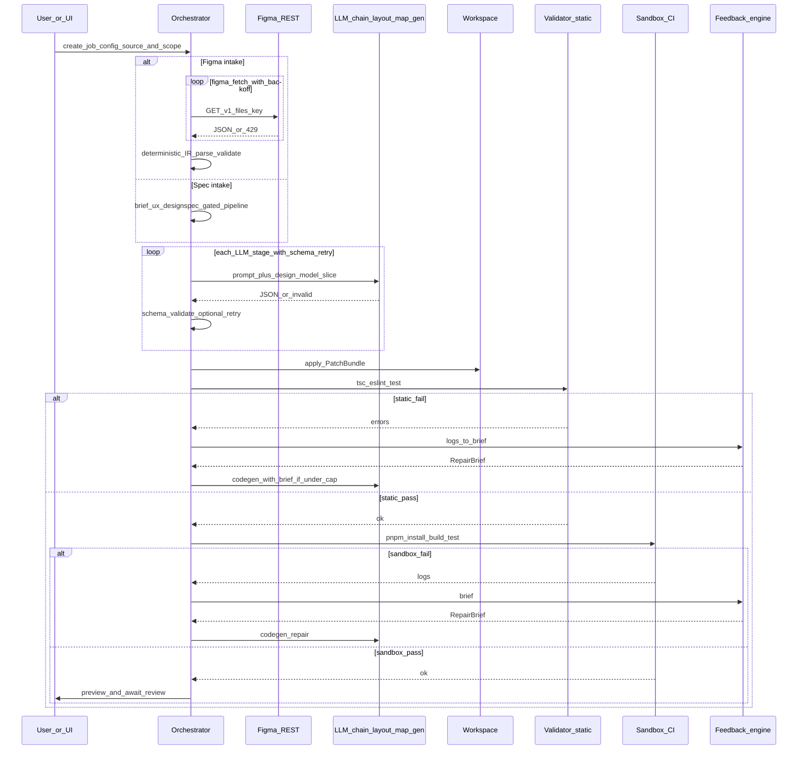
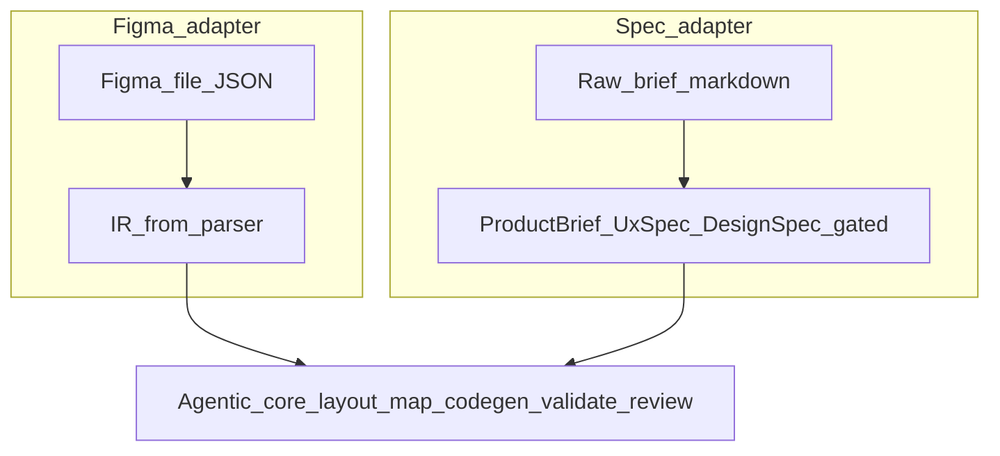

# Agentic coding agent — design intake to production frontend

This repository is **documentation only**: a GitBook-friendly, implementation-oriented guide for building an **agentic coding system**—durable jobs, **LLM stages with schema validation and retries**, **PatchBundle** application, **static checks and sandbox builds**, **repair loops with caps**, and **human-in-the-loop review**—that ships **production-grade frontend code** (this corpus standardizes on **React + TypeScript + Vite**). **Design intake is pluggable:** one supported adapter is **Figma** (`file_key` → IR); another is **requirements-only** work that produces a gated **`DesignSpec`** before codegen ([Chapter 18 — Requirements-only intake](docs/18-greenfield-from-requirements/README.md)). The **shared core** is the same agentic workflow after a normalized **design model** exists.

**You write the product in a separate app repo** (API + worker + templates). The **step-by-step build path** lives in [docs/00-build-track/README.md](docs/00-build-track/README.md): milestones **M0–M10** (core pipeline + optional Figma adapter in **M1**), optional **G0–G10** for spec-led jobs, checklists, and “done when” tests. Use the numbered chapters as deep dives when each milestone points you there.

## Who this is for

- **Beginners and PMs**: you learn the agentic pipeline end-to-end—queues, states, budgets, review—without assuming prior agent-framework experience.  
- **Junior engineers**: you get concrete components, prompts, data shapes, and failure modes so you can implement v1.  
- **Maintainers**: you get scaling, security, cost, and operations guidance for growing the product.

## Visual architecture — topology plus algorithms

Three views work together: **(1)** where subsystems sit, **(2)** the main **control-flow algorithm** (decisions, retries, caps—what you would implement as `while`/`if` in code), **(3)** the **time-ordered** message flow. Constants like `R_figma` (when Figma intake is used), `R_llm`, and `R_repair` are policy knobs (environment or DB).

### 1) Subsystem topology (compact map)

### 2) Main job algorithm (detailed control flow)

Treat this as pseudocode rendered as a graph: each diamond is a branch; each rectangle is a step your orchestrator implements.

**Algorithm notes (maps directly to code structure):**

- **`R_figma`**: max Figma fetch retries on 429/5xx.  
- **`R_llm`**: per-stage schema repair attempts (typically 1 LLM retry after appending `ajv` / Zod errors).  
- **`R_repair`**: max codegen re-entries after static or sandbox failure (global repair budget).  
- **Apply patches (atomic step in the diagram)**: should be transactional (new git worktree or reset on failure) so partial patches never poison the next loop.  
- **Human review gate**: in batch mode you can auto-approve when all checks pass; in product mode you block until UI fires `approve` or `change_request`.

### 3) Time-ordered collaboration (sequence)

Same logic as (2), shown as messages—useful when wiring APIs and workers.

**How the three views relate:** (1) is the module graph; **(2) is what you implement** as the orchestrator state machine; (3) is the same behavior for API and worker design.

### Keeping chapter docs in sync

Diagrams **1–3** above (topology, main job algorithm, sequence) are mirrored for implementers in [docs/02-architecture/README.md](docs/02-architecture/README.md), [docs/03-workflow/README.md](docs/03-workflow/README.md), and [docs/04-agent-design/README.md](docs/04-agent-design/README.md). [docs/08-feedback-loop/README.md](docs/08-feedback-loop/README.md) ties the repair loop to nodes `fbA` / `fbB` → `rep*` → `incR` → `genCall`. **Edit README and those sections together** when the **orchestrator** control flow changes. Intake-specific states and spec-led diagrams live in [docs/18-greenfield-from-requirements/README.md](docs/18-greenfield-from-requirements/README.md).

## Design intake modes (same agentic core)

| Intake | Typical input | See | Build milestones |
|--------|---------------|-----|-------------------|
| **Figma file** | `file_key` + frame | [Chapter 01](docs/01-overview/README.md) → [Chapter 02](docs/02-architecture/README.md); Figma REST in [references](docs/00-references.md) | **M0–M10** ([build track](docs/00-build-track/README.md)) — **M1** is the Figma fetch step |
| **Requirements only** | Goals / prose | [Chapter 18 — Requirements-only intake](docs/18-greenfield-from-requirements/README.md) | **G0–G10** plus shared **M5–M10** patterns ([build track](docs/00-build-track/README.md#g-milestones-requirements-only-intake-g0g10)) |

## Quick start

| Goal | Where to start | Time |
|------|----------------|------|
| **Build the agent (juniors — core path)** | [Roadmap — start to production](docs/00-build-track/roadmap-to-production.md) → [Build track M0–M10](docs/00-build-track/README.md) → [stack and repo layout](docs/00-build-track/stack-and-repo-structure.md) → [http-and-shape-samples](docs/00-build-track/http-and-shape-samples.md) → [example JSON](docs/schemas/README.md) | multi-day to launch |
| **Add requirements-only intake** | [Chapter 18](docs/18-greenfield-from-requirements/README.md) → [G0–G10 milestones](docs/00-build-track/README.md#g-milestones-requirements-only-intake-g0g10) → [example DesignSpec](docs/schemas/design-spec.min.example.json) | plan after core **M6** is stable |
| Understand the product story | [docs/01-overview/README.md](docs/01-overview/README.md) | ~20 min |
| Read the pipeline conceptually | [docs/02-architecture/README.md](docs/02-architecture/README.md) → [docs/03-workflow/README.md](docs/03-workflow/README.md) → [docs/04-agent-design/README.md](docs/04-agent-design/README.md) → [docs/16-context-llm-and-files/README.md](docs/16-context-llm-and-files/README.md) → [docs/05-prompts/README.md](docs/05-prompts/README.md) → [docs/18-greenfield-from-requirements/README.md](docs/18-greenfield-from-requirements/README.md) (spec-led intake) | ~2–4 hours reading |
| Ship safely | [docs/14-security/README.md](docs/14-security/README.md) + [docs/07-sandbox/README.md](docs/07-sandbox/README.md) | ~1 hour |
| Modular prompts and planner-style steps | [docs/05-prompts/modular-prompt-architecture.md](docs/05-prompts/modular-prompt-architecture.md) → [docs/05-prompts/multi-step-orchestration.md](docs/05-prompts/multi-step-orchestration.md) | ~30 min |
| Integrate vs build (sandboxes, gateways, queues) | [docs/17-build-vs-integrate/README.md](docs/17-build-vs-integrate/README.md) | ~20 min |

## How to navigate

- **GitBook sidebar**: open [SUMMARY.md](SUMMARY.md) (this is the table of contents GitBook expects at the repo root). Sections follow **recommended reading order**: build spine → chapters **01–04** and **18** → prompts (**05**) → **16, 06–08** → **09–11, 17** → ops (**12–15**) → reference.  
- **Build track first**: [docs/00-build-track/](docs/00-build-track/) ([roadmap to production](docs/00-build-track/roadmap-to-production.md), [M0–M10 + G0–G10 milestones](docs/00-build-track/README.md), [stack and repo layout](docs/00-build-track/stack-and-repo-structure.md)), [docs/schemas/](docs/schemas/) (example IR / PatchBundle / RepairBrief / DesignSpec JSON).  
- **All chapters**: live under [docs/](docs/) in numbered folders (`01-overview` … `17-build-vs-integrate`, **`18-greenfield-from-requirements`**, plus `00-references`).  
- **Canonical external links**: [docs/00-references.md](docs/00-references.md).

## Simple explanation

Think of the system as an **agentic factory**: durable **jobs**, **bounded** LLM steps with **schema validation**, **atomic** file writes, **sandbox verification**, and **human review** as part of the control loop. **Design** arrives through an **adapter**—for example a **Figma file** (REST + parser → **IR**) or **prose requirements** that mature into a **`DesignSpec`** ([Chapter 18](docs/18-greenfield-from-requirements/README.md)). The **core** after a normalized design model is the same: layout and mapping assistance, **PatchBundle** codegen, static checks, repair caps, preview, approve or change request.

## Deep technical breakdown

**Agentic core (all jobs):** **build a small context package per LLM step** (structured design slice, token list, tiny repo excerpts—not the whole repo—see [docs/16-context-llm-and-files/README.md](docs/16-context-llm-and-files/README.md)) → LLM returns **structured JSON** → validate and **apply atomically** as a **PatchBundle** → **Vite build + tests** in an isolated runner → **diff review** → optional **re-prompt** with validator errors. Async jobs use a **queue** and idempotent steps with **retries** and cost/repair **caps**. **Prompts** use **versioned modules** ([docs/05-prompts/modular-prompt-architecture.md](docs/05-prompts/modular-prompt-architecture.md)); exploratory behavior uses **bounded planner loops** ([docs/05-prompts/multi-step-orchestration.md](docs/05-prompts/multi-step-orchestration.md)); **sandboxes and gateways** are often integrated ([docs/17-build-vs-integrate/README.md](docs/17-build-vs-integrate/README.md)).

**Figma intake (when enabled):** **OAuth or personal access token** → **GET** `/v1/files/:key` → deterministic **IR** build → join the agentic core. Use **exponential backoff** on **429** (`R_figma`).

**Requirements-only intake:** persist **raw brief** → optional **clarification** → schema-valid **`ProductBrief`**, **`UxSpec`**, **`DesignSpec`** with **human approvals** between artifacts ([docs/18-greenfield-from-requirements/README.md](docs/18-greenfield-from-requirements/README.md)) → **`DesignSpec`** drives the same slices the core expects from IR.

## Mermaid diagram

See **Visual architecture — topology plus algorithms** above: subsystem map, **detailed control-flow algorithm** (branching and retries), and **sequence** view. Chapter diagrams in [docs/](docs/) zoom into each stage.

## Real example

**Figma intake:** user shares `https://www.figma.com/design/abc123/MyMarketingSite`; the worker resolves `file_key=abc123`, fetches the document tree, targets frame `Landing`, and emits `src/pages/Landing.tsx` with token-backed styles.

**Spec intake:** a PM submits three paragraphs for a B2B landing page; after **approved** `ProductBrief`, `UxSpec`, and `DesignSpec`, the same worker emits `src/pages/Landing.tsx` from the **`DesignSpec` slice** for route `/`.

## Challenges and pitfalls

- **Unbounded agent loops** without `R_llm`, `R_repair`, and wall-clock caps—cost and trust collapse.  
- Treating the LLM as a **compiler**: it **hallucinates** unless every step has **schema validation** and fixtures.  
- **Skipping human review** on high-stakes jobs—treat `awaiting_review` as part of the **control system**, not paperwork.  
- When using **Figma**: ignoring **auto-layout** vs absolute positioning breaks responsive output; normalize constraints before codegen.

## Tips and best practices

- Version **IR** and **`DesignSpec`** schemas; pin prompts to `schemaVersion`.  
- Log **tokens and step latency** per job for routing and finance.  
- Keep a **human diff review** gate before merging generated code to production.

## What most people miss

The product is the **orchestration contract** (states, caps, artifacts), not any single LLM call. Weak **design normalization**—whether from **IR** or **`DesignSpec`**—hurts JSX quality more than swapping models.
