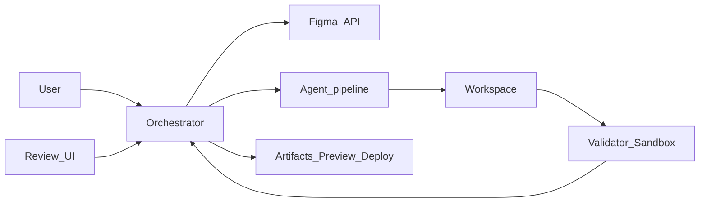
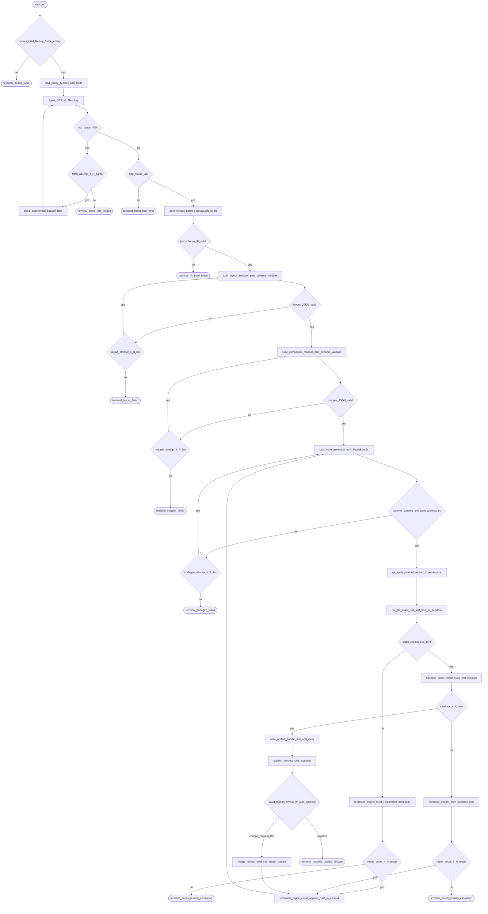
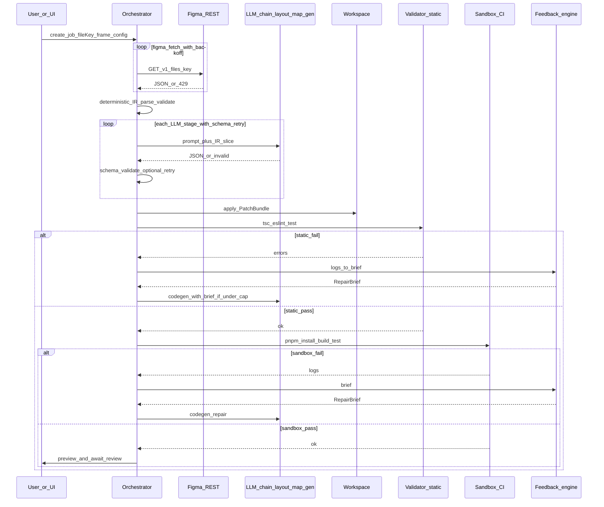

# AI Coding Agent: Figma to Production Website

This repository is **documentation only**: a GitBook-friendly, implementation-oriented guide for building an **AI agent system** that reads **Figma** designs and produces **production-grade frontend code** (this corpus standardizes on **React + TypeScript + Vite**).

**You write the product in a separate app repo** (API + worker + templates). The **step-by-step build path** lives in [docs/00-build-track/README.md](docs/00-build-track/README.md): milestones **M0–M10**, checklists, and “done when” tests. Use the numbered chapters as deep dives when each milestone points you there.

## Who this is for

- **Beginners and PMs**: you learn what the system does end-to-end, without assuming you already know agents or the Figma API.  
- **Junior engineers**: you get concrete components, prompts, data shapes, and failure modes so you can implement v1.  
- **Maintainers**: you get scaling, security, cost, and operations guidance for growing the product.

## Visual architecture — topology plus algorithms

Three views work together: **(1)** where subsystems sit, **(2)** the main **control-flow algorithm** (decisions, retries, caps—what you would implement as `while`/`if` in code), **(3)** the **time-ordered** message flow. Constants like `R_figma`, `R_llm`, `R_repair` are policy knobs (environment or DB).

### 1) Subsystem topology (compact map)

### 2) Main job algorithm (detailed control flow)

Treat this as pseudocode rendered as a graph: each diamond is a branch; each rectangle is a step your orchestrator implements.

**Algorithm notes (maps directly to code structure):**

- **`R_figma`**: max Figma fetch retries on 429/5xx.  
- **`R_llm`**: per-stage schema repair attempts (typically 1 LLM retry after appending `ajv` / Zod errors).  
- **`R_repair`**: max codegen re-entries after static or sandbox failure (global repair budget).  
- **`applyP`**: should be transactional (new git worktree or reset on failure) so partial patches never poison the next loop.  
- **`waitH`**: in batch mode you can auto-approve when all checks pass; in product mode you block until UI fires `approve` or `change_request`.

### 3) Time-ordered collaboration (sequence)

Same logic as (2), shown as messages—useful when wiring APIs and workers.

**How the three views relate:** (1) is the module graph; **(2) is what you implement** as the orchestrator state machine; (3) is the same behavior for API and worker design.

### Keeping chapter docs in sync

Diagrams **§1–§3** above are mirrored for implementers in [docs/02-architecture/README.md](docs/02-architecture/README.md), [docs/03-workflow/README.md](docs/03-workflow/README.md), and [docs/04-agent-design/README.md](docs/04-agent-design/README.md). [docs/08-feedback-loop/README.md](docs/08-feedback-loop/README.md) ties the repair loop to nodes `fbA` / `fbB` → `rep*` → `incR` → `genCall`. **Edit README and those sections together** when the control flow changes.

## Quick start

| Goal | Where to start | Time |
|------|----------------|------|
| **Build the agent (juniors — default path)** | [docs/00-build-track/README.md](docs/00-build-track/README.md) → [stack and repo layout](docs/00-build-track/stack-and-repo-structure.md) → [http-and-shape-samples](docs/00-build-track/http-and-shape-samples.md) → [example JSON](docs/schemas/README.md) | multi-day / weeks |
| Understand the product story | [docs/01-overview/README.md](docs/01-overview/README.md) | ~20 min |
| Read the pipeline conceptually | [docs/03-workflow/README.md](docs/03-workflow/README.md) → [docs/04-agent-design/README.md](docs/04-agent-design/README.md) → [docs/16-context-llm-and-files/README.md](docs/16-context-llm-and-files/README.md) → [docs/05-prompts/README.md](docs/05-prompts/README.md) | ~2–4 hours reading |
| Ship safely | [docs/14-security/README.md](docs/14-security/README.md) + [docs/07-sandbox/README.md](docs/07-sandbox/README.md) | ~1 hour |
| Modular prompts and planner-style steps | [docs/05-prompts/modular-prompt-architecture.md](docs/05-prompts/modular-prompt-architecture.md) → [docs/05-prompts/multi-step-orchestration.md](docs/05-prompts/multi-step-orchestration.md) | ~30 min |
| Integrate vs build (sandboxes, gateways, queues) | [docs/17-build-vs-integrate/README.md](docs/17-build-vs-integrate/README.md) | ~20 min |

## How to navigate

- **GitBook sidebar**: open [SUMMARY.md](SUMMARY.md) (this is the table of contents GitBook expects at the repo root).  
- **Build track first**: [docs/00-build-track/](docs/00-build-track/) (milestones + [stack and repo layout](docs/00-build-track/stack-and-repo-structure.md)), [docs/schemas/](docs/schemas/) (example IR / PatchBundle / RepairBrief JSON).  
- **All chapters**: live under [docs/](docs/) in numbered folders (`01-overview` … `17-build-vs-integrate`, plus `00-references`).  
- **Canonical external links**: [docs/00-references.md](docs/00-references.md).

## Simple explanation

Think of the agent as a **factory line**: on one side you put a **Figma link** and preferences (framework, design tokens); on the other side you get a **zip or git branch** of a website. Between those sides, specialized steps (parse layout, map components, write code, test) run in order, sometimes **more than once**, until quality checks pass or a human says “good enough.”

## Deep technical breakdown

Implementation-wise you typically run: **OAuth or personal access token** to Figma → **GET file JSON** (`GET /v1/files/:key`) → normalize to an **intermediate representation (IR)** → **build a small context package per LLM step** (IR window, token list, tiny repo excerpts—not the whole repo—see [docs/16-context-llm-and-files/README.md](docs/16-context-llm-and-files/README.md)) → LLM returns a **structured PatchBundle** → validate and **apply atomically** to a workspace → **Vite build + tests** in an isolated runner → **diff review** → optional **re-prompt** with validator errors. Async jobs (large files) use a **queue** and idempotent steps with **retries** and backoff on Figma rate limits. **Prompts** should be built from **versioned modules** ([docs/05-prompts/modular-prompt-architecture.md](docs/05-prompts/modular-prompt-architecture.md)); **multi-step** agent behavior needs **bounded planner loops** ([docs/05-prompts/multi-step-orchestration.md](docs/05-prompts/multi-step-orchestration.md)); **sandboxes and gateways** are often integrated rather than rebuilt ([docs/17-build-vs-integrate/README.md](docs/17-build-vs-integrate/README.md)).

## Mermaid diagram

See **Visual architecture — topology plus algorithms** above: subsystem map, **detailed control-flow algorithm** (branching and retries), and **sequence** view. Chapter diagrams in [docs/](docs/) zoom into each stage.

## Real example

User shares `https://www.figma.com/design/abc123/MyMarketingSite`. Your backend resolves `file_key=abc123`, fetches the document tree, extracts a frame named `Landing`, and emits `src/pages/Landing.tsx` plus CSS modules or token-backed styles.

## Challenges and pitfalls

- Treating the LLM as a compiler: it will **hallucinate** missing constraints unless the IR and validators are strict.  
- Ignoring Figma **auto-layout** vs absolute positioning: layout quality collapses on responsive breakpoints.

## Tips and best practices

- Version the **IR schema** and pin prompts to that version.  
- Always keep a **human diff review** step before merging to production.

## What most people miss

The hardest part is not code generation; it is **deterministic layout normalization** before the model writes JSX. Invest there early.
