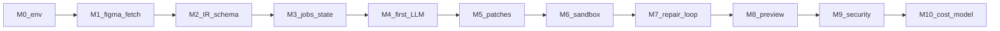
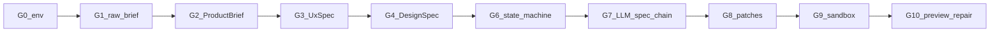

# Build track — implement the agentic coding agent (start here)

## Simple explanation

This page is the **spine** for juniors: you build your own **application repository** (Node/TypeScript service + workers) while this folder stays **documentation only**. Implement the **agentic core** (**M0 → M10**): orchestration, optional **Figma** fetch (**M1**), IR or equivalent design model, LLM stages with validation, **PatchBundle**, sandbox, repair, preview, cost and security. Add the **G0 → G10** milestones in [G milestones: requirements-only intake](#g-milestones-requirements-only-intake-g0g10) when you need jobs that start from **prose** and gated **`DesignSpec`** instead of a file ([Chapter 18](../18-greenfield-from-requirements/README.md)). Each milestone has **micro-steps** (small checkboxes), links into deeper chapters, and a **Done when** test you can actually run. For charter-to-launch ordering, use the **P1.1–P1.22** list in [Roadmap — from project start to production](roadmap-to-production.md).

**Before you sequence milestones**, read [Roadmap — from project start to production](roadmap-to-production.md) for phases **P0–P5** (charter → MVP → alpha → production readiness → launch → operate) and how they align with **M0–M10**.

**Canonical diagrams** (how the whole system fits together) stay in [README.md](../../README.md) and [Chapter 02 — Architecture](../02-architecture/README.md)—do not duplicate them here.

## Deep technical breakdown

### Prerequisites

| Area | You should have |
|------|------------------|
| **Skills** | Basic TypeScript, HTTP APIs, JSON, `git`, terminal comfort |
| **Accounts** | Optional **Figma** token if you ship that adapter; LLM provider billing; for **G** milestones, a sponsor who can **approve** briefs and specs in time |
| **Runtime** | Node.js 20+, `pnpm` or `npm`; Docker (recommended for M6) |
| **LLM** | API key for at least one provider you will call from the server |

### Suggested calendar (indicative)

| Week | Milestones | Focus |
|------|------------|--------|
| 1 | M0–M3 | Skeleton, Figma fetch, IR schema, job state |
| 2 | M4–M6 | First LLM step, patches, sandbox green |
| 3 | M7–M10 | Repair loop, preview, security, cost |

Adjust to your pace; milestones are the source of truth, not the week table.

### Milestone dependency (orientation)



## G milestones: requirements-only intake (G0–G10)

Use **G0–G10** for **requirements-only** intake: the agent drafts **ProductBrief → UxSpec → DesignSpec** with **human approvals**, then joins the same **M5–M8** codegen, sandbox, and review path. Product story and diagrams: [Chapter 18 — Requirements-only intake](../18-greenfield-from-requirements/README.md). Example JSON: [design-spec.min.example.json](../schemas/design-spec.min.example.json).

### Milestone dependency (G0–G10)



You may **merge G2–G4** into fewer PRs while learning; split them before production so approvals stay honest in the DB.

### G0 — Environment (reuse M0)

**Purpose:** Same API shell; job rows record `source: "requirements"` (or your enum).

**Done when:** Same as **M0**, plus one test job created with `source: "requirements"`.

### G1 — Raw brief intake

**Purpose:** Persist unstructured input safely.

**Implement (micro-steps)**

- [ ] **G1.1** Extend `POST /jobs` to accept `source: "requirements"` plus markdown string or `rawBriefId`.  
- [ ] **G1.2** Store raw text in DB or object storage; never echo secrets into logs.  
- [ ] **G1.3** Enforce max length and attachment MIME allowlist if files are allowed.

**Done when:** You can re-read the identical brief after server restart.

### G2 — ProductBrief schema + gate

**Purpose:** First **schema-valid** product artifact.

**Implement (micro-steps)**

- [ ] **G2.1** Add `product-brief.schema.json` (problem, users, non-goals, metrics, compliance flags).  
- [ ] **G2.2** LLM or guided form produces draft; validate; **retry ≤ `R_llm`** on schema errors.  
- [ ] **G2.3** `POST /jobs/:id/brief/approve` and `…/request_changes` (or equivalent) update state.  
- [ ] **G2.4** Golden JSON tests in CI.

**Done when:** Invalid brief JSON cannot reach `drafting_ux` state.

### G3 — UxSpec (information architecture)

**Purpose:** Routes and navigation are agreed before visual intent.

**Implement (micro-steps)**

- [ ] **G3.1** Add `ux-spec.schema.json` (routes, `nav[]`, key flows).  
- [ ] **G3.2** Draft from approved `ProductBrief` only (pass handles, not full chat).  
- [ ] **G3.3** Approval gate; changes loop back with reviewer comment in context.

**Done when:** `UxSpec` validates and sponsor has **one** approved revision on disk.

### G4 — DesignSpec (design intent without Figma)

**Purpose:** Replace Figma IR as the driver for layout/codegen.

**Implement (micro-steps)**

- [ ] **G4.1** Start from [design-spec.min.example.json](../schemas/design-spec.min.example.json); extend fields your codegen needs.  
- [ ] **G4.2** Bump `schemaVersion` when you add breaking fields.  
- [ ] **G4.3** Approval gate before `generating_code`.  
- [ ] **G4.4** Golden fixtures: two different “products” with different route sets.

**Done when:** Layout step consumes **only** `DesignSpec` slices for a job (no hidden prose).

### G5 — Optional visual references

**Purpose:** Mood without pretending pixels are spec.

**Implement (micro-steps)**

- [ ] **G5.1** Store reference image URLs or blobs; virus scan / size cap as your org requires.  
- [ ] **G5.2** Inject **captions or embeddings**, not raw megabytes, into prompts.

**Done when:** References are optional; jobs still work with zero attachments.

### G6 — Job state machine (clarify → spec → code)

**Purpose:** Honest UX and dashboards for long human waits.

**Implement (micro-steps)**

- [ ] **G6.1** Implement states from [Chapter 03](../03-workflow/README.md) spec-led variant (`clarifying`, `awaiting_brief_approval`, …).  
- [ ] **G6.2** Cap clarification rounds with constant `R_clarify`.  
- [ ] **G6.3** Persist reviewer comments structured for the next draft.

**Done when:** No manual DB edits to move between states.

### G7 — LLM spec chain (bounded)

**Purpose:** Same discipline as **M4**, applied to brief/spec drafts.

**Implement (micro-steps)**

- [ ] **G7.1** One prompt module per artifact; versioned assembly like [modular prompt architecture](../05-prompts/modular-prompt-architecture.md).  
- [ ] **G7.2** Log tokens per stage; attribute cost on job row.  
- [ ] **G7.3** Unit tests with **mock** LLM returning invalid JSON once, then valid.

**Done when:** CI proves schema-retry path for at least **ProductBrief**.

### G8 — PatchBundle apply (reuse M5)

**Done when:** Same **Done when** as **M5** on a job that used **requirements-only** intake.

### G9 — Sandbox (reuse M6)

**Done when:** Same as **M6**.

### G10 — Preview + repair + review (reuse M7–M8)

**Done when:** Same as **M7–M8** (`RepairBrief`, review decisions).

### After G10

Apply **M9** and **M10** to **all** job kinds. **Requirements-only** intake increases **prompt-injection** and **claims** risk—review [Chapter 14 — Security](../14-security/README.md) for untrusted user text.

### Suggested app repo layout (yours, not this docs repo)

```text
apps/orchestrator/     # HTTP API: create job, poll status
packages/ir-schema/    # JSON Schema + types for IR + PatchBundle
packages/worker/       # job runner: fetch → IR → LLM → validate → apply
templates/vite-starter/ # zippable Vite+React+TS used inside sandbox
```

Names are illustrative; keep **IR schema** and **worker** as separate packages early.

For **full stack choices** (Node, DB, queue, Docker, where each package lives) and a **complete monorepo tree**, read [Stack and repository structure](stack-and-repo-structure.md).

---

## M0 — Environment and empty orchestrator

**Purpose:** You can run a service locally and store a fake “job” row.

**Read first:** [README.md](../../README.md) (diagrams), [Chapter 02 — Architecture](../02-architecture/README.md) (containers).

**Implement (micro-steps)**

- [ ] **M0.1** Create a new git repo for your app (separate from this docs repo).
- [ ] **M0.2** Add `package.json`, TypeScript config, and a single `src` entry file.
- [ ] **M0.3** Add TypeScript HTTP server (Express/Fastify/Hono—pick one); listen on configurable port.
- [ ] **M0.4** Add `GET /health` → `200 { "ok": true }`.
- [ ] **M0.5** Choose persistence (in-memory for spike, Postgres for real); add connection module if DB.
- [ ] **M0.6** Add `POST /jobs` → creates `job` with `id`, `status: "received"`.
- [ ] **M0.7** Add `GET /jobs/:id` → returns same shape as stored row.
- [ ] **M0.8** Add minimal logging (request id optional) and `README` “how to run”.

**Done when:** `curl` against local server returns health and can create/read a job.

**Common failures:** [Chapter 12](../12-common-issues/README.md) — port conflicts, CORS (defer until you add a browser UI in M8).

---

## M1 — Figma token and raw file fetch

**Purpose:** Prove you can download real Figma JSON for a `file_key`.

**Read first:** [docs/00-references.md](../00-references.md) (Figma REST links), [http-and-shape-samples.md](http-and-shape-samples.md).

**Implement (micro-steps)**

- [ ] **M1.1** Add `.env.example` with `FIGMA_ACCESS_TOKEN` (no real values); document in README.
- [ ] **M1.2** Load token from env in server bootstrap; fail fast if missing when Figma route is used.
- [ ] **M1.3** Implement server-side `GET https://api.figma.com/v1/files/:key` with correct auth header per Figma docs.
- [ ] **M1.4** Map HTTP errors to logged `status` + body snippet (redacted); return 502/400 to client as appropriate.
- [ ] **M1.5** On success, persist **raw JSON** (or `document` subtree) keyed by `fileKey` + `version` if present.
- [ ] **M1.6** Implement **429 backoff** (sleep + retry capped)—see algorithm in [README](../../README.md).
- [ ] **M1.7** Add one manual or scripted test that logs retry behavior (can mock 429 in dev).

**Done when:** For a real file key you control, your job or debug endpoint returns HTTP 200 and stored JSON length is non-zero.

**Common failures:** wrong token scope, wrong `file_key`, rate limits—log status code and `retry-after` if present.

---

## M2 — Deterministic IR v0 + JSON Schema

**Purpose:** Stop sending raw Figma to the LLM; emit **your** IR.

**Read first:** [Chapter 02](../02-architecture/README.md), [Chapter 04](../04-agent-design/README.md), [schemas/README.md](../schemas/README.md).

**Implement (micro-steps)**

- [ ] **M2.1** Sketch IR shape on paper or ADR; list fields you need for first codegen step.
- [ ] **M2.2** Add `ir.schema.v0.json` (JSON Schema) for minimal tree: `frameId`, `children[]`, `type`, `name`, `layoutMode`, `fills` summary—or your own v0 fields.
- [ ] **M2.3** Generate or hand-write TypeScript types from schema (optional but helps).
- [ ] **M2.4** Write **pure functions** `figmaDocument → IR` (no LLM) for happy path only.
- [ ] **M2.5** Commit a **golden input** snippet (subset of real Figma JSON) in `fixtures/`.
- [ ] **M2.6** Validate mapper output with Ajv/Zod in unit test.
- [ ] **M2.7** Wire schema validation into CI on every PR.

**Done when:** Golden fixture: given a committed `fixture.figma.document.json` snippet, `toIR()` output validates against schema in a unit test.

**Common failures:** schema too loose (junk passes) or too tight (valid nodes rejected)—iterate with one real file.

---

## M3 — Job table and state machine

**Purpose:** Long work runs async; UI/worker polls status.

**Read first:** [Chapter 03 — Workflow](../03-workflow/README.md).

**Implement (micro-steps)**

- [ ] **M3.1** List allowed states and valid transitions; document in `docs/workflow-states.md` (or README).
- [ ] **M3.2** Add DB columns / enum for states: at least `received`, `fetching_figma`, `building_ir`, `generating_code`, `running_checks`, `repairing`, `awaiting_review`, `completed`, `failed`.
- [ ] **M3.3** Implement enqueue path: `POST /jobs` sets `received` and queues work.
- [ ] **M3.4** Worker loop: dequeue job → run step → transition state → persist.
- [ ] **M3.5** On exception, persist `failed` + structured `error_code` + message (no manual DB edits).
- [ ] **M3.6** (Recommended) Idempotency key on `(fileKey, frameId, promptVersion)` to avoid duplicate work.

**Done when:** Forced failure in a step sets `failed` with `error_code`; happy path reaches `completed` without manual DB edits.

**Common failures:** lost updates on crash—use DB transactions or a workflow engine later ([Chapter 17](../17-build-vs-integrate/README.md)).

---

## M4 — First LLM step + schema retry

**Purpose:** One LLM call returns **structured JSON** you validate.

**Read first:** [Chapter 05 — Prompts](../05-prompts/README.md), [Modular prompt architecture](../05-prompts/modular-prompt-architecture.md), [Chapter 16](../16-context-llm-and-files/README.md).

**Implement (micro-steps)**

- [ ] **M4.1** Implement **PromptRecipe** assembler (even if modules are single files at first).
- [ ] **M4.2** Pick **one** step only (e.g. `layout_analyzer` stub returning a trivial `LayoutTree` for one frame).
- [ ] **M4.3** Add JSON post-processor: strip markdown fences if model wraps output.
- [ ] **M4.4** Validate model JSON against step schema; collect Ajv/Zod errors as strings.
- [ ] **M4.5** Append schema errors to prompt and **retry ≤ `R_llm`** on validation failure.
- [ ] **M4.6** Log token usage per attempt (even rough) for later M10.

**Done when:** Integration test: mock LLM returns invalid JSON once, valid JSON second time → job progresses.

**Common failures:** model returns markdown fences—strip in post-processor before `JSON.parse`.

---

## M5 — PatchBundle apply + git worktree

**Purpose:** Model output becomes real files **atomically**.

**Read first:** [Chapter 16](../16-context-llm-and-files/README.md), [schemas/patch-bundle.min.example.json](../schemas/patch-bundle.min.example.json).

**Implement (micro-steps)**

- [ ] **M5.1** Define `PatchBundle` TypeScript type + JSON Schema; align with [patch-bundle example](../schemas/patch-bundle.min.example.json).
- [ ] **M5.2** Accept `PatchBundle` JSON in worker; reject paths outside `src/` (or your allowlist).
- [ ] **M5.3** Clone or copy `templates/vite-starter` into a **fresh worktree** per job.
- [ ] **M5.4** Apply patches in deterministic order; validate UTF-8 / size limits per file.
- [ ] **M5.5** On any validation or IO failure, discard worktree and fail job cleanly.

**Done when:** After apply, `src/App.tsx` (or chosen file) contains expected string from fixture PatchBundle in a test.

**Common failures:** partial writes—never commit half a bundle.

---

## M6 — Sandbox: `pnpm test` / `pnpm build`

**Purpose:** Prove generated code compiles in isolation.

**Read first:** [Chapter 07 — Sandbox](../07-sandbox/README.md), [Chapter 17](../17-build-vs-integrate/README.md).

**Implement (micro-steps)**

- [ ] **M6.1** Write `Dockerfile` (or Job spec) that receives worktree path / artifact ref.
- [ ] **M6.2** In container: install deps with `pnpm install --frozen-lockfile` (or `npm ci`).
- [ ] **M6.3** Run `pnpm build`; capture stdout/stderr with size cap.
- [ ] **M6.4** Run `pnpm test` if you have tests; treat failures like build failures.
- [ ] **M6.5** Map exit code to job row; store log pointer or truncated blob.
- [ ] **M6.6** Document CPU/memory limits and timeout for sandbox step.

**Done when:** CI or local script: known-good template passes; intentionally broken patch fails with non-zero exit captured in job row.

**Common failures:** network egress during install—document allowlist policy ([Chapter 14](../14-security/README.md)).

---

## M7 — Feedback loop and repair caps

**Purpose:** Validator errors become a **RepairBrief** and re-enter codegen with **budget**.

**Read first:** [Chapter 08 — Feedback loop](../08-feedback-loop/README.md), [schemas/repair-brief.min.example.json](../schemas/repair-brief.min.example.json).

**Implement (micro-steps)**

- [ ] **M7.1** Parse `tsc` / `eslint` output into structured `{ file, line, code, message }[]`.
- [ ] **M7.2** Map diagnostics into `RepairBrief` shape; validate against schema / example.
- [ ] **M7.3** Increment `repair_count` each repair cycle; persist on job row.
- [ ] **M7.4** When under cap, enqueue another codegen pass with brief attached.
- [ ] **M7.5** When at `R_repair`, set `failed` or `awaiting_review` per your product policy.

**Done when:** Inject a known TS error; second codegen attempt clears it in automated test (or reaches cap deterministically).

**Common failures:** oscillation—carry `nonGoals` in brief ([feedback-engine prompt](../05-prompts/feedback-engine.md)).

---

## M8 — Preview and minimal review hook

**Purpose:** Human sees output; can send `change_request`.

**Read first:** [Chapter 03](../03-workflow/README.md) (`awaiting_review`), [README algorithm](../../README.md) node `waitH`.

**Implement (micro-steps)**

- [ ] **M8.1** After successful build, publish artifact: static `dist/` URL or short-lived preview tunnel for dev.
- [ ] **M8.2** Persist preview URL + expiry on job row for client polling.
- [ ] **M8.3** Transition job to `awaiting_review` when preview is ready.
- [ ] **M8.4** Implement `POST /jobs/:id/review` with `{ "decision": "approve" | "change_request", "text": "..." }`.
- [ ] **M8.5** On `approve`, move to `completed`; on `change_request`, append to repair queue with cap from M7.

**Done when:** Manual test: approve transitions to `completed`; change request bumps `repairing` and re-runs bounded pipeline.

---

## M9 — Security baseline

**Purpose:** Avoid shipping an open proxy.

**Read first:** [Chapter 14 — Security](../14-security/README.md).

**Implement (micro-steps)**

- [ ] **M9.1** Audit logs for accidental secret leakage; add redaction middleware.
- [ ] **M9.2** Ensure LLM output cannot invoke shell; only structured patch path applies files.
- [ ] **M9.3** Tighten path allowlist for PatchBundle and any file reads in worker.
- [ ] **M9.4** Add authentication for job APIs if not localhost-only.
- [ ] **M9.5** Add rate limit on `POST /jobs` (per IP or per API key).
- [ ] **M9.6** Document sandbox egress policy; verify container matches policy.

**Done when:** Checklist in Ch 14 satisfied for your threat model (document gaps explicitly).

---

## M10 — Model routing and cost caps

**Purpose:** Control spend and quality as traffic grows.

**Read first:** [Chapter 09](../09-model-selection/README.md), [Chapter 15](../15-cost-optimization/README.md).

**Implement (micro-steps)**

- [ ] **M10.1** Add config map: step name → model id + max output tokens.
- [ ] **M10.2** Log tokens in + out per step; aggregate on job row.
- [ ] **M10.3** Estimate USD per job from token counts; compare to configured `max_usd`.
- [ ] **M10.4** When over cap mid-pipeline, abort with `failed` + `error_code: budget` (or your code).
- [ ] **M10.5** Expose last week’s cost per successful job in dashboard or export (even CSV).

**Done when:** Load test or script proves a runaway job is cut off and status reflects `failed` with `error_code: budget`.

---

## Mermaid diagram

The dependency chart above is the primary diagram for this page.

## Real example

After **M5–M6**, a job for file key `abc` and frame `Hero` should produce a downloadable zip or git ref where `pnpm build` succeeded— even if the UI is ugly; **M8** makes it reviewable.

## Challenges and pitfalls

- Starting with **codegen before IR**—you will rewrite everything; follow order M2 before M4.  
- Skipping **M6**—you will ship broken TSX to humans.

## Tips and best practices

- Keep **one golden Figma file** your whole team uses for fixtures.  
- Tag releases in your app repo when you complete M4, M6, M8—those are demo milestones.

## What most people miss

**M3 (state machine) before M4 (LLM)**—if you invert, you cannot replay or debug failed generations reliably.
