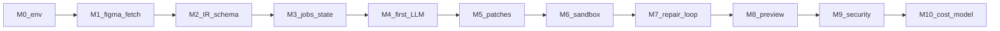

# Build track — implement the Figma-to-code agent (start here)

## Simple explanation

This page is the **spine** for juniors: you build your own **application repository** (Node/TypeScript service + workers) while this folder stays **documentation only**. Follow **M0 → M10** in order. Each milestone has a checklist, links into deeper chapters, and a **Done when** test you can actually run.

**Canonical diagrams** (how the whole system fits together) stay in [README.md](../../README.md) and [Chapter 02 — Architecture](../02-architecture/README.md)—do not duplicate them here.

## Deep technical breakdown

### Prerequisites

| Area | You should have |
|------|------------------|
| **Skills** | Basic TypeScript, HTTP APIs, JSON, `git`, terminal comfort |
| **Accounts** | Figma account; ability to create a **Personal access token** (or OAuth app for production later) |
| **Runtime** | Node.js 20+, `pnpm` or `npm`; Docker (recommended for M6) |
| **LLM** | API key for at least one provider you will call from the server |

### Suggested calendar (indicative)

| Week | Milestones | Focus |
|------|------------|--------|
| 1 | M0–M3 | Skeleton, Figma fetch, IR schema, job state |
| 2 | M4–M6 | First LLM step, patches, sandbox green |
| 3 | M7–M10 | Repair loop, preview, security, cost |

Adjust to your pace; milestones are the source of truth, not the week table.

### Milestone dependency (orientation)



### Suggested app repo layout (yours, not this docs repo)

```text
apps/orchestrator/     # HTTP API: create job, poll status
packages/ir-schema/    # JSON Schema + types for IR + PatchBundle
packages/worker/       # job runner: fetch → IR → LLM → validate → apply
templates/vite-starter/ # zippable Vite+React+TS used inside sandbox
```

Names are illustrative; keep **IR schema** and **worker** as separate packages early.

For **full stack choices** (Node, DB, queue, Docker, where each package lives) and a **complete monorepo tree**, read [Stack and repository structure](stack-and-repo-structure.md).

---

## M0 — Environment and empty orchestrator

**Purpose:** You can run a service locally and store a fake “job” row.

**Read first:** [README.md](../../README.md) (diagrams), [Chapter 02 — Architecture](../02-architecture/README.md) (containers).

**Implement**

- [ ] Create a new git repo for your app (separate from this docs repo).
- [ ] Add TypeScript HTTP server (Express/Fastify/Hono—pick one).
- [ ] Add `GET /health` → `200 { "ok": true }`.
- [ ] Add `POST /jobs` → creates `job` with `id`, `status: "received"` (in-memory or Postgres).
- [ ] Add `GET /jobs/:id` → returns job JSON.

**Done when:** `curl` against local server returns health and can create/read a job.

**Common failures:** [Chapter 12](../12-common-issues/README.md) — port conflicts, CORS (defer until you add a browser UI in M8).

---

## M1 — Figma token and raw file fetch

**Purpose:** Prove you can download real Figma JSON for a `file_key`.

**Read first:** [docs/00-references.md](../00-references.md) (Figma REST links), [http-and-shape-samples.md](http-and-shape-samples.md).

**Implement**

- [ ] Store `FIGMA_ACCESS_TOKEN` in env (never commit).
- [ ] Implement `GET https://api.figma.com/v1/files/:key` from server with `X-Figma-Token` or `Authorization: Bearer …` per Figma docs.
- [ ] On success, persist **raw JSON** (or `document` subtree) keyed by `fileKey` + `version` if present.
- [ ] Implement **429 backoff** (sleep + retry capped)—see algorithm in [README](../../README.md).

**Done when:** For a real file key you control, your job or debug endpoint returns HTTP 200 and stored JSON length is non-zero.

**Common failures:** wrong token scope, wrong `file_key`, rate limits—log status code and `retry-after` if present.

---

## M2 — Deterministic IR v0 + JSON Schema

**Purpose:** Stop sending raw Figma to the LLM; emit **your** IR.

**Read first:** [Chapter 02](../02-architecture/README.md), [Chapter 04](../04-agent-design/README.md), [schemas/README.md](../schemas/README.md).

**Implement**

- [ ] Define `ir.schema.v0.json` (JSON Schema) for a minimal tree: `frameId`, `children[]`, `type`, `name`, `layoutMode`, `fills` summary—or your own v0 fields.
- [ ] Write **pure functions** `figmaDocument → IR` (no LLM) for happy path only.
- [ ] Validate output with Ajv/Zod in CI and at runtime.

**Done when:** Golden fixture: given a committed `fixture.figma.document.json` snippet, `toIR()` output validates against schema in a unit test.

**Common failures:** schema too loose (junk passes) or too tight (valid nodes rejected)—iterate with one real file.

---

## M3 — Job table and state machine

**Purpose:** Long work runs async; UI/worker polls status.

**Read first:** [Chapter 03 — Workflow](../03-workflow/README.md).

**Implement**

- [ ] Map states to your DB: at least `received`, `fetching_figma`, `building_ir`, `generating_code`, `running_checks`, `repairing`, `awaiting_review`, `completed`, `failed`.
- [ ] Worker loop: dequeue job → transition states → persist errors as structured JSON.
- [ ] Idempotency key on `(fileKey, frameId, promptVersion)` optional but recommended.

**Done when:** Forced failure in a step sets `failed` with `error_code`; happy path reaches `completed` without manual DB edits.

**Common failures:** lost updates on crash—use DB transactions or a workflow engine later ([Chapter 17](../17-build-vs-integrate/README.md)).

---

## M4 — First LLM step + schema retry

**Purpose:** One LLM call returns **structured JSON** you validate.

**Read first:** [Chapter 05 — Prompts](../05-prompts/README.md), [Modular prompt architecture](../05-prompts/modular-prompt-architecture.md), [Chapter 16](../16-context-llm-and-files/README.md).

**Implement**

- [ ] Implement **PromptRecipe** assembler (even if modules are single files at first).
- [ ] Pick **one** step only (e.g. `layout_analyzer` stub returning a trivial `LayoutTree` for one frame).
- [ ] Append schema errors to prompt and **retry ≤ `R_llm`** on validation failure.

**Done when:** Integration test: mock LLM returns invalid JSON once, valid JSON second time → job progresses.

**Common failures:** model returns markdown fences—strip in post-processor before `JSON.parse`.

---

## M5 — PatchBundle apply + git worktree

**Purpose:** Model output becomes real files **atomically**.

**Read first:** [Chapter 16](../16-context-llm-and-files/README.md), [schemas/patch-bundle.min.example.json](../schemas/patch-bundle.min.example.json).

**Implement**

- [ ] Accept `PatchBundle` JSON; validate paths under `src/`.
- [ ] Clone or copy `templates/vite-starter` into a **fresh worktree** per job.
- [ ] Apply patches; on any failure, discard worktree.

**Done when:** After apply, `src/App.tsx` (or chosen file) contains expected string from fixture PatchBundle in a test.

**Common failures:** partial writes—never commit half a bundle.

---

## M6 — Sandbox: `pnpm test` / `pnpm build`

**Purpose:** Prove generated code compiles in isolation.

**Read first:** [Chapter 07 — Sandbox](../07-sandbox/README.md), [Chapter 17](../17-build-vs-integrate/README.md).

**Implement**

- [ ] Docker (or k8s Job) runs `pnpm install --frozen-lockfile` (or `npm ci`) then `pnpm build` and `pnpm test` if you have tests.
- [ ] Stream logs to object storage or DB with size cap.

**Done when:** CI or local script: known-good template passes; intentionally broken patch fails with non-zero exit captured in job row.

**Common failures:** network egress during install—document allowlist policy ([Chapter 14](../14-security/README.md)).

---

## M7 — Feedback loop and repair caps

**Purpose:** Validator errors become a **RepairBrief** and re-enter codegen with **budget**.

**Read first:** [Chapter 08 — Feedback loop](../08-feedback-loop/README.md), [schemas/repair-brief.min.example.json](../schemas/repair-brief.min.example.json).

**Implement**

- [ ] Build `RepairBrief` from `tsc`/`eslint` lines (structured).
- [ ] Increment `repair_count`; stop at `R_repair` and set `failed` or `awaiting_review` for human.

**Done when:** Inject a known TS error; second codegen attempt clears it in automated test (or reaches cap deterministically).

**Common failures:** oscillation—carry `nonGoals` in brief ([feedback-engine prompt](../05-prompts/feedback-engine.md)).

---

## M8 — Preview and minimal review hook

**Purpose:** Human sees output; can send `change_request`.

**Read first:** [Chapter 03](../03-workflow/README.md) (`awaiting_review`), [README algorithm](../../README.md) node `waitH`.

**Implement**

- [ ] Publish `dist/` or dev server URL (even ephemeral ngrok-style for dev).
- [ ] `POST /jobs/:id/review` with `{ "decision": "approve" | "change_request", "text": "..." }` merges into repair path.

**Done when:** Manual test: approve transitions to `completed`; change request bumps `repairing` and re-runs bounded pipeline.

---

## M9 — Security baseline

**Purpose:** Avoid shipping an open proxy.

**Read first:** [Chapter 14 — Security](../14-security/README.md).

**Implement**

- [ ] Secrets only in env/KMS; redact logs; path allowlist; no arbitrary shell from LLM.
- [ ] Rate limit public job creation; authenticate callers if exposed beyond localhost.

**Done when:** Checklist in Ch 14 satisfied for your threat model (document gaps explicitly).

---

## M10 — Model routing and cost caps

**Purpose:** Control spend and quality as traffic grows.

**Read first:** [Chapter 09](../09-model-selection/README.md), [Chapter 15](../15-cost-optimization/README.md).

**Implement**

- [ ] Log tokens per step; env-configurable model IDs per step.
- [ ] Per-job `max_usd` or token ceiling; fail job gracefully when exceeded.

**Done when:** Load test or script proves a runaway job is cut off and status reflects `failed` with `error_code: budget`.

---

## Mermaid diagram

The dependency chart above is the primary diagram for this page.

## Real example

After **M5–M6**, a job for file key `abc` and frame `Hero` should produce a downloadable zip or git ref where `pnpm build` succeeded— even if the UI is ugly; **M8** makes it reviewable.

## Challenges and pitfalls

- Starting with **codegen before IR**—you will rewrite everything; follow order M2 before M4.  
- Skipping **M6**—you will ship broken TSX to humans.

## Tips and best practices

- Keep **one golden Figma file** your whole team uses for fixtures.  
- Tag releases in your app repo when you complete M4, M6, M8—those are demo milestones.

## What most people miss

**M3 (state machine) before M4 (LLM)**—if you invert, you cannot replay or debug failed generations reliably.
