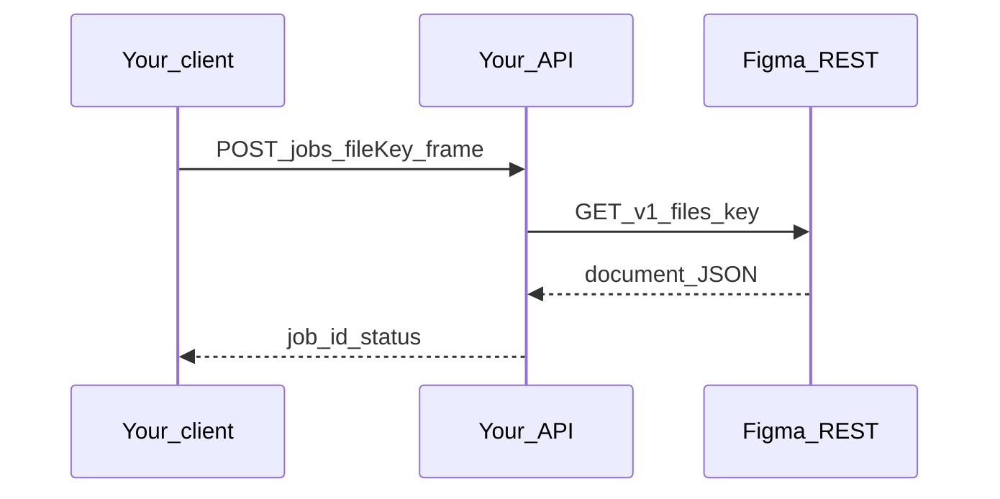

# HTTP and payload shape samples

## Simple explanation

This page collects **copy-pastable shapes** for talking to **Figma** and for the **HTTP API you implement** in your own app. Replace placeholders with real values. This docs repo does not run your server.

**Neighbors:** [Build track](README.md) · [Stack and repository structure](stack-and-repo-structure.md) · [Chapter 16 — Context, LLM I/O, files](../16-context-llm-and-files/README.md) · [schemas](../schemas/README.md)

## Deep technical breakdown

- Figma REST uses `GET /v1/files/:key` for the document tree; images use a separate endpoint (see [docs/00-references.md](../00-references.md)).  
- Your orchestrator should expose **job** resources: create job (inputs), poll job (status + artifacts), optional review POST.  
- LLM outputs should match **PatchBundle** and human/validator inputs merge into **RepairBrief**—see JSON files under [docs/schemas](../schemas/README.md).

## Mermaid diagram



## Real example

### Figma: fetch file JSON (Personal access token)

Replace `YOUR_TOKEN` and `FILE_KEY`.

```bash
curl -sS \
  -H "X-Figma-Token: YOUR_TOKEN" \
  "https://api.figma.com/v1/files/FILE_KEY" \
  | head -c 2000
```

Use full response in code; `head` is only to peek from terminal. Parse JSON and persist `document`, `components`, `styles` as needed.

### Figma: handle rate limit (conceptual)

If status is `429`, read `Retry-After` if present, sleep with jitter, retry up to `R_figma` ([README algorithm](../../README.md)).

### Your API: create job (example shape)

Request:

```json
{
  "fileKey": "FILE_KEY",
  "frameId": "123:456",
  "stack": "vite-react-ts",
  "promptVersion": "2026-04-01"
}
```

Response:

```json
{
  "jobId": "01JABC123",
  "status": "received",
  "pollUrl": "/jobs/01JABC123"
}
```

### Your API: poll job (example shape)

```json
{
  "jobId": "01JABC123",
  "status": "running_checks",
  "step": "sandbox",
  "errors": [],
  "artifactUrl": null
}
```

### Your API: review decision (example shape)

```json
{
  "decision": "change_request",
  "text": "Reduce vertical padding in Hero on md breakpoint"
}
```

## Challenges and pitfalls

- Pasting real tokens into chat logs—**rotate** if leaked.  
- Returning multi-megabyte Figma JSON to a browser—**stream** or store server-side and return a handle only.

## Tips and best practices

- Log **Figma `version`** string when present so you can cache file JSON safely.  
- Return **structured `errors[]`** from your API, not only a string message.

## What most people miss

`GET /files/:key` is one call; **images** and **large teams** add more calls—budget time in M1, not only in codegen.
