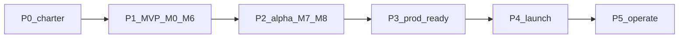
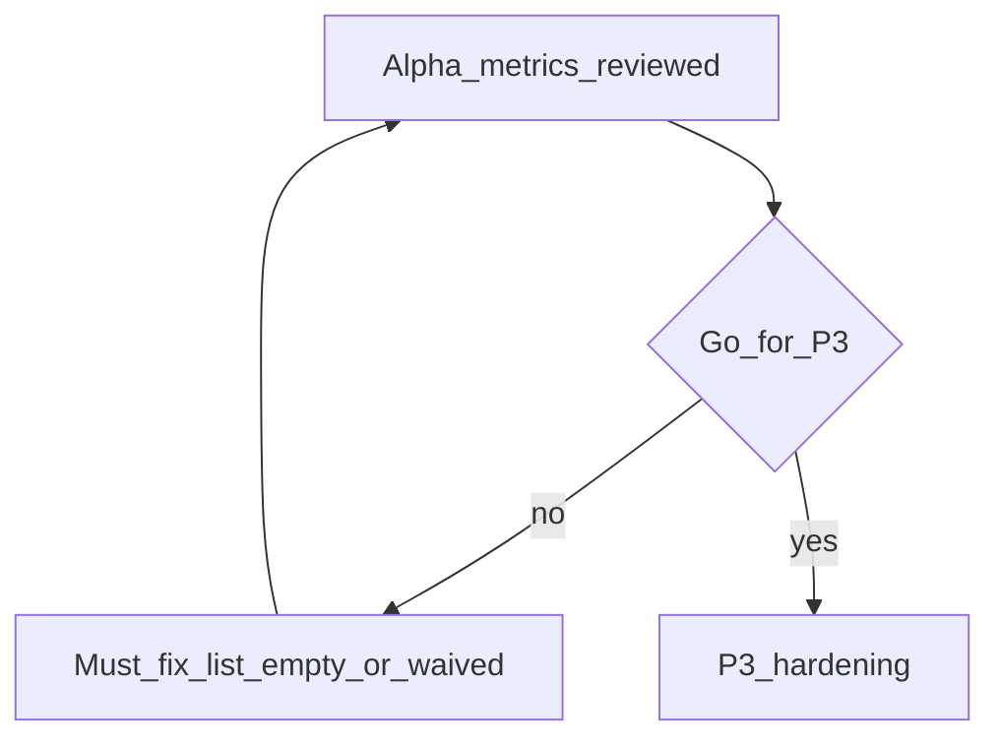

# Roadmap — from project start to production (detailed)

## Simple explanation

This page is the **delivery roadmap**: what happens **before** deep coding, how it lines up with **technical milestones M0–M10** ([Build track](README.md)), and what you must add so the system is **production-grade** (staging, security, observability, launch, and ongoing operation). Phases are broken into **numbered micro-steps** (P0.1, P1.8, …) so you can ship progress in small slices. Share it with PMs and tech leads so **“done”** means the same thing to everyone.

**Neighbors:** [Build track](README.md) · [Stack and repository structure](stack-and-repo-structure.md) · [HTTP samples](http-and-shape-samples.md) · [Chapter 10 — Deployment](../10-deployment/README.md) · [Chapter 11 — Scaling](../11-scaling/README.md) · [Chapter 14 — Security](../14-security/README.md) · [Chapter 15 — Cost optimization](../15-cost-optimization/README.md)

## Deep technical breakdown

### How phases map to engineering milestones

| Phase | Intent | Build-track milestones | Chapters to lean on |
|-------|--------|------------------------|---------------------|
| **P0 — Charter** | Agree problem, users, metrics, scope | Before / overlapping **M0** | [Overview](../01-overview/README.md) |
| **P1 — Local MVP** | Prove pipeline on laptop | **M0–M6** | [Architecture](../02-architecture/README.md), [Workflow](../03-workflow/README.md), [Sandbox](../07-sandbox/README.md), [Code generation](../06-code-generation/README.md) |
| **P2 — Product alpha** | Real files, real users, feedback UX | **M7–M8** + auth stub | [Feedback loop](../08-feedback-loop/README.md), [Workflow](../03-workflow/README.md) |
| **P3 — Production readiness** | Safe, observable, cost-bounded | **M9–M10** + platform work | [Security](../14-security/README.md), [Cost](../15-cost-optimization/README.md), [Scaling](../11-scaling/README.md), [Model selection](../09-model-selection/README.md) |
| **P4 — Launch** | Controlled go-live | Release + comms | [Deployment](../10-deployment/README.md) |
| **P5 — Operate** | Keep quality under change | Continuous | [Common issues](../12-common-issues/README.md), [Best practices](../13-best-practices/README.md) |

**Rule of thumb:** **M0–M10** = “the product works.” **P3–P5** = “we can run it for customers without heroics.”

### Micro-step index (read top to bottom)

Each label is one **small** unit of work—roughly a PR, a doc section, or a half-day spike. Check them off in order within a phase; you can parallelize only where notes say so.

| Block | Range | Theme |
|-------|--------|--------|
| Charter | **P0.1–P0.12** | Sponsor, PRD, references, risks, sign-off |
| Local MVP | **P1.1–P1.22** | Maps to **M0–M6** on the [build track](README.md) |
| Alpha | **P2.1–P2.10** | Staging, auth, feedback, cohort, policy |
| Prod hardening | **P3.1–P3.28** | Security, SLOs, observability, release, cost |
| Launch | **P4.1–P4.12** | Week playbook + comms + rollback |
| Operate | **P5.1–P5.8** | On-call, postmortems, roadmap v2 |

Details are in the **Micro-steps** subsection under each phase below.

---

## P0 — Charter and discovery

### Objectives

- One sentence **product outcome** everyone repeats without debate.  
- **Primary user** (e.g. product designer + tech lead reviewer) and **secondary** (PM).  
- **Non-goals** for v1 (e.g. no Figma plugin, no full design-system learning).  
- **Compliance triggers** (PII in files? customer data residency?—if yes, loop legal early).

### Entry criteria

- Sponsor named; engineering + design time allocated (even part-time).

### Micro-steps (P0.1–P0.12)

- [ ] **P0.1** Name sponsor and confirm engineering + design time (even part-time).  
- [ ] **P0.2** Write the **one-sentence product outcome**; paste it at the top of the PRD draft.  
- [ ] **P0.3** Document **primary user** (e.g. designer + tech reviewer) and **secondary** (e.g. PM).  
- [ ] **P0.4** List **non-goals** for v1 (what you will explicitly not build).  
- [ ] **P0.5** Run **compliance triggers**: PII in files? residency?—if yes, schedule legal touchpoint.  
- [ ] **P0.6** PRD part 1: **problem** + **user stories** (keep under one page).  
- [ ] **P0.7** PRD part 2: pick **3–5 measurable success metrics** (use table below as starting point; add targets).  
- [ ] **P0.8** **Figma reference set:** agree on 2–3 real files that must convert well for demos.  
- [ ] **P0.9** **ADR — stack:** Node/TS, DB, queue, sandbox—link [Stack and repository structure](stack-and-repo-structure.md).  
- [ ] **P0.10** **Risk register:** list top 10 (API limits, model drift, layout ambiguity, …) with **owner** and **mitigation date**.  
- [ ] **P0.11** **Definition of alpha vs prod** (user caps, billing, support expectations).  
- [ ] **P0.12** **Sign-off meeting:** sponsor approves PRD + metrics + non-goals; create empty app repo so **M0** can start.

### Example success metrics (pick and refine)

| Metric | Example target | How you measure |
|--------|----------------|------------------|
| Time to first preview | p95 under 15 min from job submit | job timestamps in DB |
| Build pass rate | ≥ 90% on golden fixtures | CI + sandbox stats |
| Human edit distance | median under N lines changed after agent (subjective until you instrument) | optional diff survey |
| Cost per successful job | ceiling in USD | token + sandbox minutes |

### Exit criteria (start P1)

- Sign-off from sponsor on PRD + metrics + non-goals.  
- Repo created and **M0** can start ([Build track](README.md)).

---

## P1 — Local MVP (M0–M6)

### Objectives

- One **happy path**: Figma file + frame → stored IR → codegen → **green** `pnpm build` (and tests if you have them) in sandbox.  
- **No** multi-tenant billing required yet.

### Entry criteria

- P0 signed; secrets available in dev only.

### Milestone-by-milestone (what “done” means for the roadmap)

| Milestone | Roadmap meaning | Exit signal |
|-----------|-----------------|---------------|
| **M0** | Service skeleton | Health + create/read job API works |
| **M1** | Figma ingestion proven | Raw JSON persisted; 429 backoff tested once |
| **M2** | IR is real | Schema + `toIR()` golden test passes |
| **M3** | Async job story | State transitions without manual DB edits |
| **M4** | LLM is real | One validated JSON step in CI (mock or real) |
| **M5** | Files on disk | PatchBundle apply is atomic in worktree |
| **M6** | Trust but verify | Docker (or chosen sandbox) returns exit 0 on template + generated patch |

### Micro-steps (P1.1–P1.22) — maps to M0–M6

**M0 — skeleton**

- [ ] **P1.1** Create app git repo (separate from docs); initial `README` with how to run.  
- [ ] **P1.2** Add TypeScript HTTP framework; single entrypoint runs locally.  
- [ ] **P1.3** Implement `GET /health` → `200`.  
- [ ] **P1.4** Implement `POST /jobs` + `GET /jobs/:id` with persisted row (memory or DB).

**M1 — Figma**

- [ ] **P1.5** Store `FIGMA_ACCESS_TOKEN` in env; document in runbook (never commit).  
- [ ] **P1.6** Call Figma files API for a known `file_key`; log status on failure.  
- [ ] **P1.7** Persist raw JSON (or `document` subtree) keyed by file/version.  
- [ ] **P1.8** Implement 429 / `Retry-After` backoff; manually test once with logging.

**M2 — IR**

- [ ] **P1.9** Author minimal `ir.schema.v0.json` and check into repo.  
- [ ] **P1.10** Implement `figmaDocument → IR` pure function for happy path.  
- [ ] **P1.11** Validate IR in unit test with golden fixture; wire Ajv/Zod in CI.

**M3 — jobs**

- [ ] **P1.12** Define job state enum + DB column(s); document transitions.  
- [ ] **P1.13** Worker dequeues job and advances states on success path.  
- [ ] **P1.14** Forced failure in one step sets `failed` + structured `error_code` (no manual DB edits).

**M4 — LLM**

- [ ] **P1.15** Implement prompt assembly for **one** step (stub OK).  
- [ ] **P1.16** Call provider from server; redact secrets in logs.  
- [ ] **P1.17** Validate JSON against step schema; retry ≤ `R_llm` on validation failure (CI with mock).

**M5 — patches**

- [ ] **P1.18** Accept `PatchBundle`; validate paths under allowlist.  
- [ ] **P1.19** Clone/copy template into fresh worktree per job.  
- [ ] **P1.20** Apply bundle atomically; discard worktree on any failure.

**M6 — sandbox**

- [ ] **P1.21** Container (or chosen sandbox) runs install + `pnpm build` (+ tests if any).  
- [ ] **P1.22** Capture exit code + logs on pass and fail; link result to job row.

**Wrap-up for P1 (product evidence)**

- [ ] Record **demo** (short Loom) on reference Figma files.  
- [ ] **Runbook draft:** worker locally, env vars, how to reset DB.  
- [ ] **CI on every PR:** typecheck + unit tests + schema validation on fixtures ([schemas](../schemas/README.md)).

### Exit criteria (start P2)

- Sponsor accepts demo on **reference Figma** files.  
- Known **P1 limitations** listed (e.g. “single frame only”, “no OAuth yet”)—becomes P2/P3 backlog.

---

## P2 — Product alpha (M7–M8 + thin platform)

### Objectives

- **Real users** (even internal) on a **shared** deployment; capture structured feedback.  
- **Repair loop** and **human review** exercised under messy real designs.

### Entry criteria

- M6 green; basic auth or VPN in front of alpha URL.

### Micro-steps (P2.1–P2.10)

- [ ] **P2.1** Provision **alpha URL** (subdomain) and point DNS / tunnel.  
- [ ] **P2.2** Deploy app to alpha with **separate DB** from any prod-like env.  
- [ ] **P2.3** Smoke test: create job end-to-end on alpha with reference file.  
- [ ] **P2.4** **Auth:** API keys per team or SSO stub; document issuance + **rotation**.  
- [ ] **P2.5** **Feedback UX:** approve path persists decision; `change_request` stores text + taxonomy if you use one.  
- [ ] **P2.6** Ensure payloads are **`RepairBrief`-compatible** where applicable ([Chapter 16](../16-context-llm-and-files/README.md)).  
- [ ] **P2.7** **Cohort plan:** list wave-1 users, dates, and how they report issues.  
- [ ] **P2.8** **Triage SLA** published (e.g. P0 24h, P1 72h) and channel (Slack / Linear).  
- [ ] **P2.9** **Data policy:** retention for jobs, raw Figma JSON, logs; export/delete if required.  
- [ ] **P2.10** **Instrumentation:** P0 metrics visible (even spreadsheet) from alpha traffic.

### Exit criteria (start P3)

- **Target metrics** from P0 measured on alpha traffic (even rough).  
- **Top failure modes** documented with tickets (layout, fonts, assets, perf).  
- **Go / no-go** meeting: list must-fix for prod vs post-launch backlog.

---

## P3 — Production readiness (platform + M9–M10 depth)

### Objectives

- Same behavior in **staging ≈ prod**; **observable**; **bounded** cost and abuse; **recoverable** failures.

### Entry criteria

- Alpha go/no-go = “go” with explicit must-fix list completed or waived in writing.

### 3A — Security and compliance (P3.1–P3.8)

- [ ] **P3.1** Draft **threat model** bullets: token theft, prompt injection via names, sandbox escape, SSRF ([Chapter 14](../14-security/README.md)).  
- [ ] **P3.2** Review threat model with second engineer; file as 1-pager in repo.  
- [ ] **P3.3** Move secrets to **vault/KMS**; remove from env files in CI where possible.  
- [ ] **P3.4** Document **secret rotation**; verify CI logs redact tokens.  
- [ ] **P3.5** **Least privilege** IAM for workers, DB, object storage—review with infra owner.  
- [ ] **P3.6** Add **dependency audit** gate (`pnpm audit` / OSV) on release branch.  
- [ ] **P3.7** If customer files: **encryption at rest** decision + implementation checklist.  
- [ ] **P3.8** Retention + **access audit** fields for sensitive objects (if storing customer data).

### 3B — Reliability and SLOs (P3.9–P3.14)

- [ ] **P3.9** Brainstorm candidate SLOs; narrow to **2–4** with definitions.  
- [ ] **P3.10** For each SLO: pick measurement source (logs, metrics, traces).  
- [ ] **P3.11** Write **error budget** policy (what you do when budget burns).  
- [ ] **P3.12** Document **idempotency** keys for webhooks and job retries.  
- [ ] **P3.13** Implement idempotency in code where gaps exist.  
- [ ] **P3.14** Run **load test** script; record N at breaking point ([Chapter 11](../11-scaling/README.md)).

### 3C — Observability (P3.15–P3.20)

- [ ] **P3.15** Add **structured log** fields: `jobId`, `step`, `durationMs`, tokens if applicable.  
- [ ] **P3.16** Expose **metrics:** queue depth, job state counts, LLM cost estimate, sandbox duration.  
- [ ] **P3.17** Build **dashboard** with above metrics for staging + prod.  
- [ ] **P3.18** (Optional) **OpenTelemetry** trace across API → worker → sandbox.  
- [ ] **P3.19** Define **alert rules:** queue age, failure spike, hourly cost threshold.  
- [ ] **P3.20** Wire alerts to on-call channel; test with synthetic spike on staging.

### 3D — Release engineering (P3.21–P3.24)

- [ ] **P3.21** **Staging promotion** rule: tagged builds only; changelog template ([Deployment](../10-deployment/README.md)).  
- [ ] **P3.22** **Migrations** playbook: expand/contract, backup before migrate, rollback test.  
- [ ] **P3.23** **Feature flags** for risky pipeline steps; document default-safe values.  
- [ ] **P3.24** **Rollback drill** on staging: previous image + pinned prompt bundle.

### 3E — Cost and capacity (P3.25–P3.28)

- [ ] **P3.25** Per-tenant **budget** knobs + global ceiling ([Chapter 15](../15-cost-optimization/README.md)).  
- [ ] **P3.26** **Model routing** table: step → model → max tokens ([Chapter 09](../09-model-selection/README.md)).  
- [ ] **P3.27** **Capacity spreadsheet:** workers × concurrency vs expected daily jobs.  
- [ ] **P3.28** Review capacity vs load test results; adjust or schedule scale work.

### Exit criteria (start P4)

- **Production exit checklist** below is 100% checked or every gap has a named owner + date.  
- **Dry run:** full job on staging with production-like data size.  
- **Incident simulation:** kill worker mid-job → job ends `failed` or resumes per design; postmortem template filled once.

---

## P4 — Launch

### Objectives

- Move default traffic (or first customer cohort) to **prod** with **rollback** rehearsed.

### Entry criteria

- P3 complete; legal/comms sign-off if applicable.

### Launch week playbook (condensed)

| When | Action |
|------|--------|
| T-7d | Freeze risky deps; run full regression on staging. |
| T-3d | Announce internal launch window; verify on-call roster. |
| T-1d | Verify backups, feature flags default-safe, dashboards green. |
| T0 | Promote build; smoke test `POST /jobs` + one golden file; monitor 2h actively. |
| T+1d | Review metrics vs SLO; triage new issues. |
| T+7d | Retrospective; move leftovers to P5 backlog. |

### Micro-steps (P4.1–P4.12)

- [ ] **P4.1** T-7d: **freeze** risky dependency upgrades; merge only fixes.  
- [ ] **P4.2** T-7d: run **full regression** on staging; log failures as blockers.  
- [ ] **P4.3** T-3d: **announce** launch window internally; confirm comms owner.  
- [ ] **P4.4** T-3d: verify **on-call roster** + escalation phone / Slack.  
- [ ] **P4.5** T-1d: verify **backups** completed successfully.  
- [ ] **P4.6** T-1d: confirm **feature flags** default-safe; dashboards green.  
- [ ] **P4.7** T0: **promote** build to prod (or first cohort).  
- [ ] **P4.8** T0: **smoke** `POST /jobs` + one golden file; assign active monitor for 2h.  
- [ ] **P4.9** T+1d: compare **metrics vs SLO**; open tickets for regressions.  
- [ ] **P4.10** T+7d: **retrospective**; move carry-over items to P5 backlog.  
- [ ] **P4.11** **Release notes** published (users + ops).  
- [ ] **P4.12** **Rollback command** documented and **re-tested** on staging this cycle.

### Exit criteria (start P5)

- No **sev-1** open; SLOs within budget for 48–72h (choose window).

---

## P5 — Operate and improve

### Objectives

- Keep the system **safe and useful** as Figma files, models, and traffic change.

### Cadence (suggested)

| Cadence | Activity |
|---------|----------|
| Weekly | Review error clusters, cost per job, top slow steps. |
| Monthly | Prompt / IR schema drift review; update golden fixtures. |
| Quarterly | Dependency major upgrades; security pen-test or automated deep scan. |

### Micro-steps (P5.1–P5.8)

- [ ] **P5.1** Expand **on-call runbook:** paging paths, escalation ladder.  
- [ ] **P5.2** Document **“disable LLM”** or degrade switch; test once on staging.  
- [ ] **P5.3** Adopt **blameless postmortem** template in repo.  
- [ ] **P5.4** Run first real or **tabletop** postmortem; track action items to closure.  
- [ ] **P5.5** Weekly triage: top **error clusters** from last 7 days.  
- [ ] **P5.6** Monthly: **prompt / IR drift** review; refresh golden fixtures.  
- [ ] **P5.7** Quarterly: **dependency / security** deep pass scheduled.  
- [ ] **P5.8** Publish **roadmap v2** from alpha + prod learnings.

---

## Production exit checklist (expanded)

Use as a **release gate** document; copy into your app repo as `docs/launch-checklist.md` and check off with names/dates.

**Release and environments**

- [ ] Staging mirrors prod **versions** (Node, DB, Redis, model IDs).  
- [ ] Promotion is **scripted** or pipeline-only (no manual kubectl edit for normal path).  
- [ ] **Rollback** verified on staging at least once per major release.

**Security**

- [ ] Secrets in vault/KMS; rotation runbook.  
- [ ] AuthN on public APIs; rate limits; IP allowlist if needed.  
- [ ] Sandbox **egress policy** documented and enforced.  
- [ ] Third-party subprocessors listed (LLM vendor, hosting, Figma).

**Reliability**

- [ ] SLOs + dashboards + alerts wired.  
- [ ] Backups automated; **restore drill** done once per quarter (schedule it now).  
- [ ] Queue/worker failure modes tested (poison message, DLQ).

**Data**

- [ ] Retention periods for raw Figma JSON, logs, artifacts.  
- [ ] GDPR/CCPA-style requests path if you store PII (even emails in logs).

**Cost**

- [ ] Per-job and global caps; alert before hard stop.  
- [ ] Finance-visible report: cost per successful job last week.

**People**

- [ ] On-call rotation with backup.  
- [ ] Owner for Figma API changes and LLM vendor deprecations.

---

### Suggested calendar (still indicative)

| Span | Phases | Notes |
|------|--------|--------|
| Weeks 1–3 | P0 + P1 (M0–M6) | Tight if part-time; extend P1 before alpha if quality weak |
| Weeks 4–6 | P2 | Longer alpha if Figma variety is high |
| Weeks 7–10 | P3 | Security + observability often dominate |
| Week 11+ | P4–P5 | Launch when checklist green |

---

## Mermaid diagram

### Phase sequence

### Gate between alpha and hardening

## Real example

**P0:** PRD states p95 preview under 15 min on 3 reference files; non-goal “no animation codegen.”  
**P2:** 12 designers in Slack channel; `change_request` taxonomy (layout vs copy vs bug).  
**P3:** Staging on `https://agent-staging.example.com`; Grafana board `Job pipeline`; ADR for switching sandbox from Docker to hosted if load exceeds threshold X.  
**P4:** Tuesday 10:00 promote; rollback command is `helm rollback agent 1` (example only).  
**P5:** Every Monday 30m triage of `failed` jobs by `error_code`.

## Challenges and pitfalls

- **Calendar launch** without checklist completion—reversible only with reputation damage.  
- **Skipping restore drills**—first real outage discovers backups never worked.  
- **Silent scope growth** during P3 (“just one more model”) without error budget discussion.

## Tips and best practices

- Keep a **single living doc** for production checklist (your repo), link here for methodology.  
- Tag **releases** with both **app version** and **prompt bundle version**.  
- Run a **game day** before P4: engineer breaks staging on purpose; on-call practices response.

## What most people miss

**Alpha success** is not “users liked the demo”; it is **measurable signal** on the same metrics you will use in prod. If you do not measure in P2, you cannot defend a launch date in P4.
