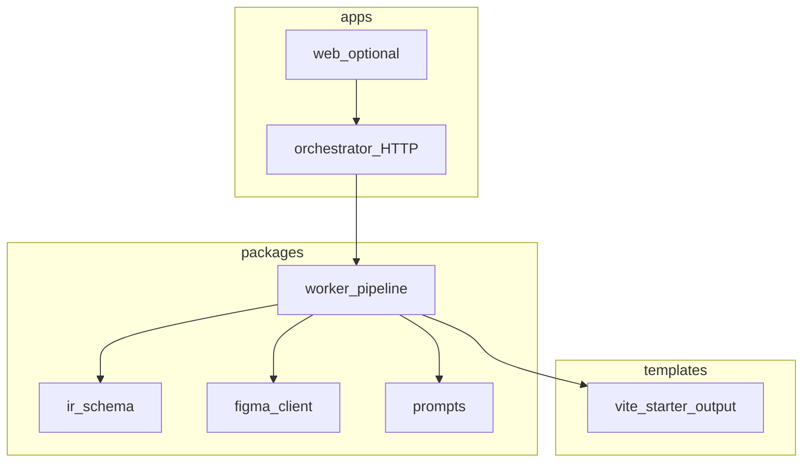

# Stack and repository structure (for your app repo)

## Simple explanation

This page names the **default technology choices** for the **service you build** (the Figma-to-code agent), and shows a **concrete folder layout** so juniors know what to create in their own git repository. The **generated website** is still **React + TypeScript + Vite** (see [README.md](../../README.md)); the **agent platform** is mostly **Node + TypeScript** talking to Figma, a database, and an LLM.

**Neighbors:** [Build track](README.md) · [Chapter 17 — Build vs integrate](../17-build-vs-integrate/README.md) · [Chapter 07 — Sandbox](../07-sandbox/README.md)

## Deep technical breakdown

### Recommended stack (opinionated default)

| Layer | Default choice | Role |
|-------|----------------|------|
| **Runtime** | Node.js **20 LTS** | Orchestrator API, workers, scripts |
| **Language** | **TypeScript** (strict mode) | Shared types across API, worker, IR |
| **Package manager** | **pnpm** + **pnpm workspaces** | One monorepo for `apps/*` and `packages/*` |
| **HTTP API** | **Fastify** or **Hono** (pick one team-wide) | `POST /jobs`, `GET /jobs/:id`, webhooks |
| **Persistence** | **PostgreSQL** + **Drizzle** or **Prisma** | Jobs, state, artifact metadata; use **SQLite** only for local throwaway v0 |
| **Queue / async** | **BullMQ** + **Redis**, or **Temporal**, or in-process queue for **M0–M3** only | Run long steps off the HTTP thread |
| **LLM access** | Vendor **SDK** or HTTP to a **gateway** ([Chapter 17](../17-build-vs-integrate/README.md)) | Chat + JSON mode / tool calling per provider |
| **Schema validation** | **Zod** and/or **Ajv** (JSON Schema) | IR, `PatchBundle`, `RepairBrief`, `PlanStep[]` |
| **Sandbox** | **Docker** image running your `templates/vite-starter` | `pnpm install` / `build` / `test` ([Chapter 07](../07-sandbox/README.md)) |
| **Generated product** | **Vite + React + TypeScript**, **CSS Modules** + design tokens | Matches the rest of this documentation corpus |

**Not** the default for v1 (add later if needed): Kubernetes operators, custom hypervisors, multi-region active-active.

### Monorepo layout (full example)

Create a **new repository** (not this docs repo) with a layout like:

```text
your-figma-agent/                 # root
├── package.json                  # private: true, workspaces: ["apps/*","packages/*","templates/*"]
├── pnpm-workspace.yaml
├── tsconfig.base.json            # shared TS options; paths if you use project references
├── .env.example                  # FIGMA_ACCESS_TOKEN, DATABASE_URL, OPENAI_API_KEY, REDIS_URL, …
├── docker/
│   └── sandbox.Dockerfile        # image used in M6: Node + pnpm, non-root user, optional egress policy
├── apps/
│   ├── orchestrator/             # HTTP API: health, jobs CRUD, optional review webhook
│   │   ├── package.json
│   │   └── src/
│   │       ├── index.ts          # server bootstrap
│   │       ├── routes/jobs.ts    # POST/GET /jobs
│   │       └── config.ts         # env parsing (zod)
│   └── web/                      # optional: minimal UI for M8 (Vite+React or Next—keep thin)
│       ├── package.json
│       └── src/
├── packages/
│   ├── ir-schema/                # JSON Schema files + generated types; used by worker + tests
│   │   ├── schemas/
│   │   │   ├── ir.v0.json
│   │   │   └── patch-bundle.v2.json
│   │   └── src/index.ts          # exports validators
│   ├── figma-client/             # GET file, GET images, backoff, typed responses (thin wrapper)
│   ├── worker/                   # dequeue job → pipeline steps → update DB → trigger sandbox
│   │   ├── package.json
│   │   └── src/
│   │       ├── pipeline.ts       # orchestrates M1–M7 steps
│   │       ├── llm/              # per-step clients + prompt assembly
│   │       └── sandbox-runner.ts # spawns Docker or calls hosted API
│   ├── prompts/                  # modular prompt markdown / YAML ([modular prompt doc](../05-prompts/modular-prompt-architecture.md))
│   └── shared/                   # logger, errors, small utils shared by orchestrator + worker
├── templates/
│   └── vite-starter/             # copied or mounted into sandbox; lockfile committed
│       ├── package.json
│       ├── vite.config.ts
│       └── src/…
├── fixtures/                       # golden Figma JSON snippets + expected IR (tests)
└── .github/
    └── workflows/
        └── ci.yml                # typecheck, test, validate fixtures against schemas
```

**Why split `apps/orchestrator` and `packages/worker`:** web requests stay fast; heavy work moves to a worker process or container you can scale independently.

### Environment variables (starter list)

| Variable | Used by |
|----------|---------|
| `FIGMA_ACCESS_TOKEN` | `figma-client` |
| `DATABASE_URL` | orchestrator + worker |
| `REDIS_URL` | queue (if used) |
| `OPENAI_API_KEY` / provider equivalents | `packages/worker` LLM calls |
| `SANDBOX_IMAGE` | worker Docker runner |

Document every variable in `README.md` of **your** app repo; never commit `.env`.

## Mermaid diagram



## Real example

Root `package.json` workspaces snippet:

```json
{
  "name": "figma-agent-monorepo",
  "private": true,
  "scripts": {
    "dev": "pnpm --filter orchestrator dev",
    "worker": "pnpm --filter worker start"
  }
}
```

## Challenges and pitfalls

- Putting **LLM calls inside the HTTP process** at scale—move to **worker** early.  
- One giant `packages/worker/src/index.ts`—split by **pipeline step** files before M5.

## Tips and best practices

- Commit **`templates/vite-starter/pnpm-lock.yaml`** so sandbox installs are reproducible.  
- Use the same **Node major** in Dockerfile as in `.nvmrc` / `engines` in package.json.

## What most people miss

**`packages/ir-schema` is the contract** between Figma ingestion, LLM steps, and tests—invest in it before writing a lot of worker code.
