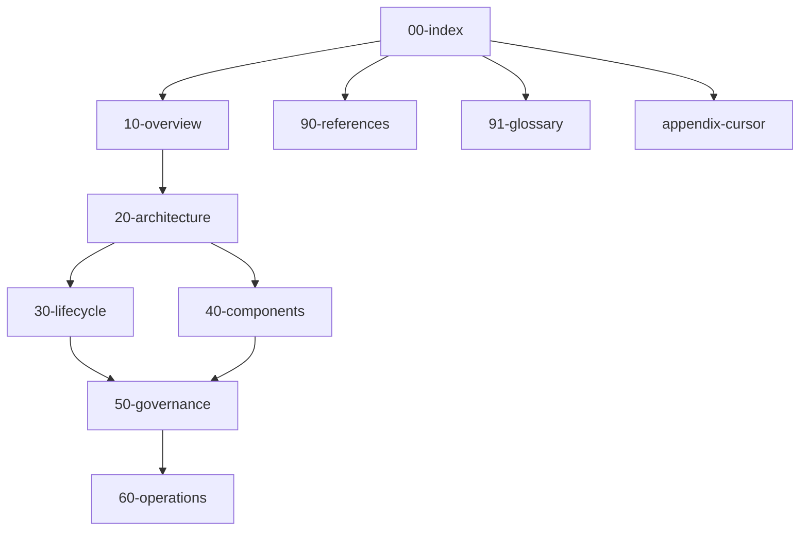

# Documentation map

This page is the **single entry map** for the AI coding agent design corpus. Every page ends with a **See also** block linking up, sideways, and down.

## Doc tree

## All pages

| Doc | One-line purpose |
|-----|------------------|
| [10-overview.md](10-overview.md) | What an AI coding agent is; actors, context, and [pipeline logic](10-overview.md#pipeline-logic) |
| [20-architecture.md](20-architecture.md) | Containers, boundaries, sequences at system level |
| [30-lifecycle.md](30-lifecycle.md) | Perceive → plan → act → verify loop and states |
| [40-components.md](40-components.md) | Subsystems and how they plug together |
| [50-governance.md](50-governance.md) | Permissions, abuse cases, human gates |
| [60-operations.md](60-operations.md) | Observability, cost, evals, release of behavior |
| [90-references.md](90-references.md) | External proof links (vendors, protocol, standards) |
| [91-glossary.md](91-glossary.md) | Terms with backlinks to first definitions |
| [appendix-cursor.md](appendix-cursor.md) | Cursor mapping: rules, skills, hooks, MCP |

Project entry points: [README.md](../README.md), [RULES.md](../RULES.md).

## Reading paths

### ~30 minutes (executive)

1. [10-overview.md](10-overview.md) — full read  
2. [20-architecture.md](20-architecture.md) — skim diagrams only  

### ~2 hours (builder)

1. [10-overview.md](10-overview.md)  
2. [20-architecture.md](20-architecture.md)  
3. [30-lifecycle.md](30-lifecycle.md)  
4. [40-components.md](40-components.md)  
5. [91-glossary.md](91-glossary.md) — bookmark for later  

### ~2 hours (safety and operations)

1. [20-architecture.md](20-architecture.md) — trust boundaries section  
2. [50-governance.md](50-governance.md)  
3. [60-operations.md](60-operations.md)  
4. [90-references.md](90-references.md) — OWASP and vendor tool docs  

### Deep dive (full corpus)

Read numeric order `10` → `60`, then `90`–`91`, then [appendix-cursor.md](appendix-cursor.md).

## Cross-link conventions

- **Relative paths** from the current file: pages in `docs/` link as `[title](NN-name.md)`; link to repo root as `[title](../README.md)`.
- **First use of glossary terms**: link once to [91-glossary.md](91-glossary.md) per document, then plain text.
- **Proof for external claims**: add or reuse a row in [90-references.md](90-references.md); prose links to that hub where helpful.
- **Mermaid**: node IDs without spaces; quote edge labels that contain punctuation; no custom `style` blocks ([RULES.md](../RULES.md)).

## See also

- [README.md](../README.md) — project purpose and quick paths  
- [RULES.md](../RULES.md) — normative editing and agent rules  
- [10-overview.md](10-overview.md) — start the technical narrative  
