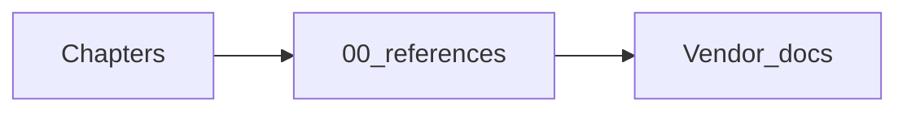

# External references (canonical links)

## Simple explanation

This page is a **link hub** so chapters stay readable and you still have proof for external behavior. For **implementation order**, milestones, **stack**, **repo layout**, and **roadmap to production**, use [Roadmap to production](../00-build-track/roadmap-to-production.md), [Build track](../00-build-track/README.md), [Stack and repository structure](../00-build-track/stack-and-repo-structure.md), and [HTTP samples](../00-build-track/http-and-shape-samples.md).

## Deep technical breakdown

Prefer linking here from other docs instead of scattering URLs; when APIs have breaking changes, update **one row** and add a short note in commit messages.

### Figma platform

| Topic | URL |
|-------|-----|
| REST API introduction | https://www.figma.com/developers/api |
| Get file JSON | https://www.figma.com/developers/api#get-files-endpoint |
| Images API | https://www.figma.com/developers/api#get-images-endpoint |
| OAuth / auth | https://www.figma.com/developers/api#access-tokens |

### Frontend stack (this repo’s default)

| Topic | URL |
|-------|-----|
| Vite | https://vitejs.dev/guide/ |
| React | https://react.dev/learn |
| TypeScript | https://www.typescriptlang.org/docs/ |

### Security standards

| Topic | URL |
|-------|-----|
| OWASP Top 10 for LLM Applications | https://owasp.org/www-project-top-10-for-large-language-model-applications/ |
| NIST AI RMF (organizational framing) | https://www.nist.gov/itl/ai-risk-management-framework |

### Optional ecosystem (agent infrastructure)

Pointers for **integrations** discussed in [Chapter 17 — Build vs integrate](../17-build-vs-integrate/README.md); verify license and data policy before adoption.

| Topic | URL |
|-------|-----|
| Docker docs | https://docs.docker.com/ |
| OpenTelemetry | https://opentelemetry.io/docs/ |
| Temporal (durable workflows) | https://docs.temporal.io/ |
| LiteLLM (multi-provider gateway) | https://docs.litellm.ai/docs/ |

## Mermaid diagram

## Real example

When implementing images, start at Figma **Get images** docs, then cross-check query params (`format`, `scale`) against your worker logs.

## Challenges and pitfalls

- Old blog posts drift; prefer **official** docs.  
- Some features exist only in **Enterprise** tiers—note limitations.

## Tips and best practices

- Pin **API versions** in your HTTP client and document upgrade playbooks.

## What most people miss

Figma’s file JSON can be **very large**—pagination and partial tree strategies are documented across multiple guide pages; read performance notes alongside schema.
