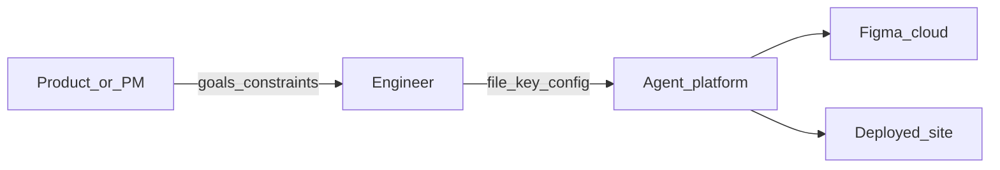

# Chapter 01 — Overview

**Build track:** if you are implementing the system, start with [Roadmap — start to production](../00-build-track/roadmap-to-production.md), then [Milestones M0–M10 and G0–G10](../00-build-track/README.md) and [Stack and repository structure](../00-build-track/stack-and-repo-structure.md); this chapter is the product story.

## Simple explanation

You are building an **agentic coding system**: it runs **long jobs** with clear **states**, uses **LLMs** for structured steps (layout, mapping, codegen), writes **PatchBundles** into a real repo, validates in **sandbox**, and loops on **repair budgets**—with **humans** in the loop for approval. **Design** can enter as a **Figma file** (REST + parser → **IR**) or as **prose** that matures into a gated **`DesignSpec`** ([Chapter 18 — Requirements-only intake](../18-greenfield-from-requirements/README.md)). The **downstream** path to working **React** is the same idea: a normalized **design model**, then code, then verification.

### Prerequisites (before you code)

- **TypeScript** and **HTTP** basics; comfortable reading JSON.  
- Optional: **Figma** file + **personal access token** (or OAuth later) if you use that adapter. For **requirements-only** jobs, a sponsor who can **approve** briefs and specs within your SLA.  
- **Node 20+** and **Docker** (recommended before sandbox milestone **M6** in the [build track](../00-build-track/README.md)).

### Out of scope for v1 (defer)

- Pixel-perfect match to every Figma plugin effect.  
- Full design-system inference across hundreds of components.  
- Multi-tenant billing and SSO—add after **M10** when the core pipeline is stable.

**Neighbors**: [Build track](../00-build-track/README.md) · [Chapter 02 — Architecture](../02-architecture/README.md) · [Chapter 03 — Workflow](../03-workflow/README.md) · [Chapter 18 — Requirements-only intake](../18-greenfield-from-requirements/README.md) · [Chapter 16 — Context, LLM I/O, files](../16-context-llm-and-files/README.md)

## Deep technical breakdown

A production system includes: **identity** and **policy**, **design intake** (e.g. **Figma REST** + deterministic **IR** build, and/or **brief → `DesignSpec`** with gates—[Chapter 18](../18-greenfield-from-requirements/README.md)), **agent workers** (schema-bound LLM steps), **workspace writes** (atomic patches), **verification** (typecheck, lint, tests in **sandbox**), and **iteration** (repair loops with caps, human **change requests**). When **Figma** is used, its REST API returns a **document tree** (`DOCUMENT` → `CANVAS` → frames) with `layoutMode`, `fills`, `strokes`, and `children` you normalize **before** codegen. When **Figma** is not used, the same normalization discipline applies to **`DesignSpec`** fields instead of node geometry.

## Mermaid diagram

Who interacts with the system:

**Canonical control-flow diagrams** (topology, branch-level algorithm with `R_figma` / `R_llm` / `R_repair`, and full sequence) live in the root [README.md](../../README.md) and are **duplicated for implementers** in [Chapter 02 — Architecture](../02-architecture/README.md), [Chapter 03 — Workflow](../03-workflow/README.md), and [Chapter 04 — Agent design](../04-agent-design/README.md). Change README and those sections together when the algorithm changes.

## Real example

**Input**: a Figma file named `SaaS Landing` with a top-level frame `Hero` using auto-layout horizontal spacing 24px.  
**Output**: a Vite project with `src/sections/Hero.tsx` exporting `<Hero />` and a `tokens.css` file containing spacing variables derived from Figma variables (when present).

## Challenges and pitfalls

- **Scope creep**: generating the entire file instead of one frame blows token budgets and quality.  
- **Naming drift**: Figma layer names like `Group 47` become unusable component names unless you rename or infer intent.

## Tips and best practices

- Start with **one frame** and one **breakpoint** before multi-page generation.  
- Ask designers to use **components** and **variables** in Figma; your mapper becomes simpler.

## What most people miss

**Design intent** lives in constraints (auto-layout, grids, constraints), not only in absolute `x/y`. If you skip constraint extraction, CSS will look “right” at one zoom level and break everywhere else.

**Reference hub**: [External references](../00-references.md).
