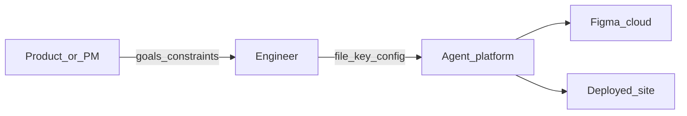

# Chapter 01 — Overview

## Simple explanation

You are building software that helps someone turn a **visual design in Figma** into a **real website** they can host. An **AI agent** does not “see” Figma like a human; it reads **structured data** from Figma’s servers, builds an internal map of frames and styles, then writes **React** files. Humans still review because AI can make mistakes.

**Neighbors**: go deeper in [Chapter 02 — Architecture](../02-architecture/README.md) and the step-by-step flow in [Chapter 03 — Workflow](../03-workflow/README.md).

## Deep technical breakdown

A production system usually includes: **identity** (who is calling Figma), **ingestion** (download file JSON and related assets), **normalization** (convert Figma nodes into a stable intermediate representation), **generation** (LLM + templates emit code), **verification** (build, lint, snapshot tests), and **iteration** (user feedback or automated error repair). Figma’s REST API returns a **document tree** (`DOCUMENT` → `CANVAS` → frames) with `layoutMode`, `fills`, `strokes`, and `children` arrays you must interpret deterministically before asking an LLM to invent JSX.

## Mermaid diagram

Who interacts with the system:

## Real example

**Input**: a Figma file named `SaaS Landing` with a top-level frame `Hero` using auto-layout horizontal spacing 24px.  
**Output**: a Vite project with `src/sections/Hero.tsx` exporting `<Hero />` and a `tokens.css` file containing spacing variables derived from Figma variables (when present).

## Challenges and pitfalls

- **Scope creep**: generating the entire file instead of one frame blows token budgets and quality.  
- **Naming drift**: Figma layer names like `Group 47` become unusable component names unless you rename or infer intent.

## Tips and best practices

- Start with **one frame** and one **breakpoint** before multi-page generation.  
- Ask designers to use **components** and **variables** in Figma; your mapper becomes simpler.

## What most people miss

**Design intent** lives in constraints (auto-layout, grids, constraints), not only in absolute `x/y`. If you skip constraint extraction, CSS will look “right” at one zoom level and break everywhere else.

**Reference hub**: [External references](../00-references.md).
