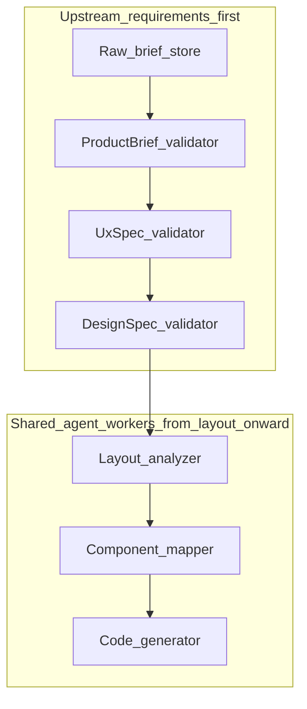
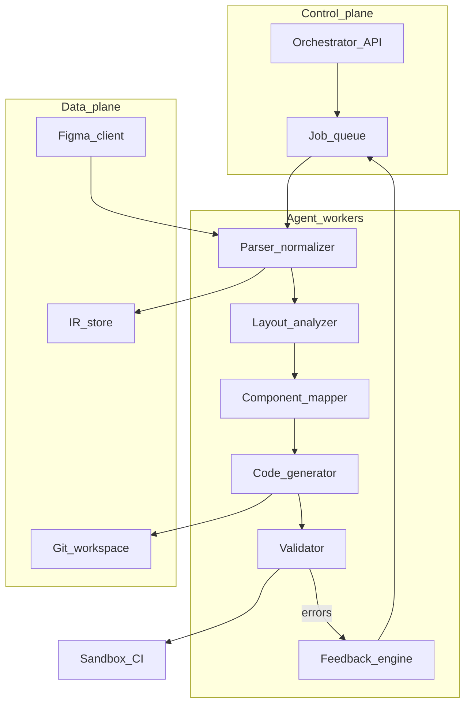
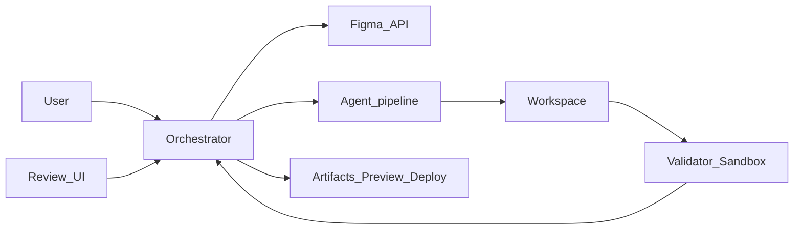
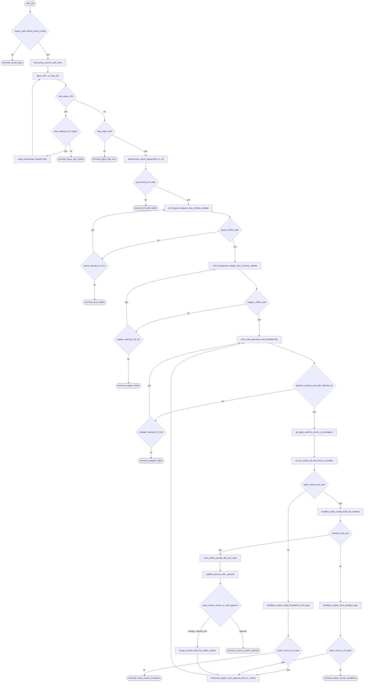

# Chapter 02 — Architecture

**Build track:** implement the **orchestrator boundary** and container split during **M0–M3** ([build track](../00-build-track/README.md)); the diagrams below match the README “canonical” copies.

## Simple explanation

**Architecture** answers: what are the big boxes, and how do they talk? Here the boxes are: **ingest truth** (Figma API **or** brief/spec stores), **understand layout**, **map to React components**, **write files**, **check quality**, and **loop on feedback**. Each box can be a **service** or a **step** inside one app.

**Neighbors**: [Build track](../00-build-track/README.md) · [Chapter 01 — Overview](../01-overview/README.md) · [Chapter 03 — Workflow](../03-workflow/README.md) · [Chapter 04 — Agent design](../04-agent-design/README.md) · [Chapter 18 — Requirements-only intake](../18-greenfield-from-requirements/README.md) · [Chapter 17 — Build vs integrate](../17-build-vs-integrate/README.md) · **Canonical diagrams:** [README.md](../../README.md) (*Visual architecture — topology plus algorithms*)

## Deep technical breakdown

Use a **modular pipeline** behind a single orchestrator API:

| Container | Responsibility |
|-----------|----------------|
| **Figma client** | OAuth/token, `GET /v1/files/:key`, `GET /v1/images`, rate-limit handling (**when Figma intake is enabled**) |
| **Brief and spec store** | Raw markdown, `ProductBrief`, `UxSpec`, `DesignSpec` revisions + approval metadata (**requirements-only** jobs); treat uploads as **untrusted** |
| **IR builder** | Deterministic transform: Figma JSON → typed IR (frames, text styles, layout boxes) |
| **Spec-to-layout bridge** | Deterministic slicing: `DesignSpec` → same **layout input shape** your `layout_analyzer` expects (optional shared schema with IR) |
| **Agent workers** | LLM calls per task with strict JSON schema outputs |
| **Workspace writer** | Applies unified diffs to a git worktree |
| **Sandbox runner** | `pnpm install`, `pnpm test`, `pnpm build` in isolated environment |
| **Artifact store** | S3/Git bundle of outputs and logs |

Communication is **message-passing**: each step receives a **layout input slice** (from **IR** or from **`DesignSpec`**), plus `userConfig` and `priorErrors`, and returns structured outputs (e.g. patches) with telemetry. Avoid letting the LLM freely write to disk without schema validation.

### Requirements-only topology (extra boxes)

When `source` is **requirements-only**, the **Figma client** is unused; **brief/spec** containers feed the pipeline until `DesignSpec` is approved, then workers run the **shared agentic core** from **layout analysis** onward.

**Prompt modules and planner loops** (how prompts are composed and when the LLM chooses several steps) live in [Modular prompt architecture](../05-prompts/modular-prompt-architecture.md) and [Multi-step orchestration](../05-prompts/multi-step-orchestration.md). **When to integrate sandboxes, gateways, and queues** instead of building them is covered in [Chapter 17 — Build vs integrate](../17-build-vs-integrate/README.md).

## Mermaid diagram

Container placement (how services sit relative to control vs data plane):

### Canonical topology and algorithm (synced with README)

The following blocks mirror [README.md](../../README.md) (*Visual architecture — topology plus algorithms*). **Edit README and this subsection together** when the orchestrator algorithm changes.

#### Topology (compact)

#### Main job algorithm (branch-level detail)

**Policy knobs (same names as README):** `R_figma` (Figma fetch retries), `R_llm` (per-stage schema retries), `R_repair` (codegen repair budget), transactional **`applyP`**, human gate **`waitH`**.

For the **time-ordered** view see [Chapter 04 — Agent design](../04-agent-design/README.md).

## Real example

A request `POST /jobs` with body `{ "fileKey": "abc", "frameId": "123:456", "stack": "vite-react-ts" }` enqueues work. Worker `p` fetches Figma JSON and writes `ir/landing.json`. Worker `g` emits `src/App.tsx` importing `./sections/Hero`.

## Challenges and pitfalls

- **Monolith creep**: one 5,000-line prompt tries to do parse+codegen; debugging becomes impossible.  
- **Shared mutable workspace**: parallel jobs overwrite each other—use **per-job worktrees**.

## Tips and best practices

- Define a **versioned IR schema** (`ir.schema.v2.json`) and validate every worker output against it.  
- Put **secrets** only in the control plane; sandboxes get short-lived tokens.

## What most people miss

The IR is your **real contract** between deterministic code and probabilistic LLM steps. If the IR is fuzzy, every downstream prompt inherits that ambiguity.
