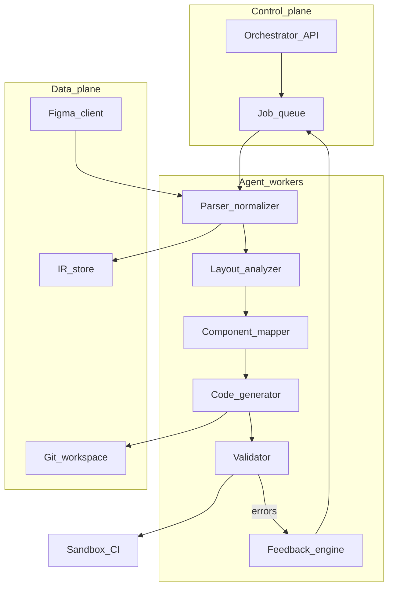

# Chapter 02 — Architecture

## Simple explanation

**Architecture** answers: what are the big boxes, and how do they talk? Here the boxes are: connect to Figma, understand layout, map to React components, write files, check quality, and loop on feedback. Each box can be a **service** or a **step** inside one app.

**Neighbors**: [Chapter 01 — Overview](../01-overview/README.md) · [Chapter 03 — Workflow](../03-workflow/README.md) · [Chapter 04 — Agent design](../04-agent-design/README.md)

## Deep technical breakdown

Use a **modular pipeline** behind a single orchestrator API:

| Container | Responsibility |
|-----------|----------------|
| **Figma client** | OAuth/token, `GET /v1/files/:key`, `GET /v1/images`, rate-limit handling |
| **IR builder** | Deterministic transform: Figma JSON → typed IR (frames, text styles, layout boxes) |
| **Agent workers** | LLM calls per task with strict JSON schema outputs |
| **Workspace writer** | Applies unified diffs to a git worktree |
| **Sandbox runner** | `pnpm install`, `pnpm test`, `pnpm build` in isolated environment |
| **Artifact store** | S3/Git bundle of outputs and logs |

Communication is **message-passing**: each step receives `{ irSlice, userConfig, priorErrors }` and returns `{ patchSet, telemetry }`. Avoid letting the LLM freely write to disk without schema validation.

## Mermaid diagram

## Real example

A request `POST /jobs` with body `{ "fileKey": "abc", "frameId": "123:456", "stack": "vite-react-ts" }` enqueues work. Worker `p` fetches Figma JSON and writes `ir/landing.json`. Worker `g` emits `src/App.tsx` importing `./sections/Hero`.

## Challenges and pitfalls

- **Monolith creep**: one 5,000-line prompt tries to do parse+codegen; debugging becomes impossible.  
- **Shared mutable workspace**: parallel jobs overwrite each other—use **per-job worktrees**.

## Tips and best practices

- Define a **versioned IR schema** (`ir.schema.v2.json`) and validate every worker output against it.  
- Put **secrets** only in the control plane; sandboxes get short-lived tokens.

## What most people miss

The IR is your **real contract** between deterministic code and probabilistic LLM steps. If the IR is fuzzy, every downstream prompt inherits that ambiguity.
