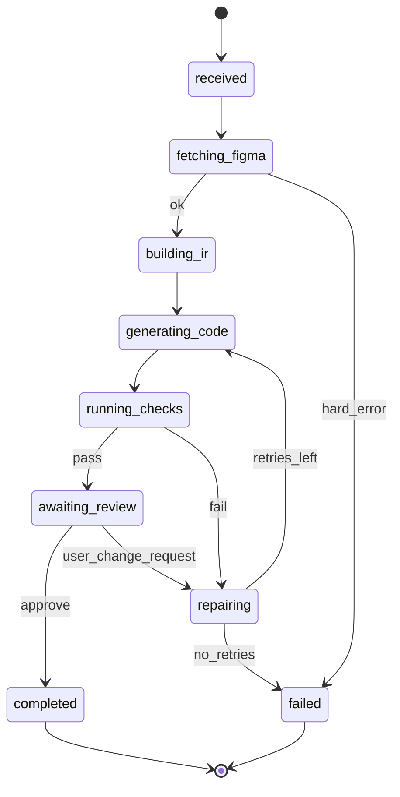

# Chapter 03 — Workflow (end-to-end user flow)

## Simple explanation

From a user’s eyes: **paste a Figma link** → wait while the system fetches and thinks → **preview a website** → **request tweaks** (“make the hero tighter on mobile”) → the system updates → you **approve** and deploy.

**Neighbors**: [Chapter 02 — Architecture](../02-architecture/README.md) · [Chapter 04 — Agent design](../04-agent-design/README.md) · [Chapter 08 — Feedback loop](../08-feedback-loop/README.md)

## Deep technical breakdown

Implement the flow as a **state machine** with **async jobs**:

- **States**: `received`, `fetching_figma`, `building_ir`, `generating_code`, `running_checks`, `awaiting_review`, `repairing`, `completed`, `failed`.  
- **Async**: Figma fetch and image export can take seconds; codegen may take minutes—use a **job id** and webhooks or polling.  
- **Retries**: exponential backoff on `429` from Figma; retry codegen once on **schema validation failure**; cap repair loops (e.g. max 3) to prevent runaway cost.

Persist **idempotency keys** per `(fileKey, frameId, promptVersion)` so retries do not duplicate artifacts.

## Mermaid diagram

## Real example

1. User submits job `J-1001`.  
2. Worker hits Figma `GET /v1/files/abc` (retry x3 on 429).  
3. IR built; codegen produces `Hero.tsx`.  
4. Sandbox fails TypeScript: missing import. Validator returns structured error `{ "rule": "tsc", "message": "..." }`.  
5. Feedback engine re-prompts codegen with error context; second build passes; UI shows **Awaiting review**.

## Challenges and pitfalls

- **Blocking UI** on long steps: always show **progress** and partial logs.  
- **Unbounded repair**: without caps, the agent can loop forever on a fundamental IR bug.

## Tips and best practices

- Store **structured validator output** in the DB; it is gold for evals and prompt tuning.  
- Let users **pin** a `promptVersion` when comparing quality across releases.

## What most people miss

**Awaiting review** is a first-class state, not an afterthought. The best systems treat human review as part of the **control loop**, not a manual export step.
