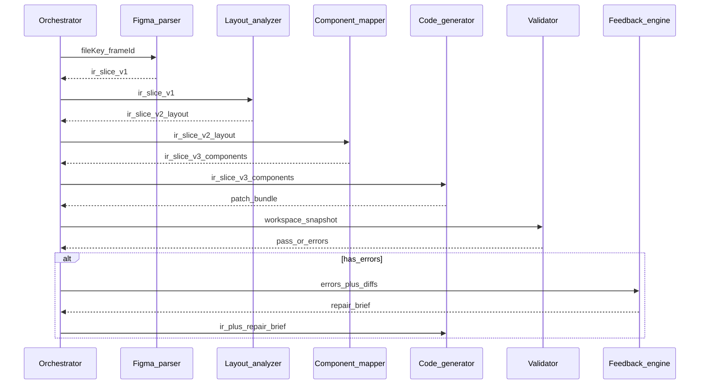

# Chapter 04 — Agent design (components and communication)

## Simple explanation

Instead of one giant AI, you run **smaller specialists**: one step understands Figma nodes, another understands layout, another writes React. They pass a **shared worksheet** (the IR plus error messages) forward like a relay race.

**Neighbors**: [Chapter 03 — Workflow](../03-workflow/README.md) · [Chapter 05 — Prompts](../05-prompts/README.md) · [Chapter 06 — Code generation](../06-code-generation/README.md)

## Deep technical breakdown

**Components** (aligning with your product vocabulary):

1. **Figma parser** — fetch + normalize raw Figma JSON; resolve component sets and variants.  
2. **Layout analyzer** — compute flex/grid intent, spacing, responsive breakpoints from constraints.  
3. **Component mapper** — map Figma components to design-system or generated React components.  
4. **Code generator** — emit TSX, CSS modules or tokens, routes.  
5. **Validator** — run `tsc`, eslint, unit tests, visual snapshot optional.  
6. **Feedback loop engine** — translate failures into the next prompt context.

**Communication**: use a **directed acyclic graph** in v1 (linear pipeline). Add branching only when needed (e.g. parallelize image downloads). Messages should be **typed JSON** with `schemaVersion`, `nodeId`, `artifactUri`, and `errors[]`.

## Mermaid diagram



## Real example

`ir_slice_v2_layout` might include:

```json
{
  "frameId": "1:2",
  "layout": { "mode": "flex", "direction": "row", "gap": 24 },
  "children": ["1:3", "1:4"]
}
```

The component mapper rewrites `1:3` from `INSTANCE` of `Button/Primary` to `{ "ds": "Button", "props": { "variant": "primary" } }`.

## Challenges and pitfalls

- **Leaky abstractions**: if codegen reads raw Figma JSON “just this once,” you lose reproducibility.  
- **Oversized context**: sending the entire file JSON to every LLM call is slow and noisy.

## Tips and best practices

- Give each worker only the **minimal IR subtree** it needs (windowed by frame and depth).  
- Log **prompt hashes** and IR hashes together for forensics.

## What most people miss

The **feedback engine** should output a **repair brief** (structured), not a second full website prose spec. Structured deltas tune codegen far better than long natural-language complaints.
