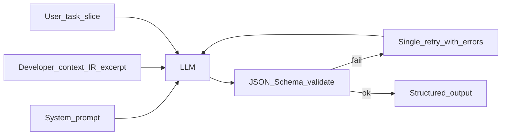

# Chapter 05 — Prompt engineering (overview)

**Build track:** **M4** introduces the first LLM step with schema retry; adopt [modular prompt architecture](modular-prompt-architecture.md) from M4 onward (even if v1 uses one file per module). Per-node prompt pages matter most from **M4–M7**. [Multi-step orchestration](multi-step-orchestration.md) is optional until you add exploratory repair beyond the fixed pipeline ([build track](../00-build-track/README.md)).

## Simple explanation

**Prompt engineering** means writing instructions so the model does **predictable** work. In this system, each agent step gets: what role it plays, what JSON it must return, and what happens if it disobeys. Good prompts are **short, structured, and testable**.

**Neighbors**: [Build track](../00-build-track/README.md) · [Chapter 04 — Agent design](../04-agent-design/README.md) · [Chapter 16 — Context, LLM I/O, files](../16-context-llm-and-files/README.md) · [Chapter 18 — Requirements-only intake](../18-greenfield-from-requirements/README.md) · [Modular prompt architecture](modular-prompt-architecture.md) · [Multi-step orchestration](multi-step-orchestration.md) · per-node pages: [figma-parser](figma-parser.md), [layout-analyzer](layout-analyzer.md), [component-mapper](component-mapper.md), [code-generator](code-generator.md), [validator](validator.md), [feedback-engine](feedback-engine.md) · [Chapter 06 — Code generation](../06-code-generation/README.md) · [Chapter 17 — Build vs integrate](../17-build-vs-integrate/README.md)

## Deep technical breakdown

Use a **three-layer prompt**:

1. **System**: immutable policy (output schema, banned APIs, stack assumptions).  
2. **Developer** (optional): tool and IR schema excerpts.  
3. **User**: task-specific slice (frame id, constraints, prior errors).

**Prompt chaining**: output of step N becomes **typed input** to step N+1—never free-form prose between machines. **Debugging**: log token counts, refusal patterns, schema validation failures; keep a **golden IR** fixture and run prompts in CI with `temperature=0` for regression.

**Validation rules**: every LLM step should post-process with **JSON Schema** validation and reject-and-retry once with the validation error appended.

**Modular prompts:** split policy, stack, role, and schema fragments; assemble per step with a versioned **registry**—see [Modular prompt architecture](modular-prompt-architecture.md).

**Multi-step LLM work:** when the model must choose a sequence of tools or subtasks, use a **bounded planner + executor** (`PlanStep[]`, allowlisted tools, `max_steps` / re-plan caps)—see [Multi-step orchestration](multi-step-orchestration.md). Keep the **fixed pipeline** (IR or **`DesignSpec`** → layout → map → codegen → validate) unless you intentionally carve out an exploratory repair island. For **requirements-only** jobs, keep the **brief → UX → DesignSpec** chain **fixed** too—each hop is its own schema-validated “node,” then **reuse** the same layout/codegen/validator prompts with **`DesignSpec` slices** instead of IR slices ([Chapter 18](../18-greenfield-from-requirements/README.md)).

**Off-the-shelf layers:** sandboxes, gateways, queues, and telemetry are often faster to integrate than to build—see [Chapter 17 — Build vs integrate](../17-build-vs-integrate/README.md).

## Mermaid diagram

## Real example

**Chaining**: `figma-parser` emits `NormalizedNode[]` → `layout-analyzer` consumes only the subtree for `frame=Hero` → `code-generator` receives `LayoutBox` objects, not raw Figma.

## Challenges and pitfalls

- **Bad prompt**: “Write React for this JSON” with 40k tokens of unfiltered Figma → inconsistent components.  
- **Good prompt**: “Emit **only** `components[]` matching schema v3; use design tokens IDs; no external libraries.”

## Tips and best practices

- Maintain a **prompt changelog** next to your IR schema version.  
- Keep **negative constraints** (“do not use inline styles except motion”) explicit.

## What most people miss

The best guardrail is not clever wording; it is a **strict schema + automatic repair loop**. Prompts set intent; schemas enforce reality.
