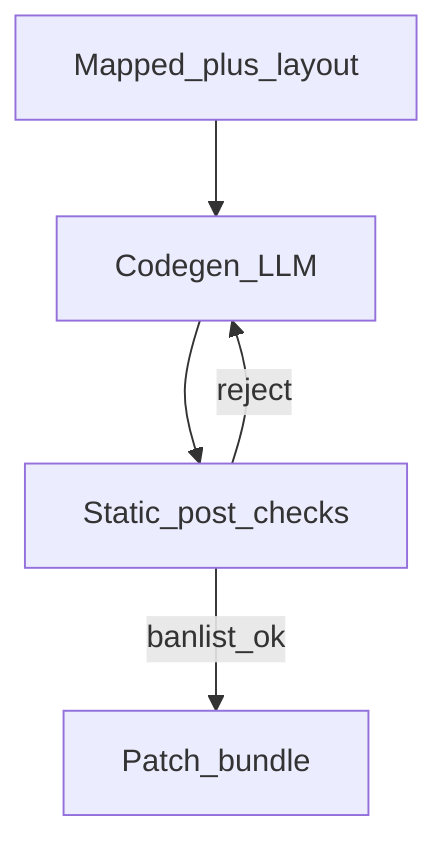

# Prompt pack — Code generator node

## Simple explanation

The **code generator** writes **React + TypeScript** files: components, pages, and styles. It should follow the mapped tree and layout boxes, not improvise a new layout.

**Neighbors**: [Component mapper](component-mapper.md) · [Validator](validator.md) · [Chapter 06 — Code generation](../06-code-generation/README.md)

## Deep technical breakdown

Input: `MappedTree` + `LayoutTree` + `tokens` + `styleStrategy` (`css-modules|vanilla-extract|tailwind`—this corpus assumes **CSS Modules + tokens** unless configured). Output: **`PatchBundle`**: list of `{ path, operation: add|update, content }`. Never emit binary. Enforce: no `eval`, no dynamic `import()` from user strings, no network in components. Validate: TypeScript parse optional; must be valid UTF-8; file paths confined to `src/`.

## Mermaid diagram



## Real example

**System prompt**

```text
You are CodegenAgent for Vite + React + TS. Emit PatchBundle JSON v2 only.
Use CSS Modules per component file. Import design tokens from '@/theme/tokens.css'.
Do not add new dependencies without explicit allowlist entry.
```

**User prompt**

```text
Generate src/sections/Hero.tsx and src/sections/Hero.module.css
MappedTree (excerpt): ...
LayoutTree (excerpt): ...
```

**Output format (excerpt)**

```json
{
  "schemaVersion": 2,
  "patches": [
    { "path": "src/sections/Hero.tsx", "operation": "add", "content": "import styles from './Hero.module.css';\nexport function Hero() { ... }" }
  ]
}
```

**Validation rules**

- Paths must start with `src/`.  
- Ban `eval`, `Function(`, `dangerouslySetInnerHTML` unless flag `allowRichText=true`.

## Challenges and pitfalls

- **Drift from layout**: model rewrites flex to absolute—include “must match LayoutTree gap and padding numerically.”  
- **Huge files**: cap lines per file; split subcomponents.

## Tips and best practices

- Provide **one golden example** file in the system prompt (short) to lock style.  
- Ask for **named exports** and consistent file layout.

## What most people miss

Codegen should be **idempotent**: same IR + same seed should yield the same structure. If not, your temperature and nondeterminism are too high for CI.
