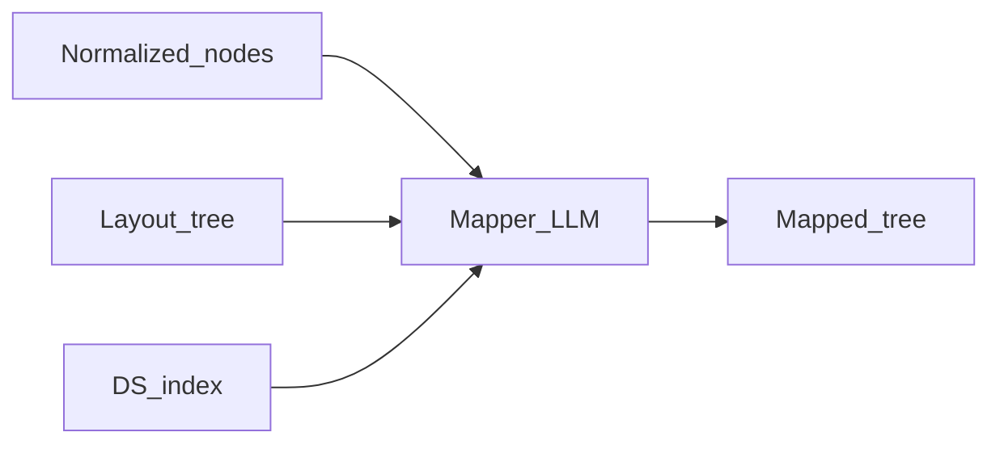

# Prompt pack — Component mapper node

## Simple explanation

The **component mapper** decides: this Figma instance is **your** `Button`, that frame is a `Card`, this text is `Typography`. It connects design-system vocabulary to Figma components and instances.

**Neighbors**: [Layout analyzer](layout-analyzer.md) · [Code generator](code-generator.md)

## Deep technical breakdown

Input: `NormalizedNode[]` + `LayoutTree` + `designSystemIndex` (export of your DS props). Output: `MappedTree` where each node has `component`: `{ "name": "Button", "importPath": "@/ds/Button", "props": { ... } }` or `primitive`: `div|span|img`. The LLM should **only choose** from the DS index when confidence is high; otherwise emit `primitive` with `todo: "needs_new_ds_component"`. Validate: imports must exist in index; props must match allowed keys.

## Mermaid diagram



## Real example

**System prompt**

```text
You are ComponentMapperAgent. Choose design-system components from INDEX only. If no match with high confidence, output primitive div/span with accessibility roles. JSON schema MappedTree v1 only.
```

**User prompt**

```text
INDEX:
- Button { variant: primary|secondary, size: sm|md|lg, disabled: boolean }
- Typography { variant: h1|body, as: span|p|h1 }

INSTANCE node 9:99 name="Button/Primary" mainComponent="Button"
```

**Output format**

```json
{
  "schemaVersion": 1,
  "map": {
    "9:99": {
      "kind": "ds",
      "component": "Button",
      "props": { "variant": "primary", "size": "md", "disabled": false }
    }
  }
}
```

**Validation rules**

- `component` must be a key in INDEX.  
- Unknown `figmaNodeId` → reject.

## Challenges and pitfalls

- **Variant explosion**: Figma variant properties not aligned with DS props—add deterministic normalization before LLM.  
- **False Button**: a rectangle named “button” is not an instance.

## Tips and best practices

- Pass **mainComponentKey** from Figma metadata when available; weight mapper decisions on it.  
- Log **confidence** (model-provided 0–1) but do not trust it blindly—cross-check instance type.

## What most people miss

Mapper quality is mostly **taxonomy work** (clean Figma libraries), not clever prompts. Spend time aligning Figma component names with DS exports.
