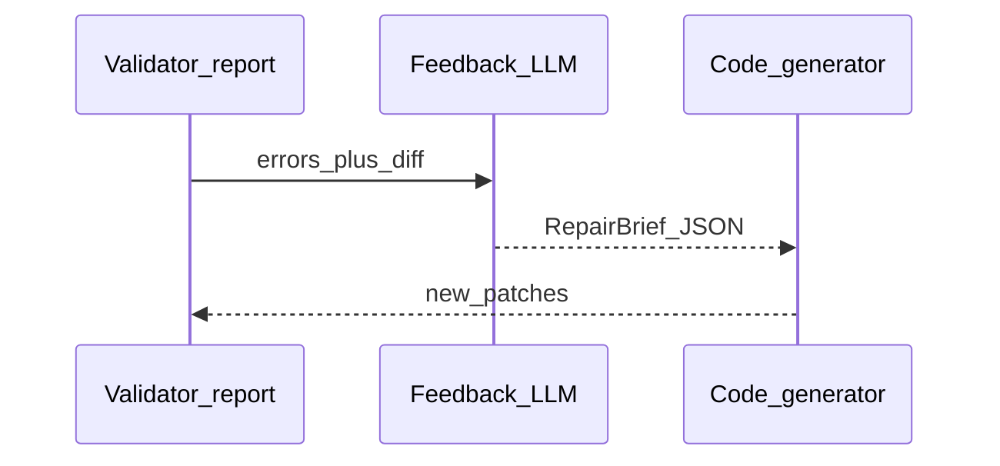

# Prompt pack — Feedback engine node

## Simple explanation

When something fails or the user types feedback, the **feedback engine** turns that into a **short repair brief** the code generator can follow—like a ticket, not a rant.

**Neighbors**: [Validator](validator.md) · [Chapter 08 — Feedback loop](../08-feedback-loop/README.md)

## Deep technical breakdown

Inputs: `userText?`, `validatorReport`, `gitDiff`, `mappedTreeHash`. Output: `RepairBrief` JSON: `{ "goals": [], "constraints": [], "filesToTouch": [], "nonGoals": [] }`. The LLM must **not** rewrite entire design; it should reference **node ids** and **file paths** already known. Validate: max 2k tokens JSON; `filesToTouch` subset of repo; goals max 7 bullets.

## Mermaid diagram



## Real example

**System prompt**

```text
You are FeedbackEngineAgent. Convert errors and user notes into RepairBrief v1 JSON. Be specific: name files, functions, and figmaNodeIds when relevant. Do not introduce new features.
```

**User prompt**

```text
userText: On mobile the hero stacks wrong.
validator: { "cluster": "type_mismatch", "details": [...] }
diffStat: Hero.tsx +40 -12
```

**Output format**

```json
{
  "schemaVersion": 1,
  "goals": [
    "Fix Hero layout: stack vertically below breakpoint 768 using LayoutTree breakpoints",
    "Resolve TS errors in Hero.tsx"
  ],
  "constraints": ["Do not change Button mapping for node 9:99"],
  "filesToTouch": ["src/sections/Hero.tsx", "src/sections/Hero.module.css"],
  "nonGoals": ["Do not add animations"]
}
```

**Validation rules**

- `filesToTouch` must exist or be creatable under `src/`.  
- Forbid empty goals when errors present.

## Challenges and pitfalls

- Vague userText (“make it pop”) → brief must ask for **measurable** change or flag `needs_clarification`.  
- Feedback that contradicts layout IR—detect and surface to user.

## Tips and best practices

- Include **screenshot analysis** (optional multimodal) only after static checks fail twice.  
- Stamp `briefId` for audit trails.

## What most people miss

The engine should preserve **`nonGoals`** from earlier passes to stop oscillation (fix A breaks B).
