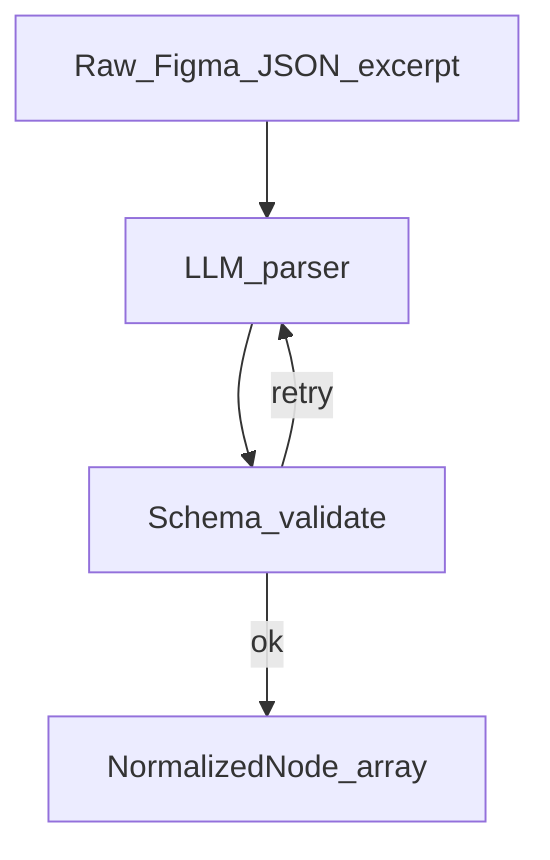

# Prompt pack — Figma parser node

## Simple explanation

The **Figma parser** step teaches the model to read a **small, curated excerpt** of Figma JSON and return **clean, renamed nodes** your code understands. It does not generate React; it **explains the tree** in a stable format.

**Neighbors**: [Prompts overview](README.md) · [Layout analyzer](layout-analyzer.md)

## Deep technical breakdown

Inputs: `fileKey`, `rootNodeId`, optional `componentLibraryMap`. The model should output **`NormalizedNode`** objects: stable `id`, `type` (`frame|text|vector|instance`), `name`, `visible`, `childrenOrder`, and raw references (`figmaNodeId`). Deterministic code should strip secrets and truncate deep trees before the LLM call; the LLM fills semantic labels (`role: "primaryCta"`). Validate with JSON Schema; on failure, retry once with the schema error.

## Mermaid diagram



## Real example

**System prompt**

```text
You are the FigmaParserAgent. Output ONLY JSON matching schema NormalizedNodeList v1.
Rules: never invent node ids; use provided figmaNodeId; max 200 nodes; prefer semantic role labels when obvious from name and type.
```

**User prompt**

```text
fileKey=abc123
rootNodeId=1:50
excerpt:
{ "id":"1:50","name":"Hero","type":"FRAME","layoutMode":"HORIZONTAL", "children":[{"id":"1:51","name":"Headline","type":"TEXT"}] }
```

**Output format (expected shape)**

```json
{
  "schemaVersion": 1,
  "nodes": [
    { "figmaNodeId": "1:50", "type": "frame", "name": "Hero", "role": "section", "children": ["1:51"] },
    { "figmaNodeId": "1:51", "type": "text", "name": "Headline", "role": "heading", "children": [] }
  ]
}
```

**Validation rules**

- Every `children[]` entry must exist as a `figmaNodeId`.  
- No duplicate `figmaNodeId`.  
- `schemaVersion` required.

## Challenges and pitfalls

- **Bad prompt**: dump entire file JSON → model truncates randomly mid-tree.  
- **Good prompt**: pre-filter to subtree + include explicit `maxNodes`.

## Tips and best practices

- Run **deterministic** dedupe of hidden layers before the LLM sees data.  
- Keep a **fixture library** of three real files for regression prompts.

## What most people miss

Parser prompts should not “beautify” layout; that belongs to **layout-analyzer**. Mixing concerns makes retries ambiguous about which stage failed.
