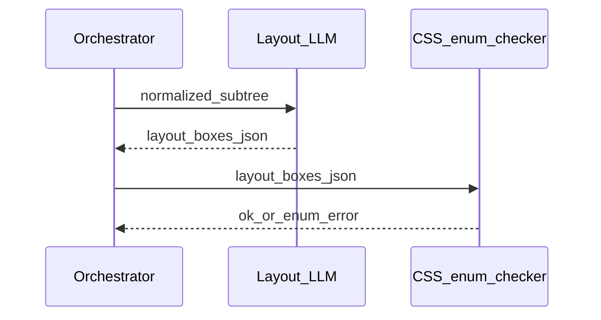

# Prompt pack — Layout analyzer node

## Simple explanation

The **layout analyzer** turns Figma’s layout knobs (auto-layout, padding, constraints) into **CSS intent**: flex direction, gap, alignment, when to use grid, and breakpoint hints.

**Neighbors**: [Figma parser](figma-parser.md) · [Component mapper](component-mapper.md)

## Deep technical breakdown

Input: `NormalizedNode[]` for a frame subtree. Output: `LayoutBox` tree with fields like `display: flex|grid`, `flexDirection`, `gap`, `padding`, `align`, `justify`, `childrenLayout`. Prefer deterministic conversion for numeric fields; use LLM only for **ambiguous** constraint combinations or missing auto-layout. Post-validate: gap ≥ 0, known enum values only.

## Mermaid diagram



## Real example

**System prompt**

```text
You are LayoutAnalyzerAgent. Map Figma auto-layout to CSS flexbox intent. Output JSON schema LayoutTree v2 only.
Never output absolute pixel positions unless layoutMode is NONE and constraints require it.
```

**User prompt**

```text
nodes:
[{"figmaNodeId":"2:10","type":"frame","layout":{"layoutMode":"HORIZONTAL","itemSpacing":24,"paddingLeft":32}}]
```

**Output format**

```json
{
  "schemaVersion": 2,
  "root": "2:10",
  "boxes": {
    "2:10": {
      "display": "flex",
      "flexDirection": "row",
      "gap": 24,
      "padding": { "left": 32 }
    }
  }
}
```

**Validation rules**

- Allowed `display` values: `flex`, `grid`, `block`.  
- `gap` must be a number in px (integer) for v2.

## Challenges and pitfalls

- **Absolute positioning addiction**: model emits `position:absolute` for everything—ban unless `layoutMode=NONE`.  
- **Mixed auto-layout and groups**: children order may not match visual z-index.

## Tips and best practices

- Pass **sibling count** and **order** explicitly in the user prompt.  
- For large frames, **window** by depth (e.g. max depth 6) per call.

## What most people miss

Figma **counter-axis sizing** (`PRIMARY`, `FIXED`) maps to `align-self` and `flex-grow` patterns—document that mapping table in code, and let the LLM only fill gaps when the table says “ambiguous.”
