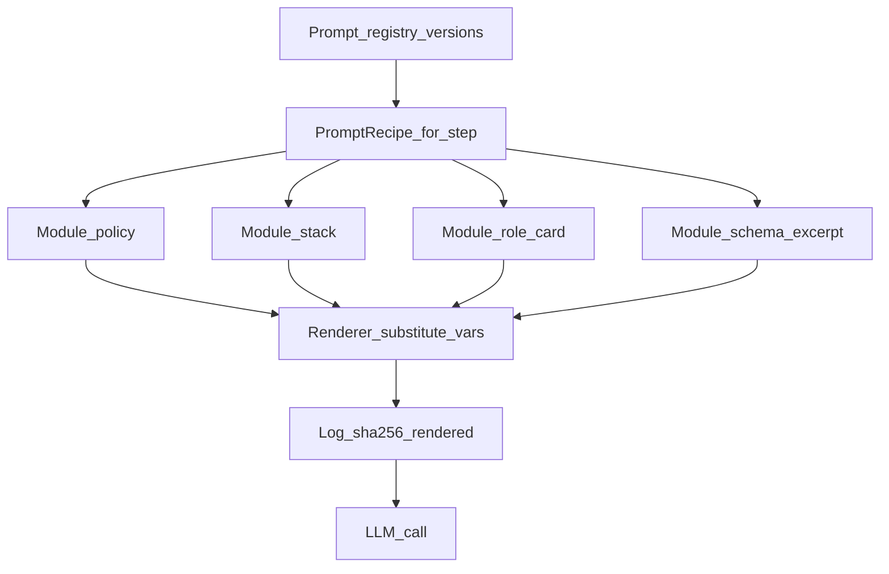

# Modular prompt architecture

## Simple explanation

Instead of one giant “do everything” prompt, you split instructions into **small modules** (files or records): global rules, stack rules, output format, and a tiny task-specific tail. At runtime an **assembler** stitches only the modules a step needs. That keeps prompts **maintainable**, **testable**, and **cheaper** (fewer duplicated tokens).

**Neighbors**: [Prompts overview](README.md) · [Multi-step orchestration](multi-step-orchestration.md) · [Chapter 16 — Context, LLM I/O, files](../16-context-llm-and-files/README.md)

## Deep technical breakdown

### Building blocks

| Module type | Typical content | Loaded for |
|-------------|-----------------|------------|
| **Policy** | Banned APIs, secrecy, tone, refusal rules | Every LLM call |
| **Stack** | Vite+React+TS conventions, file layout, import style | Codegen, validator triage |
| **Schema excerpt** | JSON Schema fragment or TypeScript type of the expected output | Same step only |
| **Role card** | “You are LayoutAnalyzerAgent…” one screen | That agent only |
| **Negative examples** | Short bad vs good pairs | Mapper/codegen when quality slips |
| **Variable bundle** | IR slice, `RepairBrief`, excerpt paths | Per job, from orchestrator |

### Assembly contract

Each step declares **`PromptRecipe`**: ordered list `{ moduleId, version, variables }`. The renderer:

1. Resolves versions from a **prompt registry** (YAML/DB).  
2. Substitutes variables (templating: Mustache, Jinja2, or typed string builder—avoid silent undefined vars).  
3. Computes **sha256(rendered)** and logs it with `jobId` for replay.  
4. Enforces **max rendered bytes** before calling the provider.

### Why modular beats monolith

- **Reuse**: `stack_vite@2` shared across mapper and codegen.  
- **A/B tests**: swap only `role_card_layout@v3` without touching policy.  
- **Security review**: auditors read `policy@1` once, not 40 prompts.  
- **Caching**: provider-side prompt cache hits on stable prefixes (policy+stack first).

## Mermaid diagram



## Real example

`PromptRecipe` for layout step (YAML-ish):

```yaml
step: layout_analyzer
modules:
  - id: policy/global
    version: 1.4.0
  - id: stack/vite-react-ts
    version: 2.1.0
  - id: roles/layout_analyzer
    version: 3.0.0
  - id: schemas/LayoutTree_v2.fragment.json
    version: pinned
variables:
  irSubtree: "{{ irJson }}"
  frameId: "{{ frameId }}"
```

Rendered string order: **policy → stack → role → schema → variables footer**.

## Challenges and pitfalls

- **Hidden coupling**: module B assumes module A’s vocabulary—document **depends_on** in the registry.  
- **Template injection**: user-controlled strings in templates → treat as untrusted; escape or pass as JSON blocks, not raw concatenation into system text.  
- **Version skew**: codegen uses `stack@2` while mapper still on `stack@1`—pin **bundle version** per release train.

## Tips and best practices

- CI job: render golden recipes with fixture vars → **compare hash** to committed baseline (or allowlist drift with PR label).  
- Keep each **role card under ~400 lines**; push long tables to **referenced files** the model reads via tool/RAG, not inline.

## What most people miss

Modular prompts need a **registry and semver** as much as npm packages. Without versions, you cannot reproduce a bug from last Tuesday’s traffic.
