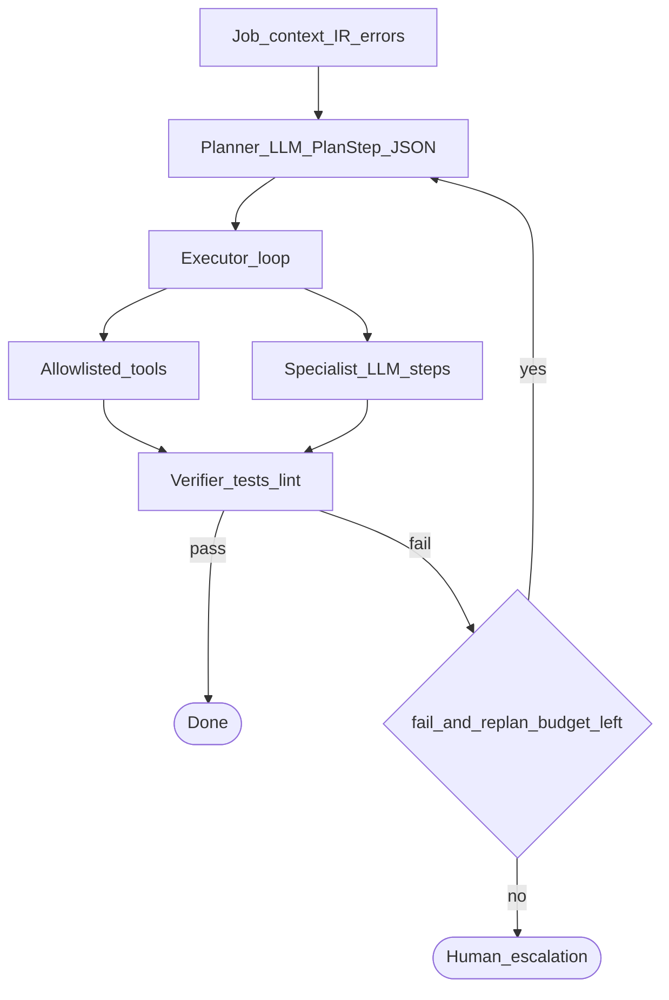

# Multi-step orchestration (when the LLM drives several steps)

## Simple explanation

Some jobs are not a straight line (parse → layout → code). The model may need to **decide** what to do next: “read this file,” “run grep,” “then edit.” That is **multi-step**: each step is small, but the **sequence** is chosen dynamically within limits you set.

**Neighbors**: [Modular prompt architecture](modular-prompt-architecture.md) · [Prompts overview](README.md) · [Chapter 03 — Workflow](../03-workflow/README.md) · [Chapter 04 — Agent design](../04-agent-design/README.md)

## Deep technical breakdown

### Two patterns

| Pattern | When to use | Risk |
|---------|-------------|------|
| **Fixed pipeline** | Figma → IR → layout → map → codegen (predictable SLAs) | Less flexible for odd files |
| **Planner + executor** | Unknown repo layout, exploratory refactors, “fix until green” | Higher cost, needs hard caps |

### Planner shape (recommended contract)

The planner LLM (or a smaller model) emits **`PlanStep[]`** JSON—never free prose:

```json
{
  "schemaVersion": 1,
  "steps": [
    { "id": "s1", "kind": "tool", "tool": "read_file", "args": { "path": "src/App.tsx" } },
    { "id": "s2", "kind": "llm_subtask", "agent": "codegen", "inputRef": "s1" }
  ]
}
```

**Executor loop** (pseudocode shape):

```text
plan = planner.run(context)
for step in plan.steps within max_steps:
  if step.kind == tool: run allowlisted tool; append observation
  if step.kind == llm_subtask: call specialist with narrowed context
  if verifier.fail: optionally replan with error digest (bounded)
```

### Guardrails (non-negotiable)

- **`max_steps`**, **`max_tool_calls`**, **`max_wall_ms`**, **`max_usd`** per job.  
- **Tool allowlist** only (`read_file`, `grep`, `apply_patch`…)—no arbitrary shell from planner output.  
- **Re-plan budget**: at most `K` new plans after failure (e.g. `K=2`), then escalate to human.  
- **State**: persist `{ messages[], toolResults[], planId }` so workers are idempotent on retry.

### Relationship to your Figma pipeline

Keep the **Figma core** as a **fixed pipeline** for quality. Use **planner+tools** only inside bounded islands—for example “repair until tests pass” after codegen, or “discover DS import paths” on unfamiliar repos.

## Mermaid diagram



## Real example

After sandbox fails with `Cannot find module './Hero.module.css'`, the planner emits: `read_file` `Hero.tsx` → `codegen` subtask “add missing CSS module with classes used in TSX.” Executor runs tools, then calls codegen with **only** those observations—full repo never enters context.

## Challenges and pitfalls

- **Runaway tool loops** (“read entire tree”): cap depth and file count per tool batch.  
- **Planner hallucinating tools**: schema-validate `PlanStep` and reject unknown `tool` names.  
- **Mixing planner freedom with Figma determinism**: keep Figma IR extraction **out** of the planner; planner operates on **workspace + errors**.

## Tips and best practices

- Log **per-step latency and tokens**; attribute cost to `planId`.  
- Prefer **deterministic preprocessing** before offering the planner a job (smaller plan, fewer surprises).

## What most people miss

A planner is not “smarter”; it is **another model with more degrees of freedom**. You only win if **tools + verifiers** are strict—otherwise you traded a straight pipeline for an expensive random walk.
