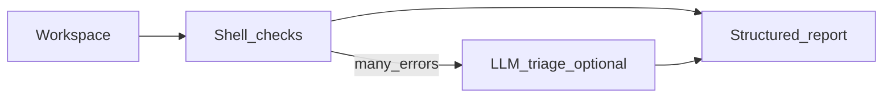

# Prompt pack — Validator node (LLM-assisted triage)

## Simple explanation

Most validation is **not** an LLM: TypeScript, ESLint, and tests are scripts. Use a small **ValidatorAgent** when you need to **cluster errors**, **suggest root cause**, or **summarize** 200 lines of logs for the feedback engine.

**Neighbors**: [Code generator](code-generator.md) · [Feedback engine](feedback-engine.md)

## Deep technical breakdown

**Primary validator (deterministic)**: run `pnpm install --frozen-lockfile`, `pnpm exec tsc --noEmit`, `pnpm exec eslint .`, `pnpm test`. Capture stdout/stderr with exit codes.  
**LLM validator (optional)**: input is `{ "errors": [...], "diffStat": "...", "lastPatches": [...] }`; output is `{ "cluster": "missing_import", "hypothesis": "...", "recommendedNextTool": "codegen" }` with strict schema. Never let the LLM validator decide security—only triage.

## Mermaid diagram



## Real example

**System prompt**

```text
You are ValidatorTriageAgent. Classify build errors into one of: missing_import, type_mismatch, eslint_style, test_failure, infra. Output JSON schema ValidatorTriage v1 only. Do not propose unsafe commands.
```

**User prompt**

```text
tsc exit=2
---
src/sections/Hero.tsx(3,21): error TS2307: Cannot find module './Hero.module.css' or its corresponding type declarations.
```

**Output format**

```json
{
  "schemaVersion": 1,
  "cluster": "missing_import",
  "hypothesis": "CSS module file missing or path typo",
  "recommendedNextTool": "codegen"
}
```

**Validation rules**

- `cluster` must be from allowed enum.  
- No shell commands in output.

## Challenges and pitfalls

- Letting the model “fix” by running shell: **never**—orchestrator only runs allowlisted commands.  
- Over-using LLM triage on simple single-line errors wastes money.

## Tips and best practices

- Gate LLM triage behind `errorLines > 20` or `exitCode in knownHard`.  
- Always attach **file:line** snippets, not whole logs.

## What most people miss

The validator’s job is to produce **machine-actionable** artifacts (`errors[]` with codes). Human-readable summaries are secondary.
