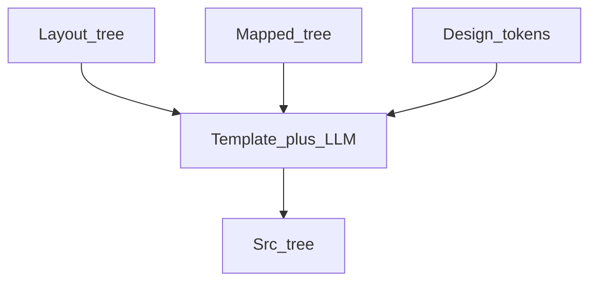

# Chapter 06 — Code generation logic

## Simple explanation

**Code generation** is the step where layout and mapping become **real files**: `.tsx`, `.css`, and shared tokens. Think of it as translating a blueprint into carpentry—measurements must match.

**Neighbors**: [Chapter 05 — Prompts](../05-prompts/code-generator.md) · [Chapter 07 — Sandbox](../07-sandbox/README.md) · [Chapter 08 — Feedback loop](../08-feedback-loop/README.md)

## Deep technical breakdown

**Layout → CSS**: map Figma auto-layout `HORIZONTAL`/`VERTICAL` to `flex-direction: row|column`; `itemSpacing` → `gap`; padding fields → `padding`. Use **CSS flex** first; use **grid** when two-dimensional alignment regions are detected (e.g. card grids).  
**Components → reuse**: emit leaf `Button` imports from DS; for unknown primitives, generate local `Stack`/`Box` helpers.  
**Responsive**: encode breakpoints from Figma **if** constraints or separate frames exist (`Hero_mobile`, `Hero_desktop`); otherwise default `{ sm:640, md:768, lg:1024 }` and document assumptions.  
**Design tokens**: export Figma variables to `tokens.css` as CSS variables `--color-text-primary`, `--space-3`, etc.; reference them from modules.

## Mermaid diagram



## Real example

Figma: horizontal auto-layout gap 24 → CSS module:

```css
.row { display: flex; flex-direction: row; gap: 24px; align-items: center; }
```

React:

```tsx
export function Hero() {
  return (
    <section className={styles.hero}>
      <div className={styles.row}>...</div>
    </section>
  );
}
```

## Challenges and pitfalls

- **Pixel-perfect traps**: sub-pixel differences between Figma and browser rounding cause endless tweaks—prefer tokenized spacing.  
- **Text auto-size**: Figma text with auto height vs fixed height maps poorly—pick one policy.

## Tips and best practices

- Generate **`data-figma-id` attributes** (dev-only) for traceability, stripped in prod build via env.  
- Unit-test a **layout mapper** table without LLM coverage.

## What most people miss

**Typography** needs explicit line-height policy; Figma line heights do not always match web defaults—document conversion or you get subtle vertical drift.
