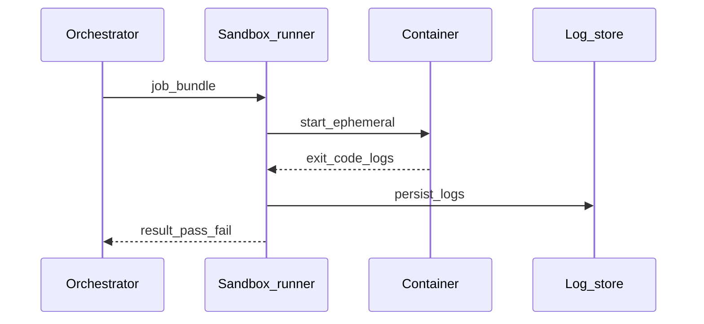

# Chapter 07 — Sandbox execution

## Simple explanation

A **sandbox** is a safe playground where generated code runs without risking your laptop or production. You run installs, builds, and tests there, then copy out only **verified artifacts**.

**Neighbors**: [Chapter 06 — Code generation](../06-code-generation/README.md) · [Chapter 14 — Security](../14-security/README.md) · [Chapter 17 — Build vs integrate](../17-build-vs-integrate/README.md)

## Deep technical breakdown

**Approaches**:

1. **Docker container** (common): ephemeral container per job, non-root user, read-only base, writable `/workspace`, no host mounts—or read-only mount of repo template.  
2. **Firecracker / VM** (stronger isolation): higher cold start cost.  
3. **Browser iframe** (limited): good for **visual preview**, not for trusting arbitrary shell; never treat iframe as security boundary for malicious codegen.

**Pipeline**: copy patch bundle → `pnpm install` (with lockfile from template) → `pnpm test` → `pnpm build` → collect artifacts + logs. **Error capture**: stream stdout/stderr to object storage; cap size; redact secrets via regex.

## Mermaid diagram

## Real example

`docker run --rm -v $(pwd)/workspace:/workspace -w /workspace node:20 bash -lc "pnpm install && pnpm test"` with **seccomp** profile and **network egress deny** except registry allowlist.

## Challenges and pitfalls

- **Supply chain**: `pnpm install` in sandbox still fetches packages—pin lockfile and use **verified registry proxy**.  
- **Timeouts**: hung tests block workers—use `timeout` wrapper per command.

## Tips and best practices

- Use **multi-stage** images: deps cached, app layer thin.  
- Save **`docker inspect`**-level metadata for audits.

## What most people miss

Sandbox **network policy** is part of the threat model, not an optimization. Codegen+install can exfiltrate tokens if env vars leak—inject short-lived read-only creds only when needed.
