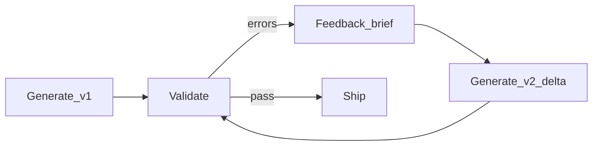

# Chapter 08 — Feedback loop (iteration and self-repair)

## Simple explanation

The first generated site is rarely perfect. A **feedback loop** means: detect problems, tell the agent **exactly** what failed, and regenerate **only what must change**—like revising an essay with teacher comments.

**Neighbors**: [Chapter 03 — Workflow](../03-workflow/README.md) · [Chapter 16 — Context, LLM I/O, files](../16-context-llm-and-files/README.md) · [Chapter 05 — Prompts / Feedback engine](../05-prompts/feedback-engine.md) · [Chapter 12 — Common issues](../12-common-issues/README.md) · **Algorithm context:** [README.md](../../README.md) (repair path `fbA` / `fbB` → `rep*` → `incR` → `genCall`)

## Deep technical breakdown

**Automated loop**: `validator.errors[]` → `RepairBrief` → `PatchBundle` (delta) → re-run checks until pass or max retries.  
**Human loop**: UI shows diff + preview URL; user comments create a new `RepairBrief` with `source: human`.  
**Diff-based updates**: prefer **unified diffs** or structured patches to avoid rewriting entire files (smaller prompts, fewer regressions). Track `baseCommit` so retries apply on consistent parent.

## Mermaid diagram

That loop is the **same** as the `fbA` / `fbB` → `repair_count_lt_R_repair` → `increment_repair_count` → `genCall` region in the **main job algorithm** diagram in [README.md](../../README.md) and [Chapter 03 — Workflow](../03-workflow/README.md). Keep those diagrams aligned when you change repair policy.

## Real example

TypeScript error `TS2307` missing CSS module → feedback brief goal: “add `Hero.module.css` with class names referenced in TSX.” Codegen issues **add** patch only for CSS file.

## Challenges and pitfalls

- **Wobble**: fix A unfixes B—use `nonGoals` and snapshot tests on critical sections.  
- **Unbounded scope**: user asks for new feature during bugfix—route to new job.

## Tips and best practices

- Keep a **patch budget** (max files touched per repair).  
- Show users a **side-by-side** diff with Figma frame thumbnail.

## What most people miss

Successful loops depend on **error causality**: validators must attribute errors to **specific files and nodes**; otherwise the LLM guesses.
