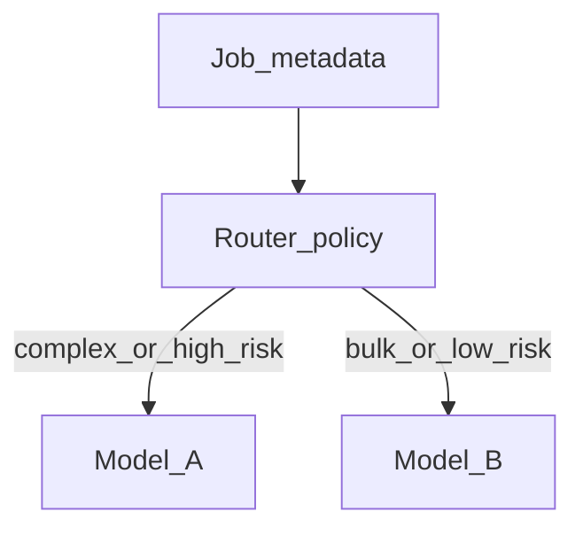

# Chapter 09 — Model selection

## Simple explanation

Different **AI models** have different strengths: some are better at long code, some at strict JSON, some are cheaper. **Model selection** means picking the right worker for each step and budget.

**Neighbors**: [Chapter 11 — Scaling](../11-scaling/README.md) · [Chapter 15 — Cost optimization](../15-cost-optimization/README.md)

## Deep technical breakdown

**Closed models (example families: GPT)**: strong general reasoning, good tool adherence with schema prompting; cost scales with tokens; good for **codegen** and **feedback** when quality matters.  
**Open-weight models (examples: Llama, Mistral, Qwen families)**: lower per-token cost self-hosted; need tighter prompts and more eval; good for **high-volume triage** or **sandboxed internal** use.

**Heuristic routing**:

| Step | Prefer | Why |
|------|--------|-----|
| IR normalization (LLM assist) | smaller / cheaper | structured, short |
| Layout ambiguity resolution | mid-size | needs reasoning |
| Codegen | strongest affordable | long context + correctness |
| Validator triage | small | classification |

Track **quality metrics** per route (pass rate, retries) weekly.

### Self-hosted inference — example hardware baselines

Use this table for **capacity planning** when you run **open-weight code models** on your own GPUs (vLLM, tensor parallel, etc.). Real needs depend on **context length**, **concurrency**, **quantization**, and the serving stack—always validate with a load test and the upstream model card.

| Model | Size | Required infra |
| ----- | ---- | -------------- |
| **DeepSeek-Coder-V2** | 236B | 8× A100 / H100 (80GB VRAM each)  200GB+ system RAM  NVMe SSD 500GB+  Multi-GPU distributed inference (vLLM / tensor parallel) |
| **Qwen2.5-Coder-32B** | 32B | 1× A100 80GB OR 2× RTX 4090  64–96GB RAM  NVMe SSD 100–200GB  FP16 or 4/8-bit quant |
| **Qwen2.5-Coder-14B** | 14B | 1× RTX 4090 (24GB) OR A6000  64GB RAM  NVMe SSD 100GB  4-bit / 8-bit quant recommended |

## Mermaid diagram

## Real example

Policy YAML: `codegen.model = gpt-4.1` for customer jobs; `triage.model = local-llama-3-8b` only when `errors.length>30`.

## Challenges and pitfalls

- **Model drift**: vendor updates behavior—pin **snapshot evals** and version prompts.  
- **Hidden costs**: long system prompts repeated every call—cache static prefixes where API allows.

## Tips and best practices

- A/B test **one step at a time**; do not change parser+codegen simultaneously.  
- Log **tokens in/out** per step for finance attribution.

## What most people miss

The cheapest win is often **smaller context** (better IR filtering), not a cheaper model.
