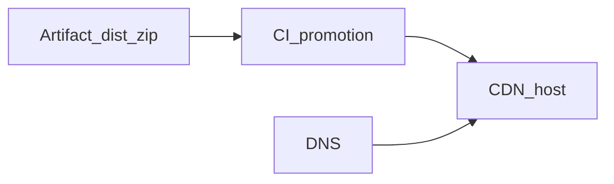

# Chapter 10 — Deployment

## Simple explanation

**Deployment** is how the generated site reaches the internet: build artifacts, upload to hosting, set a domain, and wire environment variables safely.

**Neighbors**: [Chapter 07 — Sandbox](../07-sandbox/README.md) · [Chapter 14 — Security](../14-security/README.md)

## Deep technical breakdown

**Agent platform deployment** (the service that runs Figma jobs): container on Kubernetes/Cloud Run; secrets in KMS; Postgres for jobs; object storage for artifacts.  
**Generated site deployment**: typical path is **static hosting** (S3+CloudFront, Netlify, Vercel) for Vite `dist/`, or **container** if SSR added later. CI should promote only **signed artifacts** from sandbox success.

**Pipeline**: `build` artifact hash → `upload` → `smoke test` GET `/` → `switch traffic` blue/green.

## Mermaid diagram

## Real example

`aws s3 sync dist/ s3://my-site-prod --delete` after `pnpm build` with `VITE_API_URL` injected at build time from CI secrets.

## Challenges and pitfalls

- **Client-side secrets**: never bake private keys into Vite bundles—public env only.  
- **Cache poisoning**: CDN stale assets—use content-hashed filenames (Vite default).

## Tips and best practices

- Keep **preview deployments** per PR/job id for stakeholder review.  
- Automate **rollback** to previous artifact hash.

## What most people miss

Deployment should verify **accessibility** and **SEO basics** (title, meta) as part of promotion gates, not only HTTP 200.
