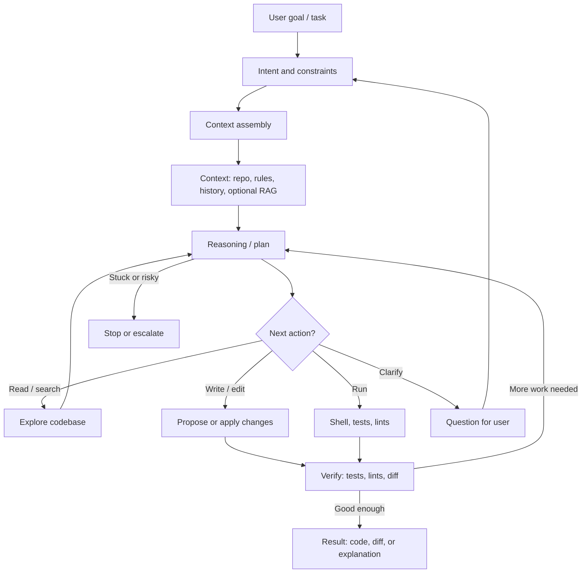
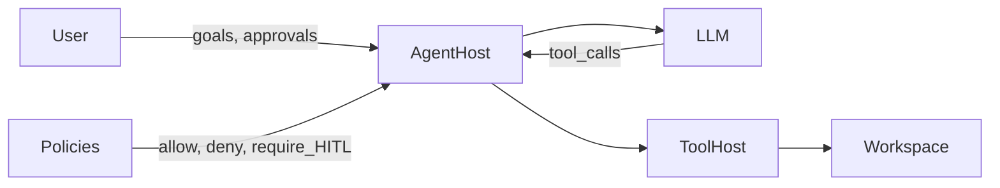

# Overview — what is an AI coding agent?

## Summary

An [AI coding agent](91-glossary.md) is software that helps a human (or another system) change a codebase by combining an [LLM](91-glossary.md), **tools** (read file, search, run tests, apply patch), and **policies** (what may run, what must be approved). Unlike a single-shot chat completion, an agent **loops**: observe the repo, propose actions, execute tools, read results, and continue until the task is done or blocked.

This page names the **actors** and **context**. Deeper structure lives in [20-architecture.md](20-architecture.md); motion over time in [30-lifecycle.md](30-lifecycle.md).

## Pipeline logic

End-to-end flow: **task → intent → assembled context → reasoning**; then the model chooses a **next action** (explore, edit, run, or ask). Exploration and commands feed back into reasoning; edits and runs go through **verification**; the loop continues until the output is good enough, the user clarifies intent, or the run **stops or escalates** when stuck or risky.

**In one line:** iterate **context → plan → (tools + edits + checks) → verify** until you have a verified result or a deliberate handoff (question, stop, or escalation).

For a formal state machine and sequence view of the same loop, see [30-lifecycle.md](30-lifecycle.md).

## System context

Who touches what, at the highest level:

**Agent host** is the integration surface (IDE, CLI, or service) that wires UI, filesystem, and network to the orchestration loop described in [20-architecture.md](20-architecture.md).

## Why agents instead of one-shot chat?

- **Grounding**: tools fetch current file contents and command output; the model is not limited to stale paraphrase.  
- **Verification**: tests and linters close the loop so wrong edits get detected inside the session.  
- **Scale**: large tasks decompose into many small tool calls; the [orchestrator](91-glossary.md) tracks progress.

Tool calling formats differ by provider; see [90-references.md](90-references.md) (REF-OPENAI-FC, REF-ANTHROPIC-TOOLS, REF-GOOGLE-FC).

## Responsibilities split

| Concern | Typical owner | Doc |
|--------|----------------|-----|
| Correctness of code change | Agent + user review | [30-lifecycle.md](30-lifecycle.md), [40-components.md](40-components.md) |
| Safety of execution | Policy + [sandbox](91-glossary.md) | [50-governance.md](50-governance.md) |
| Repeatability and regressions | Telemetry + [evals](91-glossary.md) | [60-operations.md](60-operations.md) |

## See also

- Up: [00-index.md](00-index.md)  
- Down: [20-architecture.md](20-architecture.md)  
- Sideways: [30-lifecycle.md](30-lifecycle.md) (behavior over time)  
- Proof: [90-references.md](90-references.md)  
