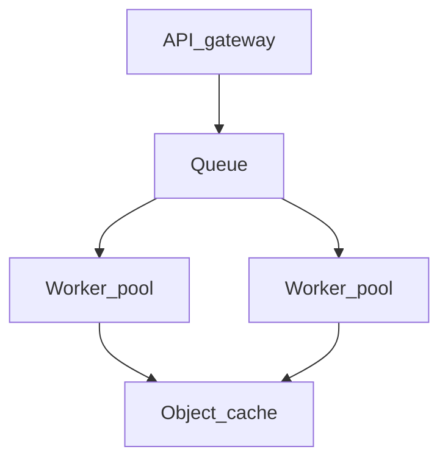

# Chapter 11 — Scaling

## Simple explanation

**Scaling** means your system stays fast and reliable when **many users** run conversions at once. You add queues, more workers, and caching—not bigger prompts.

**Neighbors**: [Chapter 02 — Architecture](../02-architecture/README.md) · [Chapter 15 — Cost optimization](../15-cost-optimization/README.md) · [Chapter 17 — Build vs integrate](../17-build-vs-integrate/README.md)

## Deep technical breakdown

**Queue systems**: SQS/Rabbit/Redis streams for `Job` messages; workers horizontally scaled; **idempotency** keys prevent duplicate Figma fetches.  
**Parallelism**: shard by `fileKey` cautiously—Figma rate limits are per-token; prefer parallel **asset downloads** and sequential **codegen** per job to reduce workspace conflicts.  
**Caching**: cache `GET /v1/files/:key` JSON by `version` id from Figma; invalidate on webhook or TTL; cache **embeddings** of IR slices if you use RAG for DS docs.  
**Cost control**: per-tenant budgets, concurrency caps, and model routing ([Chapter 09](../09-model-selection/README.md)).

## Mermaid diagram

## Real example

Redis cache key `figma:file:{key}:version:{ver}` → skip network if worker restarts mid-job.

## Challenges and pitfalls

- **Thundering herd** on popular design files—coalesce in-flight jobs for same `(key,version)`.  
- **Starvation**: large jobs block queue—use **priority queues** or separate lanes.

## Tips and best practices

- Expose **queue depth** metrics to users (“position 12”).  
- Autoscale workers on **p95 wait time**, not CPU.

## What most people miss

Scaling **Figma API** compliance (rate limits, pagination) is often your first bottleneck—not LLM throughput.
