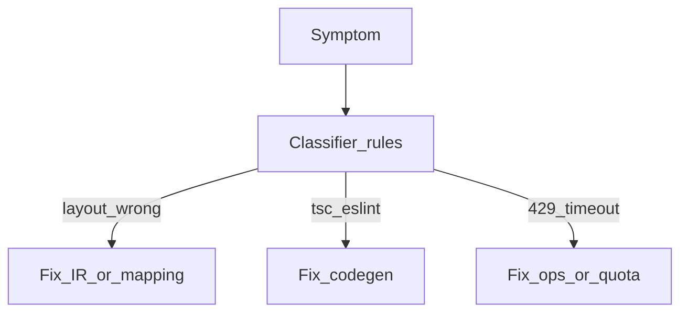

# Chapter 12 — Common issues and failure handling

## Simple explanation

Things go wrong: layouts look broken, images missing, the agent loops. This chapter is a **field guide** to recognize failures quickly and route them to the right fix.

**Neighbors**: [Chapter 08 — Feedback loop](../08-feedback-loop/README.md) · [Chapter 13 — Best practices](../13-best-practices/README.md)

## Deep technical breakdown

| Symptom | Likely layer | Mitigation |
|---------|--------------|------------|
| Hallucinated UI (buttons not in design) | Codegen / weak IR | tighten schema; add `data-figma-id` checks in snapshot tests |
| Broken layouts at md breakpoint | Layout analyzer assumptions | add explicit breakpoint frames in Figma or rules in mapper |
| Missing assets | Figma export / image API | batch `GET /v1/images` with `format=png,svg`; verify 404s |
| Infinite repair loop | Validator noise / vague brief | cap retries; require structured cluster; escalate to human |
| Figma 429 storms | Ingestion | backoff+jitter; cache file JSON |

Instrument each failure with **`stage`**, **`error_code`**, and **`correlationId`**.

## Mermaid diagram

## Real example

**Infinite loop**: three codegen retries all fail ESLint on import order—switch to deterministic `eslint --fix` in sandbox before re-prompting LLM.

## Challenges and pitfalls

- Blaming the model when the **IR** is wrong—always diff IR hash between passes.  
- Hiding errors behind “Something went wrong” in UI—users cannot give useful feedback.

## Tips and best practices

- Publish a **public status page** for Figma outages vs internal bugs.  
- Add **one-click export** of logs for support.

## What most people miss

Many “model bugs” are **deterministic asset URL expiry**—Figma image URLs can be time-limited; re-fetch when preview stale.
