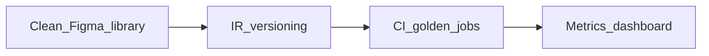

# Chapter 13 — Best practices

## Simple explanation

**Best practices** are habits that save time later: clean Figma libraries, small prompts, good tests, and clear ownership of tokens.

**Neighbors**: [Chapter 06 — Code generation](../06-code-generation/README.md) · [Chapter 14 — Security](../14-security/README.md)

## Deep technical breakdown

**Design side**: components with sensible names; variables for color/spacing/type; avoid deep boolean variant matrices unless mapped.  
**Engineering side**: IR schema versioning; deterministic preprocessors; CI golden tests; per-step metrics dashboards; codeowners on prompt packs.  
**Performance**: cache Figma file JSON; parallelize asset fetch; stream partial previews; compress logs.  
**Quality**: snapshot critical routes; accessibility checks (`axe`) in sandbox optional lane.

## Mermaid diagram

## Real example

CI job `pnpm test:figma-fixtures` loads three frozen IR JSON files and asserts generated `Hero` matches snapshots without calling LLM (template path).

## Challenges and pitfalls

- **Over-automation**: skipping designer review for brand-sensitive pages.  
- **Under-specification**: no owner for token naming conventions.

## Tips and best practices

- Run **weekly evals** on a frozen benchmark of 10 frames.  
- Pair **designer office hours** with engineers when mapping DS.

## What most people miss

Invest in **rename tables** (Figma component → DS import) as data, not prompts—data scales better.
