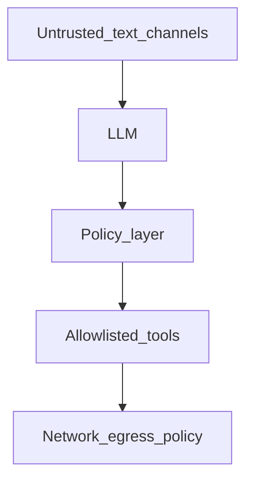

# Chapter 14 — Security

## Simple explanation

**Security** means protecting user data, your API keys, and your customers from abuse—even when AI writes code.

**Neighbors**: [Chapter 07 — Sandbox](../07-sandbox/README.md) · [Chapter 11 — Scaling](../11-scaling/README.md)

## Deep technical breakdown

**Prompt injection**: untrusted text (Figma layer names, issue tracker text pasted into prompts) can instruct the model to exfiltrate secrets. Mitigations: **separate** trusted system policy from untrusted content; tool allowlists; never pass raw `.env` into prompts; output scanning for secret patterns.  
**Sandbox escape**: treat every dependency install as risky—use no-new-privileges containers, read-only root where possible, egress allowlists, non-root user.  
**API key protection**: short-lived OAuth to Figma; rotate keys; per-tenant tokens; KMS for secrets; never log headers.

## Mermaid diagram

## Real example

Strip `description` fields from third-party Figma components before LLM if your threat model includes external collaborators with malicious names.

## Challenges and pitfalls

- **MCP / plugins**: third-party tools widen attack surface—review like production code.  
- **SSRF**: if codegen can fetch URLs, attackers may probe internal IPs—block RFC1918 ranges.

## Tips and best practices

- Add **secret scanning** (git-secrets, TruffleHog) in CI on generated patches.  
- Threat-model **OAuth scopes** minimally (read file, not admin).

## What most people miss

The **biggest** exfiltration path is often “email the logs” or “paste full env in triage prompt”—guard human workflows too.
