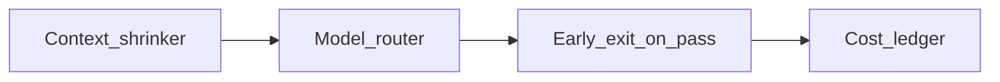

# Chapter 15 — Cost optimization

## Simple explanation

**Cost optimization** means spending less money on AI and infrastructure while keeping quality acceptable—mostly by doing **less unnecessary work**.

**Neighbors**: [Chapter 09 — Model selection](../09-model-selection/README.md) · [Chapter 11 — Scaling](../11-scaling/README.md)

## Deep technical breakdown

**Token savings**: shrink IR excerpts; avoid resending static system text where caching supported; split large frames; store compressed transcripts.  
**Compute savings**: reuse sandbox layers; warm worker pools; cancel jobs on user abandon.  
**Model savings**: route easy steps to smaller models; stop early when validator passes mid-pipeline.  
**Finance**: per-job cost = sum(`tokens*price`) + `sandbox_seconds*cpu_price` + `storage`; attribute to tenant.

## Mermaid diagram

## Real example

If `MappedTree` unchanged between user tweak attempts, skip mapper+layout LLM calls and go straight to codegen with new brief only.

## Challenges and pitfalls

- **Over-pruning context** causes quality collapse—monitor pass rate when changing filters.  
- **Mis-attributed costs** when workers share a pool—tag spans with `jobId`.

## Tips and best practices

- Set **hard per-job token budgets** with user-visible warnings.  
- Offer a **“draft quality”** tier for exploration.

## What most people miss

Caching Figma file JSON is often **10×** cheaper than cutting model quality—network and duplicate work dominate at scale.
