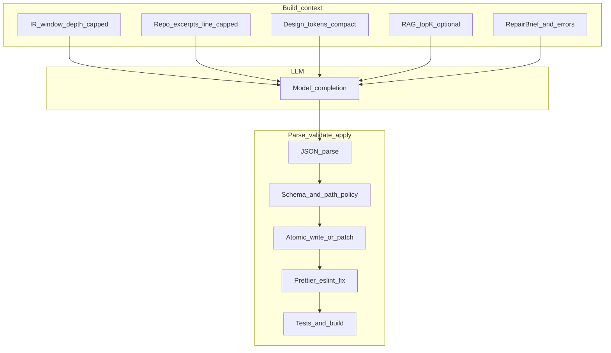

# Chapter 16 — Context for the LLM, response shapes, and writing files

## Simple explanation

You **cannot** paste the whole codebase into the model every time: it will not fit, it is noisy, and it leaks secrets. Instead the app builds a **small, purposeful package of text** for each step: “here is the slice of the design we are implementing, here are the few repo files that matter, here are the rules.” The model answers in a **fixed format** (usually JSON). Your backend **checks** that format, then **writes or patches files** safely—not by blindly trusting prose.

**Neighbors**: [Chapter 04 — Agent design](../04-agent-design/README.md) · [Chapter 05 — Prompts / Code generator](../05-prompts/code-generator.md) · [Modular prompt architecture](../05-prompts/modular-prompt-architecture.md) · [Multi-step orchestration](../05-prompts/multi-step-orchestration.md) · [Chapter 06 — Code generation](../06-code-generation/README.md) · [Chapter 08 — Feedback loop](../08-feedback-loop/README.md) · [Chapter 18 — Requirements-only intake](../18-greenfield-from-requirements/README.md)

## Deep technical breakdown

### A) How to build context before calling the LLM

Treat context as **layers** (send in this order; stop when you hit the token budget for that step):

| Layer | Contents | Why |
|-------|-----------|-----|
| **L0 System** | Role, stack (Vite+React+TS), global bans (`eval`, raw secrets), output schema name | Stable, cacheable |
| **L1 Task** | **Figma intake:** `fileKey`, `frameId`, goal paragraph, `promptVersion`. **Spec intake:** `jobId`, `designSpecVersion`, approved artifact handles, `promptVersion` | Grounds the job |
| **L2 Design truth** | **Figma intake:** IR slice for the target frame (depth-capped), resolved styles/tokens—**not** raw full Figma file. **Spec intake:** `DesignSpec` slice for the route/section under implementation ([example fixture](../schemas/design-spec.min.example.json)) | Same token discipline: send **handles + subtree**, never whole history |
| **L3 Repo hints** | Small **excerpts** with line numbers: `package.json` scripts/deps summary, `tsconfig` paths, **design-system index** (export list), existing file **only if** the change touches it (cap e.g. 200 lines or diff hunks) | Enough to import correctly |
| **L4 Retrieved** (optional) | Top‑k chunks from embeddings over DS docs / past good PRs—**only for mapper/codegen** | Teaches conventions without full tree |
| **L5 Errors / feedback** | Structured `errors[]`, last `RepairBrief`, optional user comment tied to `figmaNodeId` **or** `designSpecSectionId` | Drives repair without resending whole logs |

**Rules that keep context small:**

- **Window IR** by `frameId` + `maxDepth` + `maxNodes`; drop hidden layers in **deterministic** code before the LLM sees them.  
- **Never** put `.env`, credentials, or full `node_modules` in prompts.  
- Prefer **hashes** in the prompt (`workspaceSha`, `irHash`) so the model reasons about freshness; fetch new excerpts only when hashes change.  
- Let the model **request** extra paths via a tool protocol in product systems; in batch docs mode, the orchestrator precomputes the allowlist of paths.

### B) How the user gives feedback and how it becomes a fix

| Channel | What the user does | What you store | What goes into the next LLM call |
|---------|---------------------|----------------|-----------------------------------|
| **Review UI** | Approve / request changes | `ReviewDecision` | Change request → merged into `RepairBrief.goals[]` + `constraints[]` |
| **Anchored comment** | Click a preview element → maps to `figmaNodeId` | `Comment { nodeId, body }` | Injected into L5 with file path hints from trace attrs |
| **Free text** | “Hero too tall on mobile” | Raw string | Feedback engine normalizes to structured brief (or asks one clarifying question) |

The **orchestrator** always merges human input into the same **`RepairBrief` JSON** shape the automated validator uses, so **one code path** feeds codegen.

### C) What shape the LLM response should take

**Preferred contract:** `PatchBundle` (JSON), not markdown code fences as the only output.

```json
{
  "schemaVersion": 2,
  "patches": [
    {
      "path": "src/sections/Hero.tsx",
      "operation": "update",
      "content": "/* full new file content OR unified diff policy per product */"
    }
  ],
  "rationale": "optional, for logs only, not written to repo"
}
```

Alternatives (harder): **unified diff** only (must parse with `diff` libraries and validate paths); **search_replace blocks** `{ path, oldString, newString }` (must verify `oldString` appears exactly once). Pick **one** primary format per product.

### D) How the agent parses the response and updates each file

Pipeline after the model returns:

1. **HTTP/tool envelope strip** — if using tool calling, read the structured arguments only.  
2. **JSON parse** — strict; on failure → one retry with “your last message was not valid JSON schema PatchBundle v2”.  
3. **Schema validate** — `ajv` / Zod: paths under `src/`, allowed extensions, max file size, ban strings (`eval`, `child_process`).  
4. **Normalize paths** — resolve realpath, reject `..` escape.  
5. **Order patches** — e.g. create parent dirs first; deterministic order for reproducibility.  
6. **Apply** — in a **git worktree** or temp clone: write files or apply unified diff; if any step throws → **rollback** entire bundle.  
7. **Deterministic format** — run `prettier` / `eslint --fix` as **code**, not LLM, so style is stable.  
8. **Verify** — `tsc`, tests, sandbox (Chapter 07); feed compact errors back to L5.

```text
LLM output → parse JSON → validate schema → path policy → apply atomically → format → verify
```

## Mermaid diagram



## Real example

**Context package (excerpt) sent to codegen** might be only:

- 120 lines of `Hero` IR JSON  
- `tokens.css` variable names list (30 lines)  
- `src/ds/index.ts` export list (40 lines)  
- `RepairBrief`: `{ "goals": ["Add gap-4 below md breakpoint"], "filesToTouch": ["src/sections/Hero.tsx"] }`

**Model returns** `PatchBundle` with one `update` to `Hero.tsx`.

**Agent does:** validate → apply in worktree → `pnpm exec prettier --write src/sections/Hero.tsx` → `pnpm test` → pass → commit.

## Challenges and pitfalls

- **Full-file regen** on every repair blows tokens and causes unrelated churn—prefer **minimal diffs** or `search_replace` with uniqueness checks.  
- **Context poisoning**: pasting logs that contain secrets into the next prompt—**redact** first.  
- **Ambiguous imports**: excerpt too small → model invents paths—keep **export index** in L3.

## Tips and best practices

- Log **`contextBytes` / `tokenEstimate` / `patchCount`** per step for cost dashboards.  
- Version **`PatchBundle.schemaVersion`** with migrations.  
- For large repos, maintain a **`CODEOWNERS`-style map** from Figma frame → likely file paths to widen excerpts deterministically.

## What most people miss

The quality ceiling is often set by **L3 repo hints**, not by the cleverness of the codegen prompt. Spend engineering time on **which 150 lines** of existing code the model sees, not on adjectives in the system message.
