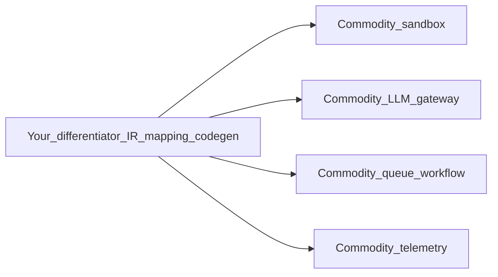

# Chapter 17 — Build vs integrate (recommended modules)

## Simple explanation

You do **not** have to code every piece yourself. For sandboxes, LLM routing, queues, and observability, mature **libraries or services** often get you to production faster. This chapter lists **categories** of tools teams commonly integrate, and **when building from scratch** still pays off.

**Neighbors**: [Chapter 07 — Sandbox](../07-sandbox/README.md) · [Chapter 11 — Scaling](../11-scaling/README.md) · [Chapter 14 — Security](../14-security/README.md) · [Chapter 09 — Model selection](../09-model-selection/README.md)

## Deep technical breakdown

### Decision rubric

| Concern | Integrate first when… | Build from scratch when… |
|---------|------------------------|---------------------------|
| **Sandbox runs** | You need standard `pnpm build/test` in isolation quickly | You need custom hardware, air-gapped, or unusual kernel policies |
| **LLM routing / keys** | Many models and fallbacks; uniform telemetry | Single vendor forever and trivial traffic |
| **Durable jobs / retries** | Long jobs, crash recovery, human pause | One-shot CLI prototype |
| **Observability / evals** | Traces, scores, datasets across prompts | Strict data residency forbids SaaS and you have internal platform |
| **Auth to Figma** | OAuth is standard—use well-maintained HTTP + token store | Never roll your own crypto; only customize **policy** around tokens |

**Principle:** buy/integrate **commodity** layers (containers, HTTP, queues); build **differentiators** (IR schema, Figma mapping, design-system rules, your eval suite tied to brand).

### Categories and examples (non-exhaustive)

Names below are **examples of product categories**, not mandatory picks. Evaluate license, SOC2, data residency, and egress for your org.

| Category | Example directions | Role in this agent |
|----------|---------------------|-------------------|
| **Ephemeral sandboxes** | Cloud sand APIs, Firecracker-based runners, **Docker** on your own k8s | Run `pnpm test` / `build` safely |
| **LLM gateway** | Unified API across providers, routing, budgets, caching | Swap models per step without rewriting clients |
| **Workflow / durable execution** | Durable workflow engines, queue + worker you already operate | Figma fetch + codegen long jobs with retries |
| **Tracing / prompt observability** | OpenTelemetry + vendor APM, prompt trace tools | Debug failures, regressions, cost attribution |
| **Structured outputs** | Schema validation libs (`ajv`, Zod), tool-calling SDKs | Same validation in CI and prod |
| **Diff / patch apply** | Git libraries, patch parsers | Atomic apply of `PatchBundle` |

### Sandboxing specifically

- **Self-managed Docker (or k8s Job)** on your cloud: maximum control; you own patching and images.  
- **Hosted ephemeral environments** (search “cloud dev environments API”, “ephemeral sandbox API”): faster time-to-first-run if their isolation model fits your threat model—**review** network egress and persistence rules.  
- **Never** rely on a browser **iframe** alone for arbitrary user-generated code execution.

## Mermaid diagram

## Real example

**v1 product:** Figma client you own + **Docker** sandbox you own + **one** LLM vendor SDK + **Postgres** job table + **OpenTelemetry** to your existing stack. Defer custom VM hypervisor until compliance demands it.

## Challenges and pitfalls

- **Vendor creep**: five SaaS tools with overlapping logs—pick **one** trace store of record.  
- **“Not invented here”** rebuild of Docker: rare teams outperform maintained runtimes on security **and** velocity.

## Tips and best practices

- Wrap any third-party sandbox behind your **`SandboxPort` interface** so you can swap Docker ↔ hosted without touching codegen.  
- Require **SOC2 / ISO reports** before sending customer repo contents to a hosted sandbox.

## What most people miss

The cost of **integration** is not licensing; it is **shaping your IR and PatchBundle contract** so vendors plug in cleanly. Invest in interfaces first, then choose modules that fit them.
