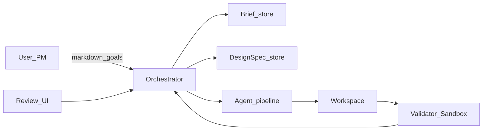
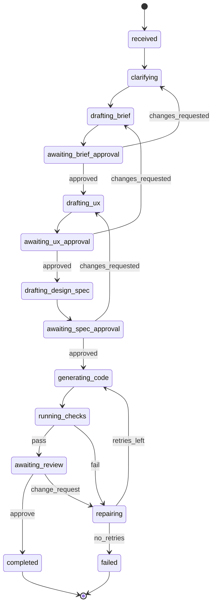
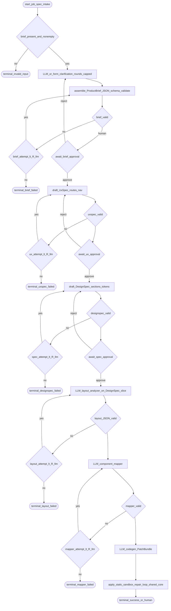
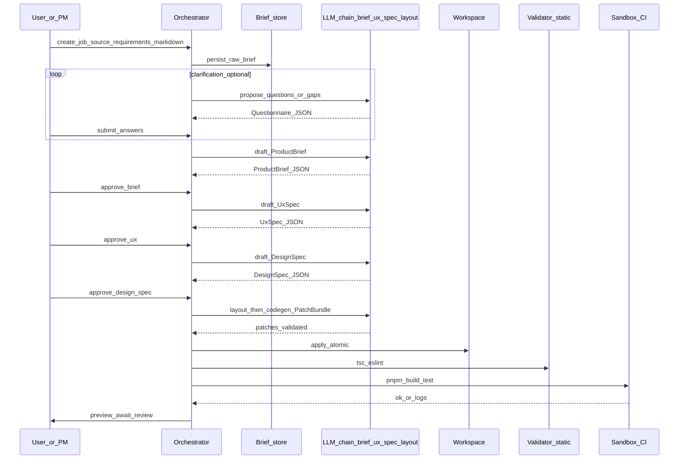

# Chapter 18 — Requirements-only design intake

**Build track:** follow **G0–G10** under [G milestones: requirements-only intake](../00-build-track/README.md#g-milestones-requirements-only-intake-g0g10) on the build-track page; this chapter is the **product and systems** story for jobs whose **design model** is built from **prose and approvals**, not from a **Figma file** in the same job.

## Simple explanation

The **agentic coding pipeline** (layout → map → codegen → sandbox → repair → review) needs a **normalized design model** before it can emit reliable JSX. When there is **no** Figma file to fetch, the system still has to produce that model: clarify goals, lock a **`ProductBrief`**, define **`UxSpec`** (routes and flows), then a versioned **`DesignSpec`** (sections, layout intent, tokens, copy slots). Each hop is **schema-checked** and usually **human-approved**—then the **same downstream workers** run as for **IR**-backed jobs.

**Neighbors:** [Chapter 01 — Overview](../01-overview/README.md) · [Chapter 02 — Architecture](../02-architecture/README.md) · [Chapter 03 — Workflow](../03-workflow/README.md) · [Chapter 04 — Agent design](../04-agent-design/README.md) · [Chapter 05 — Prompts](../05-prompts/README.md) · [Chapter 16 — Context, LLM I/O, files](../16-context-llm-and-files/README.md) · [Example DesignSpec fixture](../schemas/design-spec.min.example.json) · **Canonical orchestrator diagrams:** [README.md](../../README.md)

## Deep technical breakdown

### Why this is a first-class intake (not a prompt tweak)

**Figma-backed** jobs get measurable geometry and instances from the API when your parser is correct. **Language-backed** jobs get **no** such ground truth until you **materialize** it as JSON—which is higher variance and easier to **confabulate** (invented features, unsafe claims, inconsistent routes). Production systems therefore:

1. **Never** let a single LLM call jump from “vague brief” to “full repo.”  
2. **Always** materialize intermediate artifacts (`ProductBrief`, `UxSpec`, `DesignSpec`) with **JSON Schema** and **version pins**.  
3. **Gate** expensive codegen behind explicit **human approve** (or strict auto-policy) on the spec, not only on the final preview.

The **downstream** (PatchBundle, sandbox, RepairBrief, review) matches **IR-backed** jobs; only **everything before `layout_analyzer`** is intake-specific.

### Phases (recommended order)

| Phase | Purpose | Primary artifact | Typical owner |
|-------|-----------|------------------|---------------|
| **0 — Intake** | Capture raw text, links, constraints | `RawBrief` blob + attachments | PM / founder |
| **1 — Clarify** | Resolve ambiguities with structured Q&A | `ClarificationPack` (questions + answers) | PM + sponsor |
| **2 — Product shape** | Problem, users, non-goals, metrics | `ProductBrief` (schema-validated) | Sponsor sign-off |
| **3 — UX / IA** | Routes, nav, key flows, empty states | `UxSpec` | Design + eng |
| **4 — Design intent** | Sections per route, layout intent, tokens, copy slots | `DesignSpec` v0 → vN | Design + eng |
| **5 — (Optional) Visual reference** | Mood, references, marketing screenshots | `VisualReference[]` (URLs or stored images) | Brand |
| **6 — Layout analysis** | Same role as layout on **IR**, but input is a **`DesignSpec` slice** | `LayoutPlan` JSON | Automated + review |
| **7 — Codegen + verify** | Shared agentic core | `PatchBundle` → sandbox | Automated |

Phases 0–5 are where **most failures** happen if you skip rigor; phases 6–7 reuse your existing **M4–M8** muscle.

### `DesignSpec` vs **IR** (mental model)

Both are **inputs to the same downstream**:

- **IR** (from Figma): extracted from API JSON; geometry and component instances are **authoritative** when the parser is correct.  
- **`DesignSpec`**: **declared** by the team + LLM; authority comes from **schema validation + human approval**, not from pixels.

Treat `DesignSpec` with the same engineering discipline as IR: **golden fixtures**, **schemaVersion**, **diffable** JSON in PRs, and **CI** that rejects drift.

### Job envelope (discriminated union)

Your `POST /jobs` body should make the mode explicit:

```text
source: "figma"   → { fileKey, frameId?, … }
source: "requirements" → { rawBriefId | inlineMarkdown, optional templateId }
```

The worker branches **once** at enqueue time; after `DesignSpec` is frozen for the job, the pipeline graph **rejoins** the **shared** path at **layout analysis** (same JSON contracts where possible).

### Human gates (minimum bar for production)

| Gate | Blocks | Why |
|------|--------|-----|
| **G-A** | Codegen | `ProductBrief` approved (metrics + non-goals) |
| **G-B** | Codegen | `UxSpec` approved (routes + nav) |
| **G-C** | Codegen | `DesignSpec` approved for **scope** of this job (which routes/sections) |

Auto-approve is defensible only for **internal sandboxes** with hard spend caps and no public claims.

### Reuse of existing agent components

| IR pipeline component | Role when intake is requirements-only |
|--------------------|-----------------|
| **Figma parser** | Unused for this job kind, or used later to **import** a file into `DesignSpec` (optional hybrid) |
| **New: Brief normalizer** | Raw text → draft `ProductBrief` sections (deterministic cleanup + LLM assist) |
| **New: Clarification interviewer** | Emits `Question[]`; merges answers into brief |
| **Layout analyzer** | Consumes **`DesignSpec` slice** instead of IR subtree; same output schema family if you unify |
| **Component mapper** | Map **logical components** in `DesignSpec` to DS / codegen templates |
| **Code generator** | Same PatchBundle contract |
| **Validator / sandbox / feedback** | Unchanged |

Unifying **layout analyzer output schema** across both sources reduces branching in codegen.

## Mermaid diagram — topology (requirements-only intake)



## Mermaid diagram — state machine (spec-led jobs)

Use **different state names** than `fetching_figma` so dashboards stay honest; mapping to worker internals is in [Chapter 03](../03-workflow/README.md).



## Mermaid diagram — control flow (orchestrator)

Same **retry and budget** ideas as the canonical orchestrator (`R_llm`, `R_repair`); only the **upstream** differs.



## Mermaid diagram — sequence (happy path)



## Build track mapping (G0–G10)

Detailed checklists live on the [build track](../00-build-track/README.md); this table is the **conceptual map** to Figma milestones **M***.

| Milestone | Intent | Figma analog |
|-----------|--------|----------------|
| **G0** | Same service shell as M0 | M0 |
| **G1** | Persist raw brief + version | M1 “fetch,” but from your DB |
| **G2** | `ProductBrief` schema + validation + approval UI | part of M2 discipline |
| **G3** | `UxSpec` + approval | — |
| **G4** | `DesignSpec` + approval + golden fixtures | M2 IR |
| **G5** | Optional visual references (files/URLs) | M1 assets (conceptually) |
| **G6** | Job state machine spans clarify → spec → codegen | M3 |
| **G7** | First LLM chain for brief/spec (schema retry) | M4 |
| **G8** | PatchBundle apply + worktree | M5 |
| **G9** | Sandbox green | M6 |
| **G10** | Preview + review + repair caps | M7–M8 |

Security (**M9**) and cost (**M10**) apply **unchanged** to spec-led jobs—often **stricter**, because prompts can include **untrusted user prose** (injection surface).

## Prompting strategy (summary)

- **Treat each artifact as its own “node”** with its own JSON Schema, same as Figma nodes.  
- **Temperature**: lower for `ProductBrief` / `UxSpec` / `DesignSpec`; keep codegen policy aligned with [Chapter 05](../05-prompts/README.md).  
- **Carry forward** only **IDs and excerpts** into codegen context—never dump the entire history of chat.  
- **Red-team** the brief step: ask the model to list **assumptions** explicitly; surface them in the approval UI.

## Hybrid mode (common in real companies)

1. Start from **requirements-only** intake to reach a **reviewed `DesignSpec`**.  
2. **Import** Figma later for a marketing page or dashboard; **merge** `DesignSpec` with measured values from Figma IR for that subtree.  
3. Single codebase path: **normalize both** into a **unified internal model** before layout analysis (advanced; defer until both tracks work alone).

## Real example

**Input:** three paragraphs in Slack: “B2B analytics for Shopify merchants, freemium, needs landing + pricing + docs, brand colors navy + lime.”  
**After gates:** `ProductBrief` with ICP and non-goals; `UxSpec` with `/`, `/pricing`, `/docs`; `DesignSpec` with hero, three feature columns, comparison table schema, FAQ accordion.  
**Output:** Vite app with routes, placeholder copy in `i18n/en.json`, and **disclaimer** in footer that pricing is illustrative until finance approves.

## Challenges and pitfalls

- **Confabulated requirements** stated as facts (“we are SOC 2 certified”)—require **sources** or **explicit fiction** flags in `ProductBrief`.  
- **Scope explosion** in `DesignSpec` (twenty routes in v1)—enforce **max routes** and **template budgets** in schema.  
- **Skipping UX approval** leads to beautiful code for the **wrong** product.  
- **Unbounded clarification loops**—cap rounds; escalate to human PM.  
- **Same security class as user-uploaded content** in prompts: treat raw brief as **untrusted**; sanitize for SSRF if URLs are allowed.  
- **Legal / claims risk** in generated marketing copy—separate **“draft vs approved copy”** flags per section.  
- **Accessibility drift** without Figma inspect—add **a11y checklist** fields to `DesignSpec` (headings order, contrast targets).  
- **Token cost** explodes when each phase re-sends full chat—use **artifact stores** and pass **handles** only.

## Tips and best practices

- Version **`DesignSpec`** with the same rigor as **IR schema**; diff in PRs.  
- Offer **starter templates** (`saas-landing`, `docs-site`) so the model’s search space is smaller.  
- Run **golden tests** on `ProductBrief` / `UxSpec` / `DesignSpec` validators the same way you test `toIR()`.  
- Instrument **where** jobs fail: clarification vs brief vs spec vs codegen—each is a different product intervention.  
- For internal tools, add **“import from Figma”** as an **optional** accelerator, not the only path to truth.

## What most people miss

Requirements-only intake is not “**no design**”; it is “**design is expressed as governed JSON**.” The **spec approvals** are your **design authority** until a human designer replaces them. If you do not schedule that replacement, you will ship **implicit** design debt forever.

**Reference hub:** [External references](../00-references.md).
