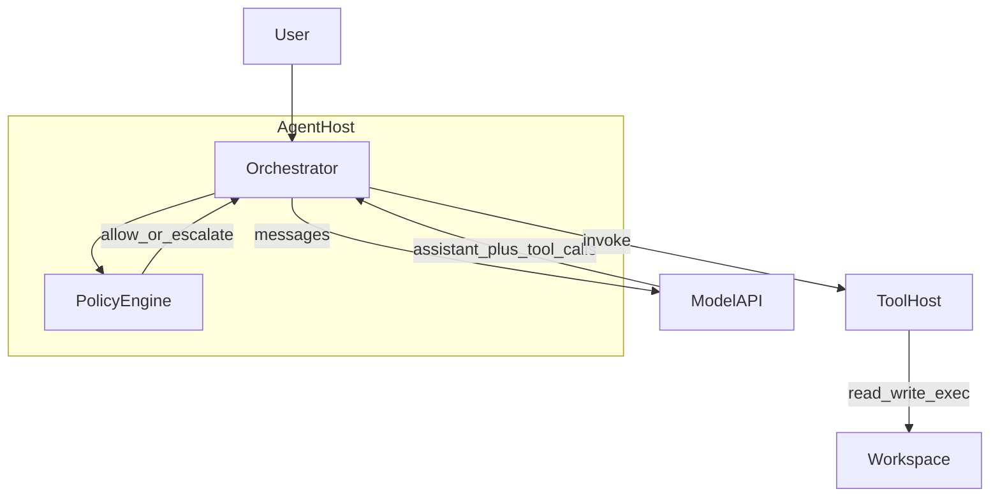
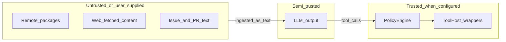
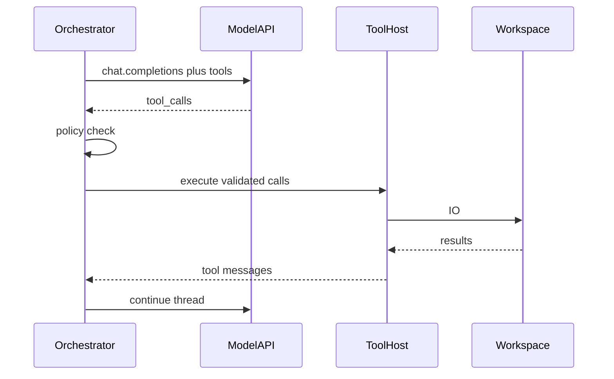

# Architecture — containers and boundaries

## Summary

Architecture here follows a **C4-style narrowing**: **system context** (already in [10-overview.md](10-overview.md)) → **containers** (orchestrator, model API, tool host, workspace) → **trust boundaries** and **data planes**. Sequences bridge to [30-lifecycle.md](30-lifecycle.md); subsystems detail is in [40-components.md](40-components.md).

## Container view

Logical containers and data flow:

The [orchestrator](91-glossary.md) owns **session state** (messages, pending tool calls, budgets). The [tool host](91-glossary.md) owns **capabilities** and **OS identity** of execution. Splitting these keeps policy enforcement in one place ([50-governance.md](50-governance.md)).

## Trust boundaries

Anything that becomes **model-visible text** (issues, logs, web pages) is a potential channel for [prompt injection](91-glossary.md). The boundary between **model suggestion** and **side effect** is the policy gate on tool invocation ([50-governance.md](50-governance.md)).

## Key sequence — single tool round

Provider-specific message shapes are documented by vendors; see [90-references.md](90-references.md).

## Data planes

| Plane | Contents | Risks |
|-------|----------|-------|
| **Conversation** | User goals, summaries, tool transcripts | Secret paste, oversized context |
| **Workspace** | Source, configs, build artifacts | Destructive edits, path traversal |
| **Execution** | Shell, package installs, network | Exfiltration, supply chain |
| **Telemetry** | Traces, prompts, outputs | Privacy, retention |

Operations guidance: [60-operations.md](60-operations.md).

## See also

- Up: [10-overview.md](10-overview.md)  
- Down: [30-lifecycle.md](30-lifecycle.md), [40-components.md](40-components.md)  
- Sideways: [50-governance.md](50-governance.md)  
- Proof: [90-references.md](90-references.md)  
