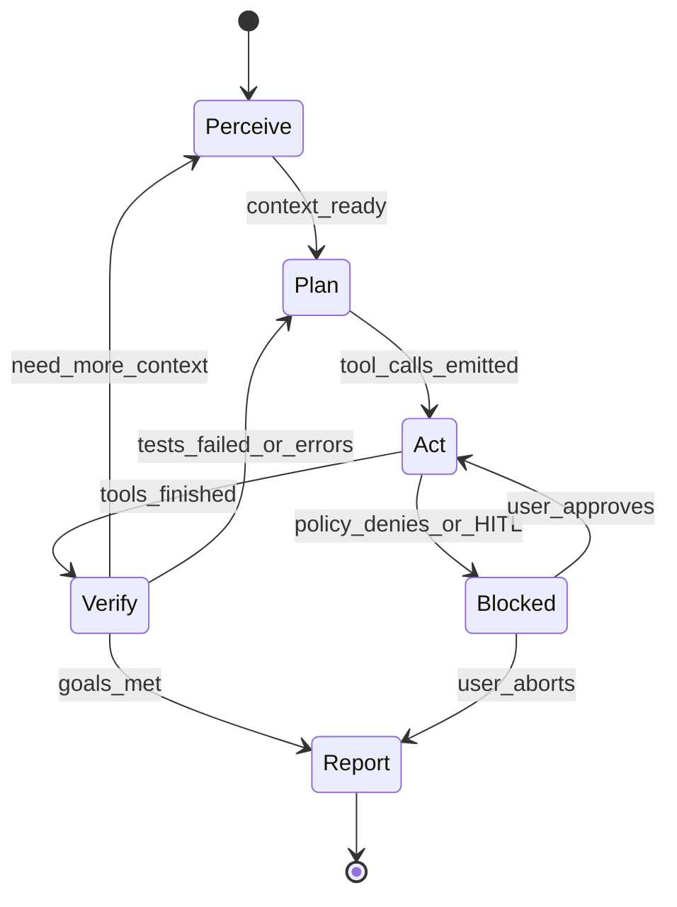
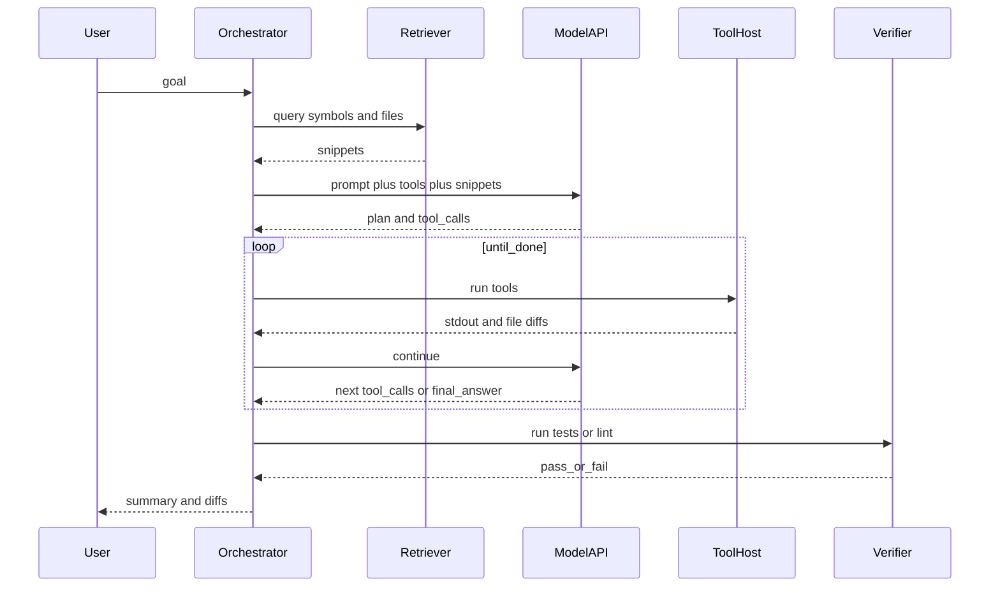

# Lifecycle — perceive, plan, act, verify

## Summary

An [AI coding agent](91-glossary.md) session is a **loop** of states: absorb context, let the [LLM](91-glossary.md) propose [tool calling](91-glossary.md), execute under policy, feed observations back, and **verify** when the task claims completion. This page models that loop and common failure transitions. Subsystem breakdown is in [40-components.md](40-components.md); enforcement in [50-governance.md](50-governance.md).

A goal-oriented flowchart (**intent → context → reason → branch → verify → iterate or hand off**) lives in [10-overview.md#pipeline-logic](10-overview.md#pipeline-logic). Here, **Perceive** aligns with context assembly, **Plan** with reasoning, **Act** with explore / edit / run, **Verify** with the verification node, and **Blocked / Report** with clarify, stop, or escalate.

## State machine

**HITL** ([glossary](91-glossary.md)) holds the session in `Blocked` until explicit user action.

## Primary sequence — multi-step task

## Failure modes (selected)

| Symptom | Common cause | Mitigation |
|---------|--------------|------------|
| Infinite loop | Model repeats failed tool | Cap iterations; dedupe tool results; escalate |
| Wrong file edited | Weak retrieval | Improve search; pin file paths in user message |
| Flaky verify | Nondeterministic tests | Retry budget; mark flaky in report |
| Silent secret leak | Pasted keys in logs | Redact patterns; shorten tool output in model context |

Risk taxonomy cross-check: [REF-OWASP-LLM](90-references.md).

## Tool round contract

For each round, the [orchestrator](91-glossary.md) should guarantee:

1. **Validate** tool names and arguments against schema.  
2. **Authorize** with [least privilege](91-glossary.md) and policy.  
3. **Execute** in [sandbox](91-glossary.md) where required.  
4. **Record** structured outcomes for [telemetry](91-glossary.md).  

Details: [40-components.md](40-components.md).

## See also

- Up: [20-architecture.md](20-architecture.md)  
- Down: [40-components.md](40-components.md)  
- Sideways: [50-governance.md](50-governance.md), [60-operations.md](60-operations.md)  
- Proof: [90-references.md](90-references.md)  
