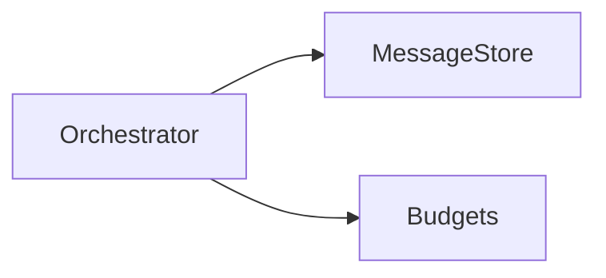
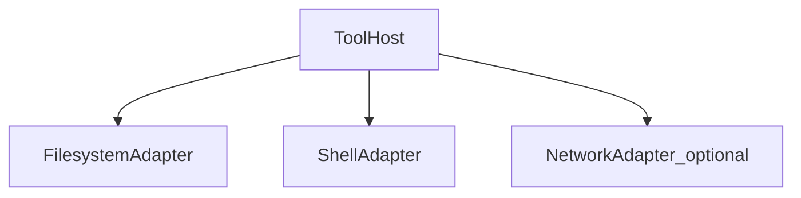

# Components — subsystems of the agent host

## Summary

This page decomposes the [Agent host](10-overview.md#system-context) into cooperating parts: [orchestrator](91-glossary.md), model client, [retrieval](91-glossary.md), [tool host](91-glossary.md), workspace IO, and verification. Each subsection ties back to [lifecycle](30-lifecycle.md) states that use it.

## Orchestrator

**Responsibilities**: thread of messages, iteration budget, branching (subagents), compaction of history, scheduling of retrieval before model calls.

**Lifecycle**: `Perceive` / `Plan` / `Act` transitions in [30-lifecycle.md](30-lifecycle.md).

## Model interface

**Responsibilities**: translate internal history to vendor chat format, register tool schemas, stream tokens, parse [tool calling](91-glossary.md) outputs reliably.

**Proof links**: [90-references.md](90-references.md) REF-OPENAI-FC, REF-ANTHROPIC-TOOLS, REF-GOOGLE-FC.

## Retrieval and context

**Responsibilities**: embedding or lexical search over repo, optional web fetch, ranking and chunking, citation to paths for user audit.

**Lifecycle**: feeds `Perceive` before `Plan`.

## Tool host

**Responsibilities**: register tools, validate arguments (JSON schema), enforce timeouts, stream stdout/stderr, map errors to model-visible messages.

**Lifecycle**: executes `Act`; outputs consumed in next `Plan` round.

Adapters are where [sandbox](91-glossary.md) and OS credentials attach.

## Workspace IO

**Responsibilities**: patch application (unified diff or structured edit), conflict detection, VCS status, ignore-file respect.

**Lifecycle**: bridges `Act` and `Verify` (build artifacts on disk).

## Verification

**Responsibilities**: run formatter, linter, unit tests, typecheck; capture exit codes and relevant logs; surface concise summaries to the model.

**Lifecycle**: `Verify` in [30-lifecycle.md](30-lifecycle.md).

## Telemetry and audit

Cross-cutting: every model call and tool invocation should emit structured events for [60-operations.md](60-operations.md).

## See also

- Up: [20-architecture.md](20-architecture.md), [30-lifecycle.md](30-lifecycle.md)  
- Down: [50-governance.md](50-governance.md) (policy around tools), [60-operations.md](60-operations.md)  
- Sideways: [91-glossary.md](91-glossary.md)  
- Proof: [90-references.md](90-references.md)  
