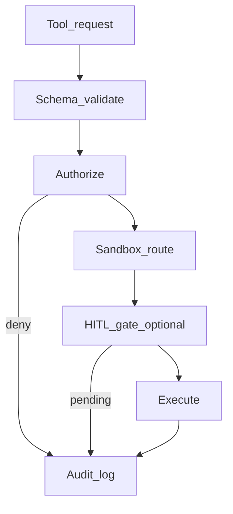

# Governance — permissions, abuse, human gates

## Summary

Governance turns a capable [tool host](91-glossary.md) into a **controlled** system: **who** may trigger tools, **what** each tool may access, and **when** a human must approve ([HITL](91-glossary.md)). Threats include [prompt injection](91-glossary.md), over-privileged credentials, and supply-chain execution. This page is policy-first; operations for audit retention are in [60-operations.md](60-operations.md).

## Policy flow

**Deny by default** for new tools and new scopes; widen with explicit configuration.

## Threats (selected)

| Threat | Mechanism | Control |
|--------|-----------|---------|
| Prompt injection | Untrusted text becomes instructions | Separate trusted system policy from retrieved content; tool allowlists; output filtering |
| Secret exfiltration | Encode secrets in URLs or clipboard tools | Network egress policy; secret scanners; no broad `curl` without gate |
| Destructive shell | `rm -rf` or recursive deletes | Sandbox filesystem; command allowlists; require approval for destructive patterns |
| Dependency confusion | Malicious package install | Locked registries; offline mirrors; review before `npm install` |

Map controls to the OWASP LLM risk list ([90-references.md](90-references.md), REF-OWASP-LLM).

## Least privilege patterns

- **Scoped tokens**: CI or MCP credentials limited to one service.  
- **Path jail**: tools may only read/write under workspace root unless explicitly widened.  
- **Time-bound elevation**: approvals expire after one action or minutes.  

## Human-in-the-loop

Use [HITL](91-glossary.md) when:

- Irreversible or data-loss operations  
- First-time use of a high-risk tool  
- Production deploy or release tagging  

## See also

- Up: [20-architecture.md](20-architecture.md#trust-boundaries), [30-lifecycle.md](30-lifecycle.md)  
- Down: [60-operations.md](60-operations.md)  
- Sideways: [40-components.md](40-components.md#tool-host)  
- Proof: [90-references.md](90-references.md)  
