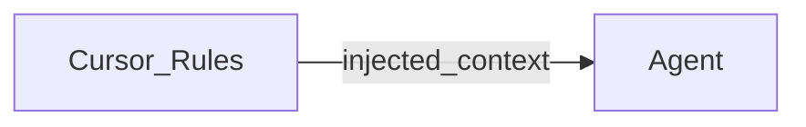
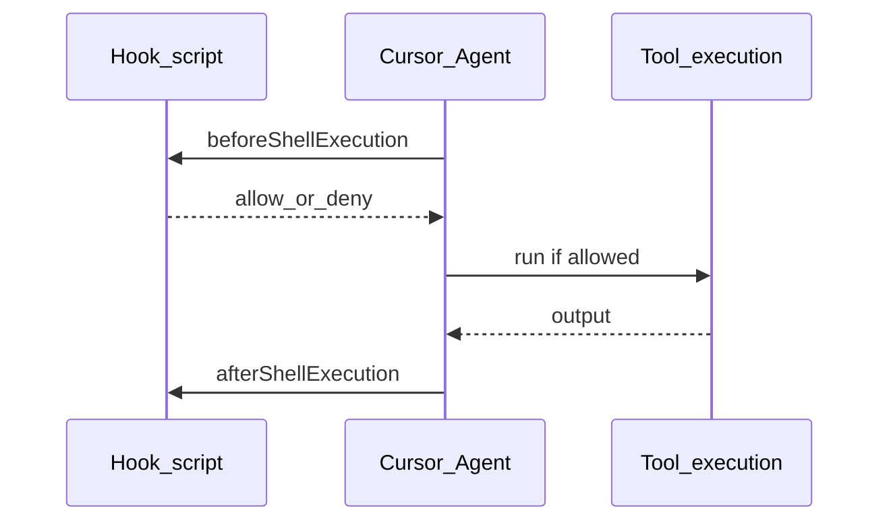

# Appendix — mapping to Cursor

## Summary

Cursor instantiates the generic ideas in this corpus: an **agent host** with **rules** (persistent instructions), **skills** (portable task packages), **hooks** (loop extension and gating), and **MCP** (external tools and data). Use this page after [20-architecture.md](20-architecture.md) and [40-components.md](40-components.md) so names line up.

Proof links for product behavior: [90-references.md](90-references.md) (REF-CURSOR-\*).

## Rules

**Maps to**: policy text and team defaults that shape every completion; closest to “system prompt plus governance narrative” in [50-governance.md](50-governance.md).

Cursor supports project rules, user rules, team rules, and `AGENTS.md`-style instructions. Authoring guidance and rule types are documented officially ([REF-CURSOR-RULES](90-references.md)).

## Skills

**Maps to**: reusable, version-controlled packages (`SKILL.md`) that teach the agent domain workflows—similar to “procedure library + optional scripts” in [40-components.md](40-components.md).

Discovery paths and frontmatter are product-specific ([REF-CURSOR-SKILLS](90-references.md)). Conceptually, skills are **progressive context**: load instructions and references on demand so the [orchestrator](91-glossary.md) stays efficient.

## Hooks

**Maps to**: scripts at the boundary between **model intent** and **side effects**—aligns with the policy flow in [50-governance.md](50-governance.md#policy-flow) and the tool host in [40-components.md](40-components.md#tool-host).

Hooks observe or gate stages such as shell execution, MCP calls, and file edits ([REF-CURSOR-HOOKS](90-references.md)). Treat hooks as **enforcement points**, not a replacement for sandboxing.

## MCP

**Maps to**: the [tool host](91-glossary.md) gaining **remote or local capabilities** through a standard protocol ([MCP](91-glossary.md)).

Cursor documents transports (`stdio`, remote), configuration in `.cursor/mcp.json`, OAuth patterns, and security expectations ([REF-CURSOR-MCP](90-references.md)). Architecturally, each MCP server is another **adapter** behind the same orchestration loop described in [30-lifecycle.md](30-lifecycle.md).

Protocol reference: [REF-MCP-SPEC](90-references.md).

## See also

- Core: [20-architecture.md](20-architecture.md), [40-components.md](40-components.md), [50-governance.md](50-governance.md)  
- Map: [00-index.md](00-index.md)  
- Proof: [90-references.md](90-references.md)  
- Entry: [README.md](../README.md)  
