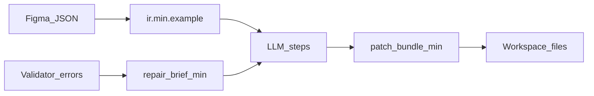

# Example schemas and JSON fixtures

## Simple explanation

These small JSON files are **examples** juniors can copy into unit tests or schema validators. They are not the full Figma export—only the **shape** your code should accept or emit.

**Neighbors:** [Build track](../00-build-track/README.md) · [Stack and repository structure](../00-build-track/stack-and-repo-structure.md) · [Chapter 16 — Context, LLM I/O, files](../16-context-llm-and-files/README.md)

## Deep technical breakdown

- **`ir.min.example.json`** — minimal IR v0-style document your `figma → IR` step might emit.  
- **`design-spec.min.example.json`** — minimal **`DesignSpec`** for **requirements-only** jobs (routes, sections, tokens); stands in for **IR** until you attach a Figma-backed design.  
- **`patch-bundle.min.example.json`** — what codegen returns before apply.  
- **`repair-brief.min.example.json`** — what feedback engine merges into the next codegen context.

Version real schemas in **your app repo**; update these fixtures when you bump `schemaVersion`.

## Mermaid diagram

## Real example

- [ir.min.example.json](ir.min.example.json)  
- [design-spec.min.example.json](design-spec.min.example.json)  
- [patch-bundle.min.example.json](patch-bundle.min.example.json)  
- [repair-brief.min.example.json](repair-brief.min.example.json)

## Challenges and pitfalls

- Drift between **fixture** and **production schema**—CI should validate fixtures against the same JSON Schema file your worker imports.

## Tips and best practices

- Add **negative fixtures** next (`patch-bundle.invalid.json`) for parser tests once basics pass.

## What most people miss

Keep examples **tiny**; large fixtures hide errors and slow down every test run.
